# Finance 智能投研助手

一个面向个人投资者的双模式智能投研项目，提供对话咨询和深度报告两种使用方式。

项目主要关注通用大模型在投研场景中的几个常见问题：

- 金融数据来源不一致，回答难以核对
- 普通聊天助手缺少用户画像，跨轮次体验不稳定
- 长对话容易丢失上下文，跨会话难以保留偏好
- 深度分析通常只能输出一段回答，不方便沉淀为可复盘结果

围绕这些问题，当前仓库已经实现：

- 对话模式：多轮追问、会话尾窗与既有摘要/画像读取、Tushare Skill 数据增强；仓库保留
  STM/LTM 基础设施，但完整 LTM 检索与写回尚未接入受控主链
- 报告模式：多 Agent 协作生成基本面、技术面、估值、新闻等综合分析报告
- 账号体系：登录、注册、切换账号、JWT 登录态恢复
- 工程化链路：Router / Planner / Executor / Evidence 校验、结构化 Trace、可选 Langfuse 观测、Docker 部署
- 金融领域 workspace Skills：除官方 Tushare vendor 外，内置个股首轮研判、板块热点、行情异动解释、ETF 筛选、基金对比等场景化 Skill

当前仓库已经整理为可公开运行的版本，支持本地开发、Docker 启动，以及基于官方 Tushare Skill vendor 的对话增强链路。

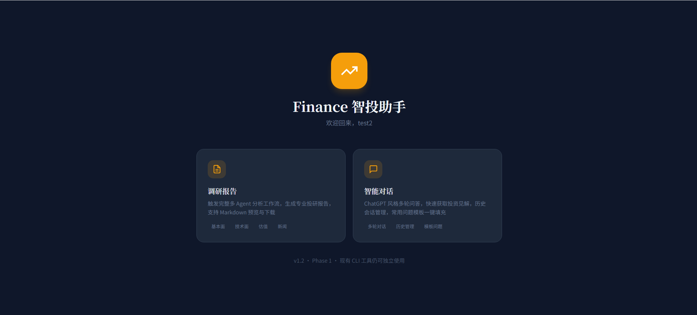

## 目录

- [项目亮点](#项目亮点)
- [页面预览](#页面预览)
- [核心能力](#核心能力)
- [可观测性：Trace 与 Langfuse](#可观测性trace-与-langfuse)
- [金融领域扩展 Skills](#金融领域扩展-skills)
- [系统结构](#系统结构)
- [快速开始](#快速开始)
- [Docker 部署](#docker-部署)
- [登录与测试账号](#登录与测试账号)
- [常见使用方式](#常见使用方式)
- [日志与排查](#日志与排查)
- [项目结构](#项目结构)
- [后续计划](#后续计划)
- [鸣谢](#鸣谢)

## 项目亮点

- 双模式投研体验
  - 对话模式适合高频问答、追问澄清、个股/板块/基金咨询
  - 报告模式适合生成结构化、可复盘、可下载的深度分析报告

- Skill-First 对话链路
  - 先判断问题是否需要实时金融数据
  - 命中数据类问题后自动进入 `tushare-data` Skill
  - 支持个股、板块、黄金、基金 / ETF 等高频场景

- 个性化记忆系统
  - STM：会话内滚动摘要与消息压缩
  - LTM：结构化画像 + 语义记忆
  - 对话和报告都能读取用户偏好、关注行业和风险风格

- 工程化执行链路
  - 官方 Tushare Skill vendor 接入
  - Router / Planner / Executor / Evidence 校验完整闭环
  - 高频结构化问题支持确定性并发取数
  - 本地结构化 Trace（JSONL / 日志）+ 可选 Langfuse 云端观测，便于调试、复盘与延迟分析
  - 工作区内置多枚金融领域扩展 Skill（个股首轮研判、板块热点、行情异动解释、ETF 筛选、基金对比等），与 Tushare 工具链协同

- 账号登录与权限隔离
  - JWT 登录态恢复
  - 测试账号开箱可用
  - 业务链路仍围绕固定 `user_id` 工作，兼容现有对话、报告、记忆与画像能力

## 页面预览

这一节按真实使用路径展示项目界面：先看首页，再看报告模式、对话模式、记忆系统和 Skill 数据增强。

### 首页与双模式入口

首页提供对话咨询和深度报告两个入口。登录后，用户可以根据当前需求选择更适合的使用方式。


### 报告模式

报告模式基于 LangGraph 协调多个分析 Agent，适合生成一份结构化、可复用、可下载的投研报告。

这张图展示了报告模式的主界面。用户输入自然语言需求后，后端会启动多 Agent 分析流程，完成基本面、技术面、估值、新闻等维度的取数与汇总。

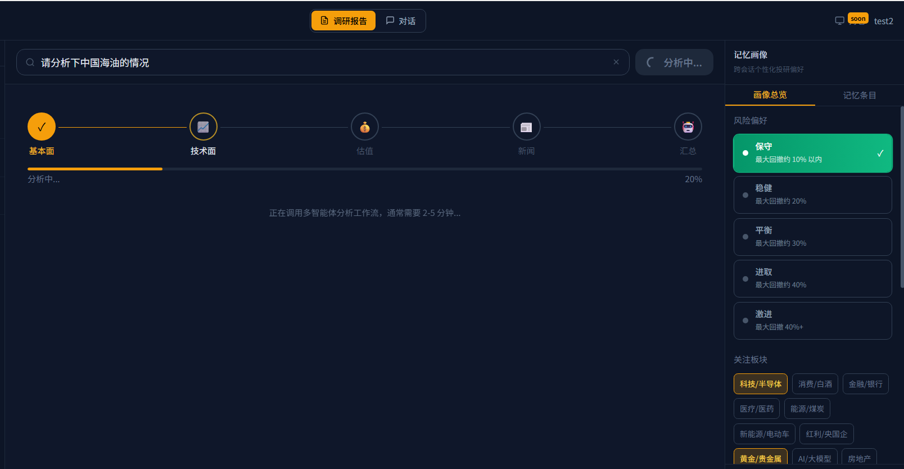

这张图展示了一份已生成的报告案例。最终结果会以 Markdown 形式保存，便于阅读、下载和复盘。

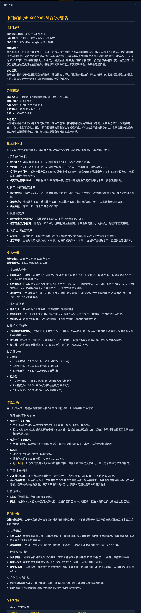

这张图展示的是报告结果页，包括在线查看、复制、下载，以及历史报告回看。

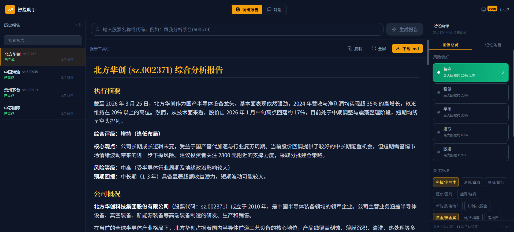

这张图展示了报告模式和用户画像的联动。完成冷启动后，系统会把风险偏好、关注行业、回答风格等信息注入分析过程。

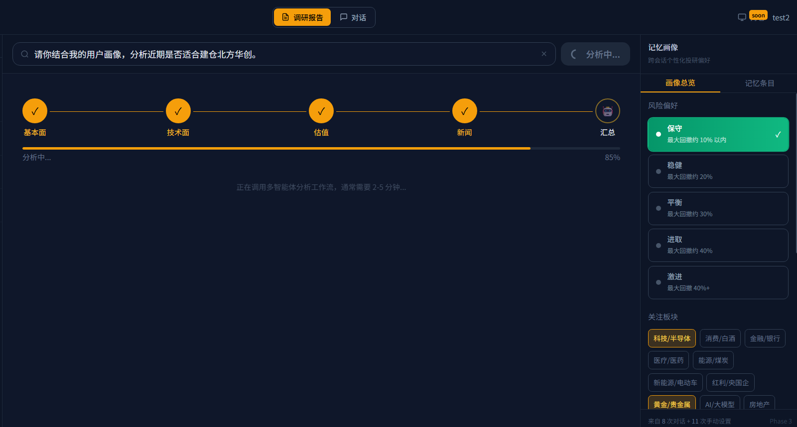

### 对话模式与记忆侧栏

对话模式支持连续追问、历史会话管理、用户画像联动，以及 Skill 自动路由。

这张图展示了对话页右侧的记忆与画像状态栏。这里会展示当前用户的画像信息和部分记忆状态。

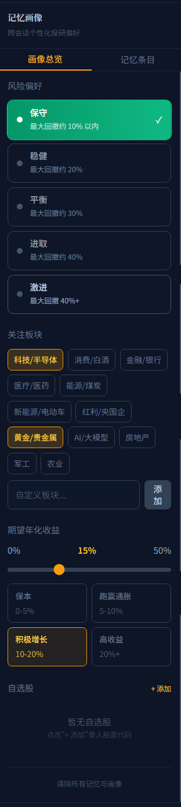

这张图展示了结构化用户画像模块。风险偏好、关注板块、收益预期、持有周期等信息会作为长期记忆的一部分注入对话与报告链路。

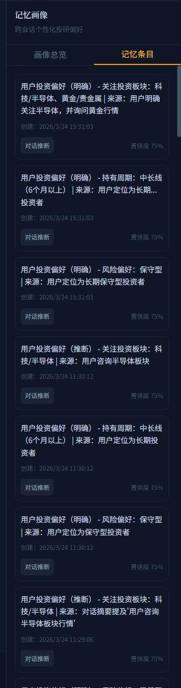

这张图展示了用户通过显式 UI 操作更新画像的过程。这部分数据会直接写入画像表，并在后续回答中生效。

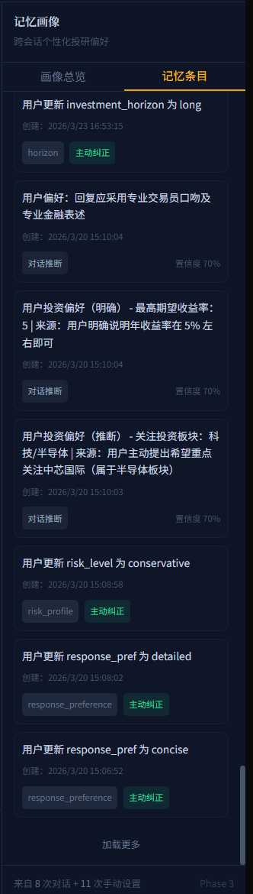

这张图展示了“用户画像可对话编辑”的体验。除了在侧栏里手动修改，用户也可以直接用自然语言告诉系统自己的偏好。

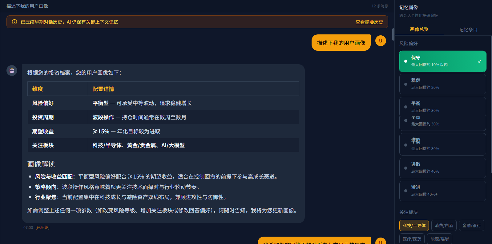

### STM 摘要与长期记忆

长对话场景下，系统会保留近期消息，并将较早内容压缩成摘要快照，兼顾连续性与上下文成本。

这张图展示的是 STM 摘要历史快照。它记录了每次对话压缩后保留下来的摘要内容，便于理解长对话中的上下文继承过程。

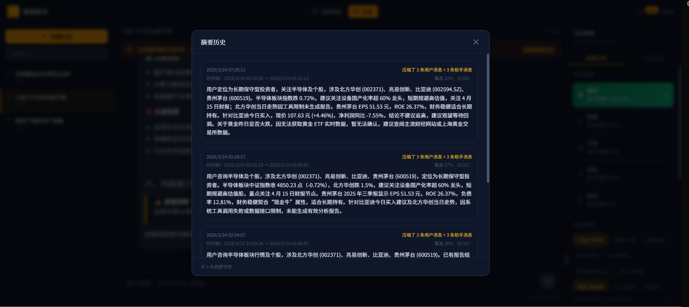

这张图展示的是长期记忆的一个典型更新场景：系统从对话中推测出用户更关注某些板块，并将其写入长期画像。

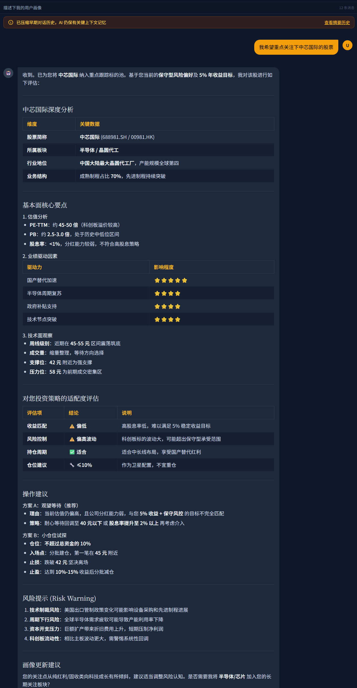

### Tushare Skill 数据增强

对话模式会根据问题类型自动判断是否需要调用官方 Tushare Skill 能力源，再由本项目运行时执行工具规划、取数与回答生成。

这张图展示了 skill 命中后的实时金融数据问答场景。对于“最新财务指标”“今天走势”“板块表现”这类需要可核对数据的问题，系统会先路由到 Tushare Skill，再基于实际数据组织回答。

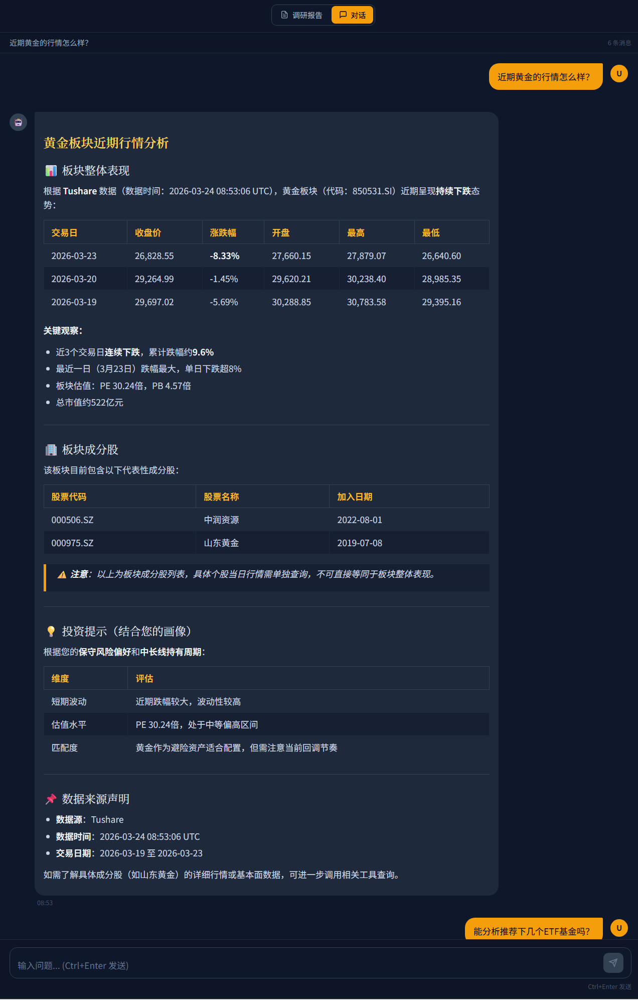

这张图展示的是基金 / ETF 推荐能力。系统会先识别问题类型，再规划对应的基金工具，对候选标的做取数和比较。

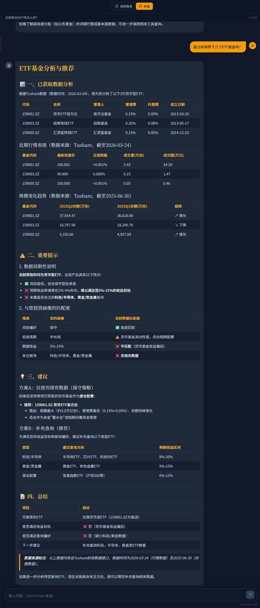

## 核心能力

### 1. 报告模式

报告模式适合需要系统化分析的场景。  
后端基于 LangGraph 组织多个分析 Agent，对同一问题做分维度拆解，再由总结节点汇总成一份完整报告。

当前覆盖的典型维度包括：

- 基本面
- 技术面
- 估值
- 新闻与舆情
- 总结与投资建议

输出结果为 Markdown 报告，支持页面预览、复制、下载和历史记录查看。

### 2. 对话模式

对话模式适合连续追问和高频咨询场景。

对话模式支持：

- 普通闲聊
- 个股财务指标查询
- 今日 / 最近行情问答
- 板块 / 行业表现分析
- 基金 / ETF 推荐与比较
- 多轮追问和上下文继承

典型流程：

```text
用户问题
  -> Router 判断要不要走 Skill
  -> Planner 生成工具计划
  -> Tushare / MCP 工具执行
  -> Evidence 校验
 -> LLM 基于记忆与数据生成最终回答
```

这条链路的核心是先判断问题是否需要实时数据，再决定走普通回答、确定性工具取数，还是更完整的 agentic 路径。

### 3. 长短期记忆

- 短期记忆 STM
  - 会话内滚动摘要
  - 最近消息保留 + 早期消息压缩
  - 长对话下维持指代消解和连续追问能力
  - 开启 `ENABLE_STM` 时，前端对话输入区可展示上下文占用环形指示（`ContextUsageRing`），便于感知压缩触发前的预算占用

- 长期记忆 LTM
  - PostgreSQL 结构化画像
  - Mem0 + pgvector 语义记忆
  - 支持跨会话个性化问答

这一部分负责保存用户偏好、关注方向和回答风格，是连续对话和个性化分析的基础。

### 4. Tushare Skill 集成

项目没有直接接入 OpenClaw runtime，而是采取了“官方 Skill 文档能力源 + 本项目自研运行时执行”的方式：

- vendor 官方 Tushare Skill 文档和 references
- 由本项目自研运行时执行：
  - skill registry
  - route
  - executor
  - planner
 - evidence validation

这样做的优点是：

- 更容易和现有 FastAPI、MemoryService、前端聊天链路集成
- 部署简单
- 可控性更强

这一部分的重点是保留官方 Skill 的知识边界和接口说明，同时让它能直接接入现有对话系统。

Workspace 金融场景扩展与 Trace / Langfuse 配置见下面两节。

## 可观测性：Trace 与 Langfuse

对话 Skill 链路在运行时会写入**结构化 Trace**（默认开启），用于记录路由决策、工具计划、执行阶段、Evidence 与回复完成等事件。主实现位于 `Financial-MCP-Agent/src/tools/skill_trace.py`，导出器在 `Financial-MCP-Agent/src/tools/trace_exporters/`（含 Langfuse）。

- **本地 Trace（主审计）**
  - 汇总日志：`Financial-MCP-Agent/logs/skill_trace.log`
  - 行式记录：`Financial-MCP-Agent/logs/chat_traces.jsonl`
  - 可选产物目录：`TRACE_ARTIFACT_DIR`（默认 `Financial-MCP-Agent/logs/chat_trace_artifacts`）
- **Langfuse（可选）**  
  在**本地 Trace 正常**的前提下，可将同一条链路导出到 Langfuse 项目，在网页端按 session、skill、延迟与错误排查。  
  - 配置开关与密钥见 `backend/.env`：`ENABLE_TRACE`、`ENABLE_LANGFUSE`、`LANGFUSE_PUBLIC_KEY`、`LANGFUSE_SECRET_KEY`、`LANGFUSE_BASE_URL` / `LANGFUSE_HOST` 等（完整列表见 `backend/.env.example`）。
  - **推荐顺序**：先只开本地 Trace 验证 → 再设 `ENABLE_LANGFUSE=true` 并填入密钥后重启后端。
  - **详细联调步骤**（含 Cloud / 采样率 / flush）：[`docs/部署指南-Langfuse-本机开发联调.md`](docs/部署指南-Langfuse-本机开发联调.md)。

历史草稿 [`Financial-MCP-Agent/INTEGRATION_LANGFUSE.md`](Financial-MCP-Agent/INTEGRATION_LANGFUSE.md) 仅作参考；当前以 `skill_trace` → `langfuse_exporter` 与上述部署指南为准。

## 金融领域扩展 Skills

在官方 `vendor/tushare-skills` 能力源之外，仓库在 `Financial-MCP-Agent/src/skills/` 下内置多枚**面向投研高频场景**的 workspace Skill（与注册表、Router 协同，多为确定性工具执行）：

| Skill ID | 用途概要 |
|----------|----------|
| `stock-first-pass` | 单股首轮研判：行情 + 核心财务，回答「是否值得继续跟踪」类问题 |
| `sector-hotspot-brief` | 板块 / 主题热点简报：强弱、龙头、是否可持续关注 |
| `market-move-explain` | 个股 / ETF / 指数 / 板块「为什么涨跌」：基于可核对盘面事实的保守解释 |
| `etf-screen` | ETF / 场内基金筛选与 shortlist（宽基、行业、黄金、红利等） |
| `fund-compare` | 两只或多只基金 / ETF 横向对比，结论需有数据支撑 |

启用对话 Skill 与 Tushare 工具后，Router 会按问题类型在官方 bundle 与上述扩展之间做路由；具体以 `skill_registry` 与运行时配置为准。

## 系统结构

### 对话模式主链路

```text
前端输入
  -> FastAPI Chat Router
  -> ControlledChatUseCase（REST / WebSocket 共用）
  -> 最小上下文 -> 权威实体 -> 两阶段路由 -> route-specific rewrite
  -> 请求级只读工具权限快照 -> Planner -> Validator -> 有界 Executor
  -> Evidence Verifier -> Controller -> 最多一次补证
  -> accepted-evidence-only LLM Synthesis
  -> 同一事务保存会话消息 -> 脱敏 root / stage Trace
```

受控对话主链的当前实现、限制和面试材料逐模块映射见
[`INTERVIEW_NARRATIVE_IMPLEMENTATION_MATRIX.md`](docs/specs/controlled-conversation-mainline/INTERVIEW_NARRATIVE_IMPLEMENTATION_MATRIX.md)。
当前 WebSocket 发送兼容的终态文本帧，不是 Provider 逐 token streaming；前端
`skill_confirm/plan_preview/step_status/verification_summary`、网页新闻、Redis 共享熔断和
完整在线 Langfuse 评测回流属于后续增强。

### 报告模式主链路

```text
用户命令
  -> 后端任务入队
  -> LangGraph 多 Agent 并行分析
  -> 汇总 Agent 生成最终报告
  -> 存库 / 前端轮询展示 / 下载 Markdown
```

## 快速开始

如果你只是想先把项目跑起来，推荐按下面的顺序：

1. 先走 Docker，把前后端和 PostgreSQL 一起拉起来
2. 登录 `test1 / test1` 或 `test2 / test2`
3. 先体验对话模式、报告模式、画像侧栏和 Skill 问答
4. 再回头看本地开发模式和代码结构

下面分成两种启动方式：

- 本地开发：适合调试后端、前端、记忆与 Skill 链路
- Docker 部署：适合快速拉起完整环境

### 推荐的首次体验路径

如果你是第一次接触这个项目，建议直接这样试：

```text
启动 Docker
  -> 打开前端
  -> 使用 test1/test1 登录
  -> 进入首页后完成冷启动或直接查看已有画像
  -> 在 chat 中测试 Skill 问答
  -> 在 report 中生成一份分析报告
```

这样能比较快地把“登录 -> 记忆 -> 对话 -> Skill -> 报告”这条主链路体验一遍。

### 1. 克隆仓库

```bash
git clone <your-repo-url>
cd Finance
```

### 2. 准备 Python 环境

```bash
python -m venv .venv
source .venv/bin/activate

pip install -U pip
pip install -r backend/requirements.txt
```

说明：

- 后端本地依赖使用 `pip install -r backend/requirements.txt`
- Docker 镜像中会使用 `uv` 安装 Python 依赖
- MCP 子项目依赖通过 `uv sync` 安装

### 3. 安装前端依赖

```bash
cd frontend
npm install
cd ..
```

### 4. 配置 Agent 模型环境

复制：

```bash
cp Financial-MCP-Agent/.env.example Financial-MCP-Agent/.env
```

编辑 `Financial-MCP-Agent/.env`：

```env
OPENAI_COMPATIBLE_API_KEY=your_api_key
OPENAI_COMPATIBLE_BASE_URL=your_base_url
OPENAI_COMPATIBLE_MODEL=your_main_model
USE_LOCAL_MODEL=api

# 如果要走本地 FinR1：
# USE_LOCAL_MODEL=local
# FINR1_MODEL_PATH=/app/FinR1
```

### 5. 配置后端环境

复制：

```bash
cp backend/.env.example backend/.env
```

最小启动建议：

```env
AUTH_ENABLED=true
JWT_SECRET_KEY=change-me-in-production-please-use-a-long-random-secret
JWT_ALGORITHM=HS256
JWT_EXPIRE_MINUTES=10080

ENABLE_STM=true
ENABLE_MEMORY=false

ENABLE_CHAT_SKILLS=false
ENABLE_TUSHARE_SKILLS=false
```

如果要开启完整 Skill：

```env
ENABLE_CHAT_SKILLS=true
ENABLE_TUSHARE_SKILLS=true
ENABLE_TUSHARE_PLANNER=true

ENABLE_TUSHARE_MARKET_TOOLS=true
ENABLE_TUSHARE_INDEX_TOOLS=true
ENABLE_TUSHARE_SECTOR_TOOLS=true

ENABLE_FUNDAMENTAL_ANALYSIS=true
ENABLE_SECTOR_ANALYSIS=true
ENABLE_STOCK_SELECTION=true

ENABLE_DETERMINISTIC_SKILL_EXECUTION=true
ENABLE_TOOL_PREFETCH_CONCURRENCY=true

CHAT_ROUTER_MODEL=kimi-k2.5
CHAT_RESOLVER_MODEL=kimi-k2.5
CHAT_SKILL_SYNTHESIS_MODEL=

TUSHARE_TOKEN=your_tushare_token
```

如果要体验长期记忆，建议补齐 PostgreSQL 与 Mem0 相关配置。

对话链路的 **Trace / Langfuse**（可选）在 `backend/.env` 中配置，与 `backend/.env.example` 保持一致即可。典型片段：

```env
ENABLE_TRACE=true
ENABLE_EVIDENCE_LINEAGE=true
ENABLE_LANGFUSE=false

# 打开 Langfuse 时改为 true，并填入 Cloud 或自托管项目的密钥
# ENABLE_LANGFUSE=true
# LANGFUSE_BASE_URL=https://cloud.langfuse.com
# LANGFUSE_HOST=https://cloud.langfuse.com
# LANGFUSE_PUBLIC_KEY=pk-lf-...
# LANGFUSE_SECRET_KEY=sk-lf-...
# LANGFUSE_ENV=dev
# LANGFUSE_SAMPLE_RATE=1.0
```

联调说明见 [`docs/部署指南-Langfuse-本机开发联调.md`](docs/部署指南-Langfuse-本机开发联调.md)。

### 6. 安装 MCP 子项目依赖

当前仓库会通过 `uv run --directory ...` 启动 `a-share-mcp-is-just-i-need`。

```bash
cd a-share-mcp-is-just-i-need
uv sync
cd ..
```

### 7. 启动后端

```bash
source .venv/bin/activate
uvicorn backend.main:app --host 0.0.0.0 --port 8000 --reload
```

启动后访问：

- Swagger UI: `http://127.0.0.1:8000/api/docs`
- OpenAPI: `http://127.0.0.1:8000/api/openapi.json`

### 8. 启动前端

```bash
cd frontend
npm run dev
```

默认访问：

- `http://localhost:5173`

首次进入会先跳到登录页；登录后若该账号尚未完成冷启动，会继续进入原有画像向导。

如果你是为了演示项目，建议优先准备这几个问题：

- `帮我看一下贵州茅台最新财务指标`
- `请结合我的画像，分析下比亚迪今天值不值得买`
- `分析半导体板块今天行情`
- `能推荐下黄金ETF的基金吗`

它们分别对应单股数据、专业分析、板块分析和基金推荐四类典型能力，比较能完整展示项目特点。

## Docker 部署

仓库已经补齐 Docker 部署文件：

- `docker/Dockerfile.backend`
- `docker/Dockerfile.frontend`
- `docker/nginx/default.conf`
- `docker/docker-compose.yml`
- `.dockerignore`

### Docker 适用场景

推荐用于：

- 想快速启动完整前后端
- 希望连 PostgreSQL + pgvector 一起跑
- 需要更接近生产环境的部署方式

如果你是第一次接触这个项目，优先使用 Docker 会更省事。

### Docker 启动前准备

先准备环境文件：

```bash
cp Financial-MCP-Agent/.env.example Financial-MCP-Agent/.env
cp backend/.env.example backend/.env
```

请至少补齐：

```env
# Financial-MCP-Agent/.env
OPENAI_COMPATIBLE_API_KEY=your_api_key
OPENAI_COMPATIBLE_BASE_URL=your_base_url
OPENAI_COMPATIBLE_MODEL=your_main_model
USE_LOCAL_MODEL=api
```

以及：

```env
# backend/.env
AUTH_ENABLED=true
JWT_SECRET_KEY=change-me-in-production-please-use-a-long-random-secret
JWT_ALGORITHM=HS256
JWT_EXPIRE_MINUTES=10080

ENABLE_STM=true
ENABLE_CHAT_SKILLS=true
ENABLE_TUSHARE_SKILLS=true
ENABLE_TUSHARE_PLANNER=true
ENABLE_TUSHARE_MARKET_TOOLS=true
ENABLE_TUSHARE_INDEX_TOOLS=true
ENABLE_TUSHARE_SECTOR_TOOLS=true
ENABLE_FUNDAMENTAL_ANALYSIS=true
ENABLE_SECTOR_ANALYSIS=true
ENABLE_STOCK_SELECTION=true
TUSHARE_TOKEN=your_tushare_token
```

如果你暂时不需要长期记忆，可先保持：

```env
ENABLE_MEMORY=false
```

说明：

- 本地直接运行时，`backend/.env` 中的 PostgreSQL 地址可以写 `localhost`
- Docker Compose 运行时，服务间通信会自动覆盖为 `postgres:5432`

### 启动 Docker Compose

在项目根目录执行：

```bash
docker compose -f docker/docker-compose.yml up --build
```

如果你刚修改过 Python 依赖，或者第一次遇到后端容器缺包问题，建议显式重建后端镜像：

```bash
docker compose -f docker/docker-compose.yml build --no-cache backend frontend
docker compose -f docker/docker-compose.yml up
```

启动后默认访问：

- 前端：`http://localhost:5173`
- 后端：`http://localhost:8000`
- Swagger：`http://localhost:8000/api/docs`
- pgAdmin：`http://localhost:5050`

### Docker 说明

- `frontend` 容器使用 Nginx 提供静态资源，并将 `/api` 代理到后端
- `backend` 镜像使用 `uv` 安装 Python 依赖，并通过 `uv sync` 准备 A 股 MCP 子项目运行环境
- Compose 默认连带启动 PostgreSQL + pgvector
- `backend` 使用 `postgresql+asyncpg` 连接 PostgreSQL，因此镜像内必须包含 `asyncpg`
- `frontend` 会等待 `backend` 健康检查通过后再启动，可减少初始阶段的 `502`
- 若启用 `USE_LOCAL_MODEL=local`，请额外挂载本地 FinR1 模型目录，并将 `FINR1_MODEL_PATH` 指向容器内路径

## 登录与测试账号

当前版本已内置登录鉴权，启动后可直接使用以下测试账号：

- `test1 / test1`
- `test2 / test2`

如果你希望以全新账号体验系统：

- 打开前端登录页
- 切换到“注册”
- 输入用户名、密码和可选显示名称
- 注册成功后会自动登录，并继续进入当前账号的冷启动向导 / 首页

登录成功后：

- 会进入首页
- 若尚未完成冷启动，会继续走画像向导
- 可在导航栏中执行“切换账号”或“退出”
- 系统会把账号映射到固定 `user_id`

为了便于快速体验，当前版本默认保留了两个测试账号。

## 常见使用方式

### 报告模式

如果你使用 Agent CLI：

```bash
cd Financial-MCP-Agent
python src/main.py --command "帮我看看贵州茅台值不值得长期持有"
```

报告输出目录：

- `Financial-MCP-Agent/reports/`

### 对话模式

启动前后端后，可以直接测试：

- 普通问题：`你是谁`
- 单股数据：`帮我看一下贵州茅台最新财务指标`
- 专业分析：`请结合我的画像，分析下比亚迪今天值不值得买`
- 板块问题：`分析半导体板块今天行情`
- 基金问题：`能推荐下黄金ETF的基金吗`

如果你想验证登录、记忆和 Skill 是否协同工作，推荐这样连续问：

1. `我偏稳健，最近更关注黄金和半导体`
2. `能推荐下黄金ETF的基金吗`
3. `是，请查询`
4. `再结合我的风格给一个更稳妥的建议`

这组问题基本可以把画像写入、上下文继承、基金工具路由和最终回答生成连起来看清楚。

## 日志与排查

日志主要在：

- `Financial-MCP-Agent/logs/`（应用日志、按模块拆分）
- **结构化 Trace**：`Financial-MCP-Agent/logs/chat_traces.jsonl`（行式事件）、`Financial-MCP-Agent/logs/skill_trace.log`（汇总）
- 可选：`TRACE_ARTIFACT_DIR` 下的对话产物

受控对话链路会记录一个 root 和以下稳定阶段 Span：

- `controlled_chat.context`
- `controlled_chat.entity_resolution`
- `controlled_chat.route`
- `controlled_chat.rewrite`
- `controlled_chat.permission`
- `controlled_chat.plan`
- `controlled_chat.validate`
- `controlled_chat.execute`
- `controlled_chat.verify`
- `controlled_chat.controller`
- `controlled_chat.synthesis`
- `controlled_chat.termination`

如果你要排查“为什么没有命中 Skill”，建议优先看：

1. `controlled_chat.entity_resolution` 和 `controlled_chat.route`
2. `controlled_chat.permission`、`controlled_chat.plan` 和 `controlled_chat.validate`
3. `controlled_chat.execute`、`controlled_chat.verify` 和 `controlled_chat.controller`

若已开启 **Langfuse**，可在控制台按 trace / session 查看与本地 JSONL 对应的观测数据；配置与排障见 [`docs/部署指南-Langfuse-本机开发联调.md`](docs/部署指南-Langfuse-本机开发联调.md)。

## 项目结构

```text
Finance-agent-Skills/
├── backend/                     # FastAPI 后端
├── frontend/                    # Vue 前端
├── Financial-MCP-Agent/         # Agent、Skill、记忆与日志核心
├── a-share-mcp-is-just-i-need/  # A 股 MCP 数据服务
├── vendor/tushare-skills/       # 官方 Tushare Skill vendor 内容
├── docs/                        # 技术文档、开发计划、图片等
└── docker/                      # Docker 与辅助部署配置
```

重点目录说明：

- `backend/`
  - FastAPI 入口
  - Chat / Memory / Report / Auth 路由
  - `application/chat` 单一聊天用例与事务合同
  - `infrastructure/chat` 模型、Tushare、数据库和 Trace Adapter

- `Financial-MCP-Agent/src/conversation/`
  - 受控对话 Typed Contracts 与唯一 Workflow
  - 实体、路由、Rewrite、权限、规划、执行、证据、控制和总结阶段

- `Financial-MCP-Agent/src/agents/`
  - 报告模式和迁移前历史 Agent 资产
  - 不再作为公开受控对话的唯一编排入口

- `Financial-MCP-Agent/src/tools/`
  - Tushare SDK 封装
  - 可调用工具
  - `skill_trace` 与 `trace_exporters/`（含 Langfuse 导出）

- `Financial-MCP-Agent/src/skills/`
  - workspace 金融领域扩展 Skill（如 `stock-first-pass`、`etf-screen` 等）

- `Financial-MCP-Agent/src/memory/`
  - MemoryService
  - LTM worker
  - 画像与语义记忆能力

## 当前已实现的关键工程点

- 报告模式多 Agent 协作
- 仓库保留 STM 压缩 worker、LTM/画像基础设施和前端上下文可视化；当前受控主链只消费
  最近消息、既有 `running_summary` 和既有画像，尚未重新接入自动压缩入队、LTM 检索/写回
  或分阶段画像注入
- 用户画像读取和跨会话记忆基础设施
- 登录、切换账号、JWT 鉴权
- 新账号注册与登录态恢复
- 官方 Tushare Skill vendor 接入
- Workspace 金融领域扩展 Skills（个股首轮、板块热点、异动解释、ETF 筛选、基金对比等）
- 唯一受控对话主链：Typed State、实体、两阶段路由、三路 Rewrite、权限快照、
  Planner、Validator、有界 Executor、Evidence、Controller/Replanner 和 Synthesis
- 当前理解和规划阶段使用确定性可复现基线；真实模型仅用于 accepted-evidence-only Synthesis
- 本地结构化 Trace（每轮一个 root，并按实际分支记录有序阶段 Span；固定成功案例为
  12 个阶段 Span、JSONL）与可选脱敏 exporter
- 默认零费用离线 CI、真实 Workflow Compose E2E，以及显式保护的 LLM + 只读 Tushare Live E2E
- 基金 / ETF、板块、个股等高频咨询场景支持

## 后续计划

后续可以继续补充：

- 更完整的项目截图与 GIF
- 架构图 / 时序图
- 生产环境部署说明
- 历史黄金集重建与面试指标复测
- 前端受控过程事件和确认卡
- Redis 分布式韧性与完整 Langfuse 评测回流
- 更完整的 FAQ

## 鸣谢

本项目在设计和实现过程中，参考了以下公开资料与项目思路：

- 居里叶的股票投资 Agent 项目
- 小红书账号：`@magickid88`
- Tushare 官方开源 Skill：`waditu-tushare/skills`

这里一并致谢。

## 说明

- 当前仓库已经具备 CI、分层测试、Compose E2E 和保护性 Live E2E；尚未提供生产 CD、SLA、
  Redis 分布式韧性或真实 Langfuse 在线闭环。
- 根目录中的部分训练脚本、数据处理脚本和实验文件保留为历史能力与扩展入口，并不是最小启动链路的必需项。
