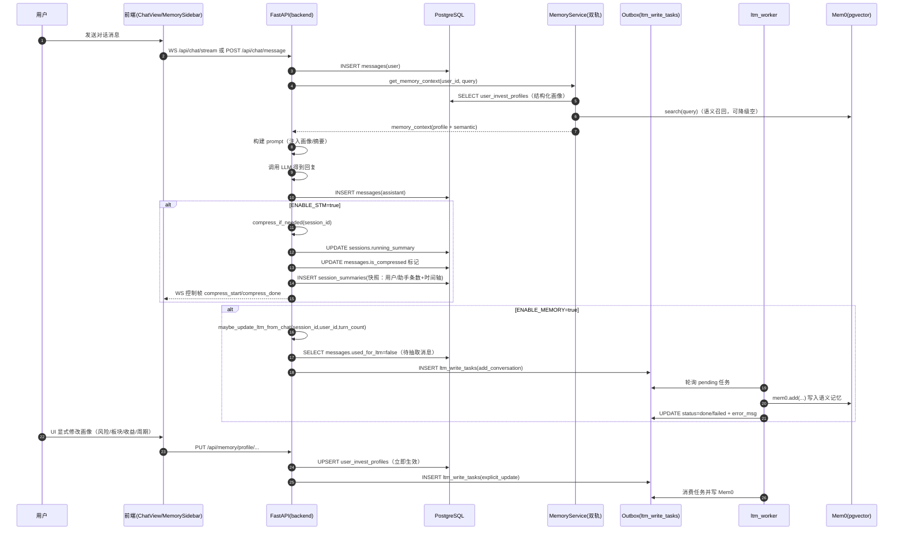

## Phase 2-3：STM（短期记忆）+ LTM（长期记忆）技术说明

> **适用范围**：Finance 智能投研助手（当前实现：Phase 2 STM + Phase 3 LTM）  
> **目标读者**：第一次接触“记忆系统 / LLM 工程”的同学（小白友好）  
> **阅读目标**：看完能回答三件事：**数据存哪、何时写入、如何被后续调用**；并能据此定位常见问题

---

### 1. 术语速查（每个专业名词一句话解释）

- **STM（Short-Term Memory，短期记忆）**：同一会话内把早期对话压缩成摘要，减少上下文长度，避免 token 超限。
- **LTM（Long-Term Memory，长期记忆）**：跨会话保存用户画像与偏好线索，用于后续对话/报告的个性化。
- **Feature Flag（功能开关）**：用环境变量控制功能启用/关闭，便于回滚、灰度和对比验证。
- **Outbox Pattern（发件箱模式）**：主链路只写“待处理任务”到数据库队列，后台 worker 异步执行，避免阻塞请求。
- **语义召回 / 向量检索**：把文本转成向量后做相似度搜索，用于从历史记忆里找与当前问题最相关的片段。
- **pgvector**：PostgreSQL 的向量扩展，用来存储/检索 embedding 向量（Mem0 的向量库后端）。
- **System Prompt（系统提示词）**：给模型的“最高优先级指令/上下文”，用于注入用户画像/摘要等信息。

---

### 2. 为什么要 STM + LTM 两套（从需求到设计）

你的系统里“记忆”分两层，各自解决不同问题：

- **STM 解决工程问题**：对话变长会导致上下文 token 膨胀，模型可能超限或忽略早期信息。  
  解决办法：把早期对话压缩为摘要（滚动更新），并保留最近几条原文。

- **LTM 解决产品问题**：用户偏好需要跨会话保存，让对话/报告能长期个性化。  
  解决办法：用“双轨制”存储长期记忆：
  - **结构化权威画像（确定性）**：PostgreSQL `user_invest_profiles`（UI 直接读写）
  - **语义增强层（可选）**：Mem0 + pgvector（偏好线索、语义检索）

小白类比：
- `user_invest_profiles` 像“设置面板”
- Mem0 像“系统从历史对话里学到的偏好痕迹”
- STM 像“本次聊天的笔记”

---

### 3. Feature Flags（功能开关）：如何打开/关闭

- **STM**：`ENABLE_STM=true/false`  
  开启后：对话压缩、摘要历史、流式压缩进度条生效
- **LTM**：`ENABLE_MEMORY=true/false`  
  开启后：画像注入、outbox、worker、Mem0 语义召回生效

后端在 `backend/config.py` 中读取（字段：`enable_stm`、`enable_memory`）。FastAPI 启动时在 `backend/main.py` 中根据 `enable_memory` 初始化 Mem0 并启动 `ltm_worker`。

---

### 4. STM（短期记忆）实现原理（Phase 2）

#### 4.1 STM 数据存哪？

STM 相关数据落在三处：

1) `sessions.running_summary`：当前会话滚动摘要（存在则前端显示提示条）  
2) `messages.is_compressed`：哪些消息已被折叠进摘要（原文不丢，只打标）  
3) `session_summaries`：摘要快照历史（用于“查看摘要历史”弹窗）

#### 4.2 STM 何时触发？

在 `backend/services/chat_service.py::compress_if_needed`：
- **触发条件**：某会话“未压缩消息数” ≥ 10（阈值 `_STM_COMPRESS_THRESHOLD`）

#### 4.3 STM 压缩做了哪些事？

一次压缩会做 3 件事：

- 更新 `sessions.running_summary` 与 `sessions.last_compress_at`
- 将本次压缩覆盖的消息打标：`messages.is_compressed=True`
- 插入一条 `session_summaries` 快照（含摘要文本 + 统计信息）

并且你实现了一个重要策略：
- **保留最近 4 条消息不压缩**（避免刚发生的信息马上被折叠，影响短期理解）

#### 4.4 前端如何呈现 STM？

在 `frontend/src/views/ChatView.vue`：
- 若 `running_summary` 存在 → 展示“已压缩早期对话历史…”提示条
- 点击“查看摘要历史” → 调 `GET /api/chat/sessions/{id}/summaries` 弹窗展示快照

在 WebSocket 流式模式（`frontend/src/composables/useChat.ts`）：
- 收到 `compress_start/compress_done/compress_skip` 控制帧 → 展示压缩进度条（百分比 + ETA）

---

### 5. LTM（长期记忆）实现原理（Phase 3）

LTM 采用“双轨制”：**结构化画像（权威）+ 语义记忆（增强）**，并通过 outbox 异步写入 Mem0，确保主链路不阻塞。

#### 5.1 结构化权威画像（PostgreSQL：`user_invest_profiles`）

用途：对话/报告注入的“确定性画像主干”，也是右侧画像卡片的唯一真相源。  
特点：写入立即生效、可解释、可视化容易。

写入来源（高→低优先级）：
- **UI 显式操作**：风险/板块/收益/周期/回答偏好
- **冷启动**：第一次提交偏好
- **对话显式纠正**：LLM `<action>` 或用户直接贴 JSON action

统一写入入口在 `Financial-MCP-Agent/src/memory/memory_service.py`：
- `MemoryService.update_profile_and_enqueue(...)`：  
  1) 立即 UPSERT `user_invest_profiles`  
  2) 同时向 outbox 写一条 `ltm_write_tasks(explicit_update)`，供 Mem0 异步同步

#### 5.2 语义增强层（Mem0 + pgvector）

用途：保存“偏好线索 / 对话推断 / 历史修正”等非结构化信息，支持语义检索召回。  
特点：异步、可降级（Mem0 不可用时主链路仍能跑）。

Mem0 初始化在 `Financial-MCP-Agent/src/memory/mem0_client.py`：
- 初始化失败会降级为 `NoopMem0Client`（所有方法返回空，不影响主链路）

#### 5.3 Outbox：`ltm_write_tasks`（异步写 Mem0 的核心）

Outbox（发件箱模式）的关键点：
- 主链路只负责 **把“要做什么”写入任务表**
- worker 后台负责 **真正执行 Mem0 写入**

典型 task_type：
- `explicit_update`：显式画像更新同步到 Mem0
- `add_conversation`：从对话抽取偏好线索（低优先级）
- `cold_start`：冷启动批量事实写入
- `explicit_delete`：删除某条记忆

#### 5.4 ltm_worker：后台任务如何落地 Mem0

FastAPI 启动时（`backend/main.py`）在 `ENABLE_MEMORY=true` 时：
1) 初始化 Mem0  
2) 启动 `ltm_worker_loop(...)`

`ltm_worker`（`Financial-MCP-Agent/src/memory/ltm_worker.py`）会循环：
- 轮询 pending 任务
- 按 task_type 调 `mem0_client.add/delete/...`
- 更新任务状态 pending → processing → done/failed（含重试与 error_msg）

---

### 6. LTM 如何被后续调用（读取链路）

#### 6.1 统一读取入口：`MemoryService.get_memory_context`

在 `Financial-MCP-Agent/src/memory/memory_service.py`：
- 并发读取：
  - `get_structured_profile`（结构化画像：`user_invest_profiles`）
  - `search_semantic`（Mem0 语义召回：Mem0 不可用时返回 []）
- 合并为：

```json
{
  "profile": { "...结构化字段..." },
  "semantic_memories": [ "...语义线索..." ]
}
```

#### 6.2 对话模式注入（FastAPI chat_service）

对话服务会把 `memory_context` 构造成 system prompt 段注入：  
画像只用于“语气/侧重点个性化”，不覆盖实时分析结论。

#### 6.3 报告模式注入（LangGraph 工作流）

在 `Financial-MCP-Agent/src/agents/memory_nodes.py`：
- `memory_read_node`：读取并写入 `state[\"data\"][\"memory_context\"]`
- `summary_agent`：按开关将 memory_context 注入最终汇总 prompt

---

### 7. STM → LTM 协同：触发节点与设计动机

对话模式里有一个关键协同点：**LTM 的“对话推断写入”会在“压缩轮次”更倾向触发**，因为此时摘要质量更高。

在 `backend/services/chat_service.py::maybe_update_ltm_from_chat`：
- 触发条件之一：`turn_count % 10 == 0`（压缩轮次）
- 入队时会把 `[对话摘要] {running_summary}` 插到 messages_for_ltm 最前面  
  → Mem0 抽取时优先看到“高密度摘要”，抽取更稳定

小白理解：
- STM 先把“这次聊天要点”写成摘要  
- LTM 再用这个摘要当高质量输入，把偏好线索写到长期记忆里

---

### 8. 时序图：STM→LTM 触发与数据流（Mermaid）



---

### 9. 示例：用最少步骤验证 STM 与 LTM 都在工作

#### 9.1 验证 STM（短期压缩）
1) 在对话模式连续聊到触发压缩（未压缩消息数达到 10）  
2) 前端出现“已压缩早期对话历史”提示条  
3) 点击“查看摘要历史”，看到快照里显示：  
   - “压缩了 X 条用户消息 + Y 条助手消息”  
   - 时间轴：开始 → 结束

#### 9.2 验证 LTM（结构化画像 + 语义层）
1) 在右侧画像卡片里更新板块/风险偏好  
2) 结构化画像立即生效（`GET /api/memory/profile` 返回变化）  
3) outbox 任务出现（`ltm_write_tasks` 新增 pending→done）  
4) 后续对话中日志出现“注入用户画像到对话上下文”
## Phase 2-3：STM（短期记忆）+ LTM（长期记忆）技术说明

> **适用范围**：Finance 智能投研助手（当前实现：Phase 2 STM + Phase 3 LTM）  
> **目标读者**：第一次接触“记忆系统 / LLM 工程”的同学（小白友好）  
> **阅读目标**：看完能回答三件事：**数据存哪、何时写入、如何被后续调用**；并能据此定位常见问题

---

### 1. 术语速查（每个专业名词一句话解释）

- **STM（Short-Term Memory，短期记忆）**：同一会话内把早期对话压缩成摘要，减少上下文长度，避免 token 超限。
- **LTM（Long-Term Memory，长期记忆）**：跨会话保存用户画像与偏好线索，用于后续对话/报告的个性化。
- **Feature Flag（功能开关）**：用环境变量控制功能启用/关闭，便于回滚、灰度和对比验证。
- **Outbox Pattern（发件箱模式）**：主链路只写“待处理任务”到数据库队列，后台 worker 异步执行，避免阻塞请求。
- **语义召回 / 向量检索**：把文本转成向量后做相似度搜索，用于从历史记忆里找与当前问题最相关的片段。
- **pgvector**：PostgreSQL 的向量扩展，用来存储/检索 embedding 向量（Mem0 的向量库后端）。
- **System Prompt（系统提示词）**：给模型的“最高优先级指令/上下文”，用于注入用户画像/摘要等信息。

---

### 2. 为什么要 STM + LTM 两套（从需求到设计）

你的系统里“记忆”分两层，各自解决不同问题：

- **STM 解决工程问题**：对话变长会导致上下文 token 膨胀，模型可能超限或忽略早期信息。  
  解决办法：把早期对话压缩为摘要（滚动更新），并保留最近几条原文。

- **LTM 解决产品问题**：用户偏好需要跨会话保存，让对话/报告能长期个性化。  
  解决办法：用“双轨制”存储长期记忆：
  - **结构化权威画像（确定性）**：PostgreSQL `user_invest_profiles`（UI 直接读写）
  - **语义增强层（可选）**：Mem0 + pgvector（偏好线索、语义检索）

小白类比：
- `user_invest_profiles` 像“设置面板”
- Mem0 像“系统从历史对话里学到的偏好痕迹”
- STM 像“本次聊天的笔记”

---

### 3. Feature Flags（功能开关）：如何打开/关闭

- **STM**：`ENABLE_STM=true/false`  
  开启后：对话压缩、摘要历史、流式压缩进度条生效
- **LTM**：`ENABLE_MEMORY=true/false`  
  开启后：画像注入、outbox、worker、Mem0 语义召回生效

后端在 `backend/config.py` 中读取（字段：`enable_stm`、`enable_memory`）。FastAPI 启动时在 `backend/main.py` 中根据 `enable_memory` 初始化 Mem0 并启动 `ltm_worker`。

---

### 4. STM（短期记忆）实现原理（Phase 2）

#### 4.1 STM 数据存哪？

STM 相关数据落在三处：

1) `sessions.running_summary`：当前会话滚动摘要（存在则前端显示提示条）  
2) `messages.is_compressed`：哪些消息已被折叠进摘要（原文不丢，只打标）  
3) `session_summaries`：摘要快照历史（用于“查看摘要历史”弹窗）

#### 4.2 STM 何时触发？

在 `backend/services/chat_service.py::compress_if_needed`：
- **触发条件**：某会话“未压缩消息数” ≥ 10（阈值 `_STM_COMPRESS_THRESHOLD`）

#### 4.3 STM 压缩做了哪些事？

一次压缩会做 3 件事：

- 更新 `sessions.running_summary` 与 `sessions.last_compress_at`
- 将本次压缩覆盖的消息打标：`messages.is_compressed=True`
- 插入一条 `session_summaries` 快照（含摘要文本 + 统计信息）

并且你实现了一个重要策略：
- **保留最近 4 条消息不压缩**（避免刚发生的信息马上被折叠，影响短期理解）

#### 4.4 前端如何呈现 STM？

在 `frontend/src/views/ChatView.vue`：
- 若 `running_summary` 存在 → 展示“已压缩早期对话历史…”提示条
- 点击“查看摘要历史” → 调 `GET /api/chat/sessions/{id}/summaries` 弹窗展示快照

在 WebSocket 流式模式（`frontend/src/composables/useChat.ts`）：
- 收到 `compress_start/compress_done/compress_skip` 控制帧 → 展示压缩进度条（百分比 + ETA）

---

### 5. LTM（长期记忆）实现原理（Phase 3）

LTM 采用“双轨制”：**结构化画像（权威）+ 语义记忆（增强）**，并通过 outbox 异步写入 Mem0，确保主链路不阻塞。

#### 5.1 结构化权威画像（PostgreSQL：`user_invest_profiles`）

用途：对话/报告注入的“确定性画像主干”，也是右侧画像卡片的唯一真相源。  
特点：写入立即生效、可解释、可视化容易。

写入来源（高→低优先级）：
- **UI 显式操作**：风险/板块/收益/周期/回答偏好
- **冷启动**：第一次提交偏好
- **对话显式纠正**：LLM `<action>` 或用户直接贴 JSON action

统一写入入口在 `Financial-MCP-Agent/src/memory/memory_service.py`：
- `MemoryService.update_profile_and_enqueue(...)`：  
  1) 立即 UPSERT `user_invest_profiles`  
  2) 同时向 outbox 写一条 `ltm_write_tasks(explicit_update)`，供 Mem0 异步同步

#### 5.2 语义增强层（Mem0 + pgvector）

用途：保存“偏好线索 / 对话推断 / 历史修正”等非结构化信息，支持语义检索召回。  
特点：异步、可降级（Mem0 不可用时主链路仍能跑）。

Mem0 初始化在 `Financial-MCP-Agent/src/memory/mem0_client.py`：
- 初始化失败会降级为 `NoopMem0Client`（所有方法返回空，不影响主链路）

#### 5.3 Outbox：`ltm_write_tasks`（异步写 Mem0 的核心）

Outbox（发件箱模式）的关键点：
- 主链路只负责 **把“要做什么”写入任务表**
- worker 后台负责 **真正执行 Mem0 写入**

典型 task_type：
- `explicit_update`：显式画像更新同步到 Mem0
- `add_conversation`：从对话抽取偏好线索（低优先级）
- `cold_start`：冷启动批量事实写入
- `explicit_delete`：删除某条记忆

#### 5.4 ltm_worker：后台任务如何落地 Mem0

FastAPI 启动时（`backend/main.py`）在 `ENABLE_MEMORY=true` 时：
1) 初始化 Mem0  
2) 启动 `ltm_worker_loop(...)`

`ltm_worker`（`Financial-MCP-Agent/src/memory/ltm_worker.py`）会循环：
- 轮询 pending 任务
- 按 task_type 调 `mem0_client.add/delete/...`
- 更新任务状态 pending → processing → done/failed（含重试与 error_msg）

---

### 6. LTM 如何被后续调用（读取链路）

#### 6.1 统一读取入口：`MemoryService.get_memory_context`

在 `Financial-MCP-Agent/src/memory/memory_service.py`：
- 并发读取：
  - `get_structured_profile`（结构化画像：`user_invest_profiles`）
  - `search_semantic`（Mem0 语义召回：Mem0 不可用时返回 []）
- 合并为：

```json
{
  "profile": { "...结构化字段..." },
  "semantic_memories": [ "...语义线索..." ]
}
```

#### 6.2 对话模式注入（FastAPI chat_service）

对话服务会把 `memory_context` 构造成 system prompt 段注入：  
画像只用于“语气/侧重点个性化”，不覆盖实时分析结论。

#### 6.3 报告模式注入（LangGraph 工作流）

在 `Financial-MCP-Agent/src/agents/memory_nodes.py`：
- `memory_read_node`：读取并写入 `state["data"]["memory_context"]`
- `summary_agent`：按开关将 memory_context 注入最终汇总 prompt

---

### 7. STM → LTM 协同：触发节点与设计动机

对话模式里有一个关键协同点：**LTM 的“对话推断写入”会在“压缩轮次”更倾向触发**，因为此时摘要质量更高。

在 `backend/services/chat_service.py::maybe_update_ltm_from_chat`：
- 触发条件之一：`turn_count % 10 == 0`（压缩轮次）
- 入队时会把 `[对话摘要] {running_summary}` 插到 messages_for_ltm 最前面  
  → Mem0 抽取时优先看到“高密度摘要”，抽取更稳定

小白理解：
- STM 先把“这次聊天要点”写成摘要  
- LTM 再用这个摘要当高质量输入，把偏好线索写到长期记忆里

---

### 8. 时序图：STM→LTM 触发与数据流（Mermaid）


---

### 9. 示例：用最少步骤验证 STM 与 LTM 都在工作

#### 9.1 验证 STM（短期压缩）
1) 在对话模式连续聊到触发压缩（未压缩消息数达到 10）  
2) 前端出现“已压缩早期对话历史”提示条  
3) 点击“查看摘要历史”，看到快照里显示：  
   - “压缩了 X 条用户消息 + Y 条助手消息”  
   - 时间轴：开始 → 结束

#### 9.2 验证 LTM（结构化画像 + 语义层）
1) 在右侧画像卡片里更新板块/风险偏好  
2) 结构化画像立即生效（`GET /api/memory/profile` 返回变化）  
3) outbox 任务出现（`ltm_write_tasks` 新增 pending→done）  
4) 后续对话中日志出现“注入用户画像到对话上下文”

