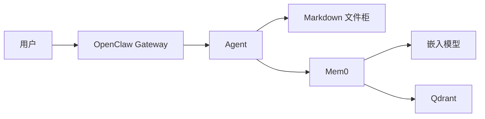
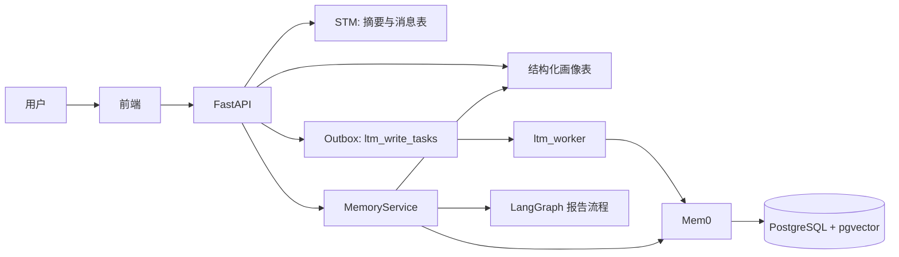

# OpenClaw 记忆实践 vs Finance 智能投研助手：小白友好对比报告

> **说明**：OpenClaw 部分依据公开分享与常见架构（原生 Markdown + Mem0 插件、Ollama + Qdrant 等）；Finance 部分依据本仓库已实现代码与《LTM-长期记忆技术说明》。  
> 若你后续调整了 OpenClaw 的配置，以你本地实际为准。

---

## 1. 一句话总结（先看这个）

| 维度 | OpenClaw（笔记里描述的做法） | 本项目 Finance |
|------|------------------------------|----------------|
| **整体感觉** | 「文件柜里的笔记」+「向量大脑」双轨，偏通用 Agent 脚手架 | 「业务数据库里的用户画像」+「向量补充层」，偏金融投研产品 |
| **“原生记忆”长什么样** | 主要是 `workspace/memory/*.md` 纯文本 | 主要是 PostgreSQL 表（如 `user_invest_profiles`）+ 会话摘要字段 |
| **向量层** | Mem0 + **Qdrant**，嵌入常用本地 **Ollama**（如 768 维） | Mem0 + **pgvector**（与业务库同栈），嵌入常用 **OpenAI 兼容接口**（默认 **1536** 维，可配） |
| **写入风格** | 强调 **autoCapture**「尽量不漏对话细节」 | 强调 **抽取后的长期事实** + **显式画像**，对话写入多配合摘要与任务队列，**不是**全量逐句原样入库 |

---

## 2. 用生活比喻理解两套系统

- **OpenClaw（笔记描述）**  
  - **Markdown**：像你在硬盘里写的「日记本 / 项目纪要」，人一眼能读完。  
  - **Mem0 + 向量库**：像「会联想的大脑」——你说过的碎片话变成向量，问的时候按**意思相近**找回来。

- **Finance 项目**  
  - **结构化画像表**：像 App 里的「个人资料与偏好设置」——风险等级、关注板块、自选股等，**以数据库为唯一权威**。  
  - **Mem0 + pgvector**：像「从聊天里整理出来的便签条」——补充一些**可检索的语义线索**，但设计上更克制，服务于投研个性化而不是完整聊天存档。  
  - **短期记忆（STM）**：像「本次聊天的活页笔记」——太长就**压缩成摘要**，省 token、保重点。

---

## 3. 对照表：五个常见关注点

### 3.1 从「手动记录」到「自动捕获」

| | OpenClaw | Finance |
|---|----------|---------|
| **痛点** | 纯 Markdown 时，要靠 Agent **自己判断**要不要写，容易丢细节 | 若只靠对话，画像容易散、难治理；若只靠模型「随手写文件」，金融场景下**合规与可控性**要求高 |
| **做法** | Mem0 侧可开 **autoCapture**，偏「多抓原始交互」 | 长期记忆以 **显式画像 + 抽取事实** 为主；对话进 Mem0 常走 **Outbox 异步任务**，并与 **STM 摘要**协同（摘要质量高时再推断偏好） |
| **小白理解** | 更像「**录音笔**」：尽量记下说过什么 | 更像「**客户经理档案**」：记下**稳定偏好**，少而准 |

### 3.2 检索：关键词 vs 语义

| | OpenClaw | Finance |
|---|----------|---------|
| **Markdown 路径** | 遍历多个 `.md`，偏字面筛选，记忆一多会慢 | 本项目**不以 Markdown 为主存**；权威检索走 **SQL 画像** |
| **向量路径** | 语义相似度（如余弦），**Qdrant** 索引 | 语义相似度，向量在 **PostgreSQL pgvector**，与业务数据同库 |
| **小白理解** | 「翻很多本笔记」vs「按意思联想」 | 「打开用户资料卡」+「联想相关便签」 |

### 3.3 性能：记忆变多会怎样？

笔记里常写向量检索「极快、O(1)」——对小白可以简单理解成：**比把所有文件从头到尾读一遍快得多**。严格来说，向量检索一般是**近似最近邻**（与索引类型、数据量有关），不是数学意义上的常数时间 O(1)。  

| | OpenClaw | Finance |
|---|----------|---------|
| **文件/Markdown 多** | 线性扫描成本上升 | 本项目不依赖扫一堆 md |
| **向量数据多** | Qdrant 负责索引检索 | pgvector 在 Postgres 内检索；同时还有 **结构化查询**分担 |

### 3.4 隐私与部署：本地 vs 混合

| | OpenClaw（笔记中的 Mem0 方案） | Finance |
|---|--------------------------------|---------|
| **典型部署** | Ollama + Qdrant **本机**，与云端对话模型**解耦** | Mem0 配置里 LLM/Embedder 可走 **OpenAI 兼容网关**；向量库为 **自建 Postgres/pgvector** |
| **小白理解** | 「记忆大脑」可以完全不出门 | 「画像在自家数据库」；是否调用外部嵌入/抽取模型由你的 **API Key 与 base_url** 决定，需自己评估合规 |

### 3.5 「双脑」是不是一回事？

| | OpenClaw | Finance |
|---|----------|---------|
| **第一脑** | Markdown：人类可读、放长期重要信息 | **PostgreSQL 画像**：产品级权威数据 + 前端可编辑 |
| **第二脑** | Mem0：碎片、海量交互、语义召回 | Mem0：语义增强；并且 **Mem0 不可用时整体降级**（`NoopMem0Client`），主流程仍可用画像 |

---

## 4. 数据流（简化版）

### 4.1 OpenClaw（根据分享整理）

### 4.2 Finance 项目（与代码一致）

---

## 5. 给你（小白）的选型启示：不用二选一，要看目标

1. **若目标是「通用助手 + 尽量留住每句聊天」**  
   OpenClaw 笔记里的 **Markdown + autoCapture Mem0** 很直观：易理解、易演示。

2. **若目标是「金融投研产品：画像可控、可审计、可关可开」**  
   Finance 这种 **DB 权威画像 + Mem0 增强 + STM 压缩 + 异步 Outbox** 更贴近工程与业务：**主链路不绑死 Mem0**，画像可单独演进。

3. **关于「O(1) / 极快」**  
   可以信「比全量扫文件快很多」，但不必死记 O(1)；真实延迟还与 **嵌入调用、库大小、索引参数** 有关。

---

## 6. 本报告涉及的仓库文件（想深挖可以看）

- `docs/LTM-长期记忆技术说明.md`：STM/LTM、Outbox、读写链路  
- `Financial-MCP-Agent/src/memory/memory_service.py`：双轨 `MemoryService`、合并 `get_memory_context`  
- `Financial-MCP-Agent/src/memory/mem0_client.py`：Mem0 配置（pgvector、嵌入维度等）  
- `Financial-MCP-Agent/src/agents/memory_nodes.py`：报告流程中的记忆读/写节点  
- `Financial-MCP-Agent/src/memory/ltm_worker.py`：异步写入 Mem0  

---

## 7. 修订记录

| 日期 | 说明 |
|------|------|
| 2026-03-20 | 初版：对照用户提供的 OpenClaw 笔记要点与当前 Finance 实现 |
