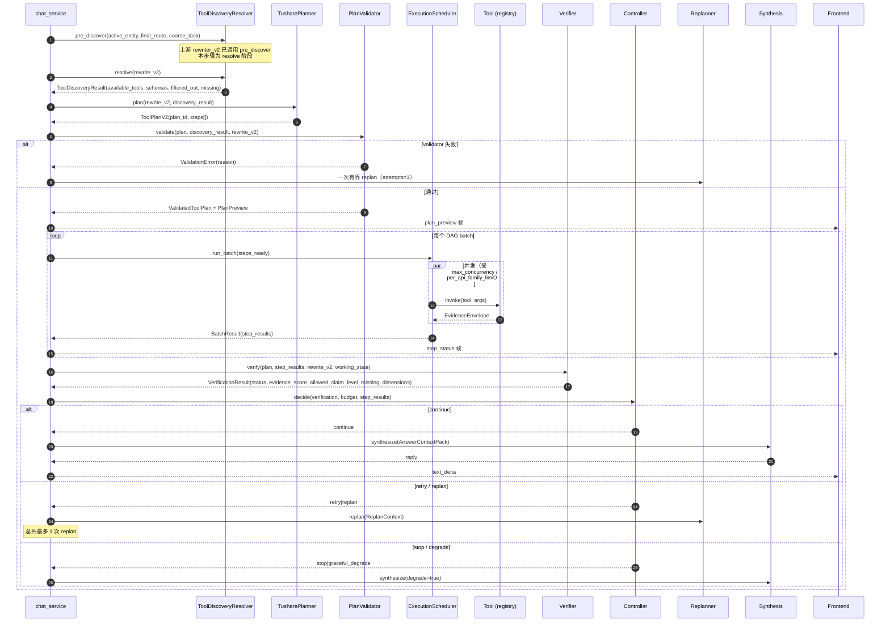

# 对话模式 Plan-and-Execute / Validator / Executor / Verifier / Controller / Replan / Synthesis 优化开发计划

> 本文是「对话模式三模块计划」的下游接续。
>
> 上游：`docs/开发计划/对话模式-实体解析-路由-改写-优化开发计划.md`（实体解析 v2 + 两阶段路由 + RewriteContextPacket + 两个窄抽取器 + working_state + 评测 harness）。本文假定上游 P0/P1/P2/P3 已经按既定边界落地，**所有依赖以上游 schema 为输入**。
>
> 范围：把 `tushare-data` 链路的剩余环节按 `docs/项目描述.md` Tushare 链路 13 个 Q&A + 可观测 + 评估章节的目标态收口，并把同一套 Plan-and-Execute / Verifier / Controller / Synthesis 边界推广到 `financial-sop` 与 `fallback`。
>
> 真源：`docs/项目描述.md`
> - Tushare 链路：3931–4124 行（Q&A 1–13）
> - 可观测：4126–4226 行（Q&A 1–17）
> - 评估环节：4228–4324 行（Q&A 1–10）
>
> 评审基线：`docs/项目描述-代码对齐审计.md` §3.3、§4.9、§4.8、§4.10。
>
> 输出路径：本文件本身。

---

## 1. 背景与目标

### 1.1 背景

上游计划完成后，`_run_skill_chat_if_enabled` 的形态已经是：

```
preflight(预算+压缩)
  → entity_resolver_v2(strict schema + 三段修复 + working_state)
  → router_v2(stage1 SOP shortlist+rerank → stage2 事实需求)
  → rewriter_v2(route-specific + RewriteContextPacket，不再产 tool_plan)
  → constraints / reply_preference extractors（并发）
  → ??? planner/executor/verifier/synthesis ???
```

后半段在仓库里现状是「相对薄」的：

- `rewrite_for_tushare` v1 之前直接产 `tool_plan`，v2 由上游计划改为 `TushareRewriteResultV2` 并通过 `adapt_rewrite_v2_to_tool_plan` 兜底（`Financial-MCP-Agent/src/agents/tushare_plan_executor.py:55-88`）。**没有独立 planner**。
- `_validate_plan` 仅做工具白名单 + DAG 检查（`tushare_plan_executor.py:90-117`、`Financial-MCP-Agent/src/agents/query_rewriter.py:487-517`）。**没有业务语义/计划质量校验**。
- `_topological_order` + 串行循环执行（`tushare_plan_executor.py:120-264`）。**没有 DAG 分层并发、没有 fingerprint 去重、没有 retry/timeout 预算**。
- replan 只是「把上一轮错误信息塞进新 prompt 再让 rewriter 出一份 plan」（`tushare_plan_executor.py:307-321`），`max_replans=2`。**不是按 verifier 输出做有界补证**。
- `skill_evidence.py` 在 SOP 链路里做 `tier / allowed_claim_level`，且默认弱化（审计 §4.8）；Tushare 链路只在 `_executor_trace_payload` 里粗暴构造 `accepted_evidences=success tools`、`evidence_ok=bool(success)`，没有真正 verifier（`tushare_plan_executor.py:163-208`）。
- `summarize_tushare_reply` 直接把整份 `tool_data` 塞进 prompt（`backend/services/chat_service.py:1043-1093`），**没有 `executed plan summary / accepted vs rejected / allowed_claim_level` 的结构化注入**。
- 工具是规则注册 `get_tushare_toolkit()`，但 `ExecutableToolSpec` 字段不齐（`api_family / freshness_tier / planner_visible / read_only / output_schema` 没标），也没有 `TushareCapabilityIndex`（`vendor/tushare-skills/` 在仓库中不存在）。
- Skill 路径有 `skill_executor_node._execute_financial_sop_skill`，但同样未走「planner → validator → executor → verifier → controller → synthesis」六段式。

### 1.2 目标

把代码补齐到 `docs/项目描述.md` Tushare 链路 13 个 Q&A 描述的目标态，并把同样的 Plan-and-Execute 框架推广到 `financial-sop`：

1. **Tushare planner** 与 rewrite 完全解耦，独立模块；只在 `ToolDiscoveryResult.available_tools` 内规划，输出含 `plan_id / objective / time_scope / steps[step_id, goal, tool_name, arguments, depends_on, expected_observation, required, evidence_type]` 的结构化 plan。
2. **Plan validator** 四类校验：工具治理 + 结构 + 业务语义 + 计划质量。
3. **Plan preview**：validator 通过后生成 user-facing 步骤列表，前端在执行前回显；执行过程中按 step 推送 `planned/running/succeeded/failed/replanned/skipped`。
4. **Tool registry v2**：每个 Tushare 工具注册 `ExecutableToolSpec`（`namespace / api_family / supported_entity_types / input_schema / output_schema / evidence_type / source_api / freshness_tier / is_primary_evidence / read_only / planner_visible / can_retry / rate_limit_group / timeout_ms / retry_policy`）。
5. **TushareCapabilityIndex（轻量版）**：本计划不强行引入 `vendor/tushare-skills/`，而是把已有 `chat_tushare_tools.py` 内部的隐式知识（`_MARKET_TOOLS / _FUND_CANDIDATE_TOOLS / _TOOL_EVIDENCE_TYPES` 等）抽成 `capability_index.py` 的显式 `TushareCapability` 列表。Vendor bundle 留作 P3+ 扩展点（带 stop condition，不在本计划内做）。
6. **ToolDiscoveryResolver**：两阶段 discovery（pre-discovery 给 rewrite，resolve 给 planner），支持 `missing_capability_signal` 受限扩展。
7. **DAG 执行器** `ExecutionScheduler`：拓扑分层并发；全局 `max_concurrency=6`、`per_api_family_limit`、`min_interval_ms`；fingerprint 去重；step 级 retry；evidence envelope 统一返回；按 step 实时推送状态。
8. **Verifier**：硬门禁（schema / 主语 / required 全缺）+ 100 分制 `evidence_score`（一致性 25 / freshness 20 / 维度 25 / 角色 15 / 质量 15）→ `status ∈ {sufficient, partial, insufficient}` + `allowed_claim_level ∈ {advisory, analytical, descriptive, refuse}` + `missing_dimensions / retryable_steps / suggested_next_action`。Tushare 链路只有这一个外部证据验收出口；旧 `skill_evidence.py` 作为 verifier 内部组件复用，不再作为平行裁判。
9. **Controller**：消费 verifier + budget + step 状态，决定 `continue / retry / replan / stop / graceful_degrade`；**`max_replans=1`**（与项目描述对齐）。
10. **Replanner**：有界补证，输入结构化 `ReplanContext`（`completed_steps / failed_steps / accepted_evidences / missing_dimensions / budget_remaining / action_fingerprints`），不重做整轮计划，不读用户原话以外的旧 prompt 错误串。
11. **Synthesis**：消费结构化 `AnswerContextPack`（`user_intent + executed_plan_summary + accepted_evidences + rejected_evidences + missing_dimensions + allowed_claim_level + constraints + reply_preference_hint`），按 `allowed_claim_level` 强制约束，不再把 `tool_data` 整包丢进 prompt。
12. **可观测**：每个阶段补齐项目描述要求的 span 字段（`trace_id / discovery_trace_id / plan_id / step_id / tool_call_id / evidence_id` 全串）；本地 `skill_trace` 是真源，Langfuse 可选导出，敏感字段脱敏。
13. **离线评测 harness 扩展**：补 `planner / executor / verifier / synthesis` 评测集，与上游 entity/route/rewrite 同一 runner；planner 评测覆盖 75 + 45 = 120 条 × 3 次 = 360 份计划；新增 `false_reject_rate / planned_evidence_coverage / overclaim_rate / latency p50/p95` 指标；executor 60 条并发对照用例。
14. **SOP 链路**：复用同一 planner/validator/executor/verifier/controller/synthesis 骨架，把现有 `skill_spec.yaml` 的 `tool_plan_steps / required_evidence` 适配进去；保留确定性 planner（deterministic skill），但在 validator 与 executor 上对齐。

### 1.3 非目标（本计划不做）

- 不引入 `vendor/tushare-skills/` bundle 与 `TushareCapabilityIndexer` 文件扫描器；只用「已注册工具元数据 + 简化 capability table」覆盖目标。Vendor bundle 的接入留作独立计划（带 P3+ stop condition）。
- 不重写 Tushare 底层 client 与 `chat_tushare_tools.py` 的 RPC 逻辑；只在外层包 `ExecutableToolSpec`、统一 envelope。
- 不在本计划落地 Langfuse 商业版接入；保留 exporter 接口与脱敏字段，依赖现有 `skill_trace`。
- 不动报告模式的 `Financial-MCP-Agent/src/agents/skill_executor_node.py` 主入口；仅在 SOP 路径上接入 verifier/controller 收口（保留兼容）。
- 不重做长期记忆候选池 / Deep 晋升（独立计划）。
- 不重写前端 UI 样式；仅追加 `plan_preview` 流式帧、`step_status` 推送、`allowed_claim_level / missing_dimensions` 展示。

### 1.4 必须保持不变的行为

| 类别 | 行为 |
|------|------|
| 流式协议 | 上游已新增的 `entity_resolution / route_stage1/2 / skill_confirm` 字段不变；新增 `plan_preview / step_status / verification_summary` 走可选字段 |
| 用户显式 SOP | 仍直接进入对应 Skill，绕过 router stage1；本计划只追加 planner/validator/executor 兼容路径 |
| Tushare 工具调用语义 | 现有 `chat_tushare_tools.py` 输出已含 `evidence_id / evidence_type / symbol / source_api / trade_date`，不删除任何字段；新增由 wrapper 补 `ok / data_time / cache_hit / retry_count / fetch_ts` 等 |
| 报告模式 | 仅复用 Verifier / Synthesis 共用组件；报告 chain 入口不接入新 controller/replan |
| HITL `skill_confirm` | 不改 schema；新增 `plan_confirm`（可选）走独立帧 |
| 数据库 | `messages.route_summary_json` 不破坏现有写入；新增 `messages.plan_artifact_json`、`messages.verification_json` 可选列 |
| 现有 Tushare 集成 smoke 测试 | 必须全绿 |

### 1.5 验收标准（顶层）

1. `route=tushare-data` 时主链路调用 `TusharePlanner → PlanValidator → ExecutionScheduler → Verifier → Controller → (Replanner≤1) → Synthesis`，trace 包含完整 ID 链 `trace_id → discovery_trace_id → plan_id → step_id → tool_call_id → evidence_id`。
2. `route=financial-sop` 时复用同一骨架（deterministic planner + 同一 validator/executor/verifier/controller/synthesis）。
3. Verifier 输出受控 `allowed_claim_level`，synthesis 在 `descriptive` 时不会写出强因果（CI assert + 离线 eval）。
4. `max_replans=1`；连续重复 fingerprint 立刻 stop/degrade。
5. 并发收益评测：`max_concurrency=6 vs serial`，executor p50 改善 ≥ 30%（同一批 60 条 plan）；同时 429/timeout/时间戳不一致 case 不上升。
6. 现有报告模式、`backend/test_chat_service_skill_processing.py`、`Financial-MCP-Agent/src/skills/tests/test_financial_sop_skills_p1.py` 100% 通过。
7. CI smoke set 加入 `planner / executor / verifier / synthesis` ≤ 4 分钟。

---

## 2. 项目描述对齐（真源摘录）

> 仅引用 `docs/项目描述.md` 中本计划必须对齐的目标行为。

### 2.1 Plan-and-Execute（3931–3940 行）

- `tushare-data` 是 **workflow-style Plan-and-Execute 单 Agent 运行时**，不是 ReAct 无限循环。
- 共享 `active_entity / tool registry / trace / 运行时预算`。
- planner 输入：`effective_query + active_entity + data_requirements + time_scope + candidate_tool_hints + constraints`。
- plan 输出：`plan_id / objective / entity / time_scope / steps[step_id, goal, tool_name, arguments, depends_on, expected_observation, required, evidence_type]`。

### 2.2 工具发现三层（4015–4039 行）

1. capability index（vendor skill 知识源）→ 本计划**轻量化为内部 capability table**。
2. executable tool registry（带 `ExecutableToolSpec`）。
3. planner-visible shortlist：rewrite 前 pre_discover + rewrite 后 resolve；冲突时 **以 `ToolDiscoveryResult.available_tools` 为准**。
4. discovery resolver 输出 artifact：`available_tools / tool_schemas / selection_reason / filtered_out_tools / missing_capabilities / reference_refs / discovery_trace_id`。

### 2.3 Plan validator 四类校验（4042–4053 行）

工具治理 → 结构 → 业务语义 → 计划质量。

### 2.4 Plan preview（4055–4058 行）

只有 validator 通过的计划才推送给前端；按 step 推 `planned / running / succeeded / failed / replanned / skipped`。

### 2.5 DAG 执行 + 限流（4060–4079 行）

- 拓扑分层并发：依赖严格串行，独立步骤并发。
- 阈值：`max_concurrency`（默认 6）、`per_api_family_limit`（1–2）、`min_interval_ms`（100–300ms）。
- 共享 evidence envelope：`ok / source / source_api / evidence_type / symbol / trade_date / data_time / payload / error / cache_hit / retry_count / fetch_ts`。
- 部分失败：required → retry → backup → 有界 replan → degrade；optional → 不阻塞。

### 2.6 Action fingerprint（4081–4082 行）

三层去重：planner 计划级 + executor 本轮级 + client 短 TTL 缓存。fingerprint = `tool_name + 规范化 arguments`。

### 2.7 预算（4087 行）

`tool_timeout / per_tool_retry_limit / max_steps / total_timeout / max_replans=1`。

### 2.8 Verifier 五组指标 + 100 分制（4091–4101 行）

- 主语一致性 25
- 时间 freshness 20
- 维度覆盖 25
- 证据角色 15
- 数据质量 15
- 硬门禁：schema 不过 / 主语冲突 / required 全缺 → `reject / degrade`。
- 阈值：`>=80 sufficient` → analytical；`60-79 partial` → descriptive + missing；`<60 insufficient` → refuse/clarify。

### 2.9 Controller（4103 行）

`continue / retry / replan / stop / graceful_degrade`，由 `VerificationResult + budget + StepResult.error_type + action_fingerprint` 决定。

### 2.10 Replanner（4104–4113 行）

只在「原计划假设失效」或「证据维度可补」时触发；timeout/429/5xx 优先 retry；连续重复 fingerprint 或连续多轮无新增 evidence → stop/degrade。**`max_replans=1`**。

### 2.11 Synthesis 输入包（4117–4123 行）

四块：用户意图 + executed plan summary + verifier 证据包 + 必要数据摘要；强制只能基于 `accepted_evidences`，`allowed_claim_level` 控制结论强度。

### 2.12 可观测必备字段（4146–4170 行）

各 span 字段：route / memory / rewrite / planner / validator / executor / tool / verifier / synthesis；ID 链 `trace_id → discovery_trace_id → plan_id → step_id → tool_call_id → evidence_id`；artifact 化大对象；脱敏边界。

### 2.13 评估口径（4252–4280 行）

- planner 6 指标：`tool_discovery_recall@k / available_tool_compliance / tool_selection_f1 / tool_input_accuracy / plan_valid_rate / planned_evidence_coverage`。
- validator：`false_reject_rate ≈ 1–2%`。
- executor：`tool_success_rate >98%`、并发 p50 改善口径。
- verifier：`contract_pass_rate / evidence_acceptance_precision / required_evidence_coverage / freshness_pass_rate / entity_consistency_rate / overclaim_rate`。

---

## 3. 当前实现现状（带 file:line 引用）

| 维度 | 现状 | 引用 |
|------|------|------|
| 独立 planner | **无**：rewrite 直接产 `tool_plan` 或 v2 经 `adapt_rewrite_v2_to_tool_plan` 映射 | `Financial-MCP-Agent/src/agents/tushare_plan_executor.py:55-88`；`query_rewriter.py:66-69, 849-920` |
| Plan validator 工具治理 | 已有（白名单 + DAG） | `tushare_plan_executor.py:90-117`；`query_rewriter.py:487-517` |
| Plan validator 结构校验 | 仅 DAG + tool name；**无空计划 / 自依赖 / 参数 schema** 校验 | 同上 |
| Plan validator 业务语义 | **无** | — |
| Plan validator 计划质量 | **无** | — |
| ExecutableToolSpec | 不存在；工具仅以 LangChain `@tool` 注册；`evidence_type` 在结果里硬编码 | `Financial-MCP-Agent/src/tools/chat_tushare_tools.py:54-77, 1032+` |
| Capability index | 不存在；vendor bundle 不在仓库 | — |
| Tool discovery resolver | 不存在；planner（其实是 rewrite）直接从 `_tushare_allowed_tool_names()` 全集合选 | `query_rewriter.py:483-485` |
| 执行模式 | 拓扑顺序 + **串行** | `tushare_plan_executor.py:120-264` |
| 并发 / per_api_family_limit / min_interval | **无** | — |
| Action fingerprint 去重 | **无** | — |
| 预算（timeout/retry/max_steps/total_timeout/max_replans） | 仅 `max_replans=2`（默认 2），其余无 | `tushare_plan_executor.py:221` |
| Step 实时状态推送 | **无**，只有最终 `executor_trace` | `tushare_plan_executor.py:267-280` |
| Plan preview（前端） | **无** | — |
| Verifier | 仅 `_executor_trace_payload` 简单统计；`accepted_evidences = success tool names`；`evidence_ok = bool(success)` | `tushare_plan_executor.py:163-208` |
| `skill_evidence.py` | SOP 链路有 tier / allowed_claim_level，**严格模式默认关闭**；只看消息流里 ToolMessage | `Financial-MCP-Agent/src/agents/skill_evidence.py:178-280`；审计 §4.8 |
| Controller | **无**；只有 executor 内部 `try/except + replan` | `tushare_plan_executor.py:281-321` |
| Replanner | **不结构化**：把错误字符串拼回 user message 再调 `rewrite_for_tushare` | `tushare_plan_executor.py:307-321` |
| Synthesis 输入 | 直接序列化整个 `tool_data` 灌入 prompt | `backend/services/chat_service.py:1043-1093` |
| Trace ID 链 | `trace_id / skill_trace_context` 有；`discovery_trace_id / plan_id` **无**；`tool_call_id` 仅作为 span name `tushare_tool_call`，无独立 ID 字段 | `tushare_plan_executor.py:246-263` |
| Evidence envelope | `chat_tushare_tools.py` 已返回部分字段；缺 `data_time / cache_hit / retry_count / fetch_ts / api_family / ok 显式标记` 的统一化 | `Financial-MCP-Agent/src/tools/chat_tushare_tools.py:648-680` |
| 评测 harness | 仅有上游计划新建的 entity/route/rewrite；planner/executor/verifier/synthesis **未覆盖** | `tests/evals/`（上游已建骨架） |

**总结：六段式后半段（planner/validator/executor/verifier/controller/replan/synthesis）几乎全部需要新建或重构。**

---

## 4. 变更面分析

| 层 | 受影响 | 不受影响 |
|----|--------|----------|
| Agent runtime | 新建 `planner/`、`tool_discovery/`、`executor/`、`verifier/`、`controller/`、`replanner/`、`synthesis/`；重构 `tushare_plan_executor.py` 为 thin wrapper（保留入口） | `entity_resolver_v2 / router_v2 / rewriter_v2 / extractors`（上游） |
| Tools | `chat_tushare_tools.py` 包一层 `ExecutableToolSpec`；新建 `executable_registry.py` 与 `capability_index.py` | 底层 RPC client、Tushare token、缓存配置 |
| Skills | `skill_executor_node._execute_financial_sop_skill` 切换为「确定性 planner + 同一 validator/executor/verifier/controller/synthesis」 | `skill_registry / SKILL.md` 解析、各 `skill_spec.yaml` 内容 |
| Backend services | `chat_service`：替换 `execute_tushare_plan` 调用 + 重构 `summarize_tushare_reply / summarize_sop_reply`；新增 plan preview / step status 流式帧 | preflight、entity v2、route v2、extractors |
| Schemas | `backend/schemas/chat.py` 新增 `PlanPreviewFrame / StepStatusFrame / VerificationSummaryFrame` 可选字段 | 现有 `text_delta / route_summary / skill_confirm` |
| Database | `messages.plan_artifact_json (JSON, nullable)` / `messages.verification_json (JSON, nullable)`；`migrations/007_plan_verification_artifacts.sql` | `sessions.working_state`（上游）、`running_summary_state` |
| Frontend | `useChat.ts` 解析新帧；`components/chat/PlanPreviewCard.vue`（新）、`components/chat/StepStatusList.vue`（新）；现有 `SkillConfirmCard.vue` 不动 | 现有路由、记忆侧栏、报告页 |
| Config | 新 flag：`enable_planner_v2 / enable_validator_v2 / enable_executor_v2 / enable_verifier_v2 / enable_controller_v2 / executor_max_concurrency / executor_per_api_family_limit / executor_min_interval_ms / max_replans / per_tool_retry_limit / per_tool_timeout_ms / total_timeout_ms` | 上游 flag |
| Tests / Eval | `tests/evals/planner/`、`executor/`、`verifier/`、`synthesis/`；扩 runner | 上游 entity/route/rewrite |
| Trace | `skill_trace` 新增 span：`planner.plan / validator.plan_validate / executor.tool_batch / executor.tool_call / verifier.evidence_check / controller.decision / replanner.replan / synthesis.final_reply` | `entity_resolution_v2 / route_stage1 / route_stage2 / rewrite_v2`（上游已加） |

---

## 5. 差距与风险

### 5.1 差距矩阵

| 能力 | 项目描述 | 现状 | 分类 |
|------|---------|------|------|
| Tushare planner 独立模块 | 必需 | 无（融合在 rewrite） | 新增 |
| ExecutableToolSpec | 完整 | 部分（evidence_type 硬编码）| 局部重构 |
| Capability index | vendor skill 来源 | 无 | **本计划：轻量内部 capability table（不引 vendor）** |
| Tool discovery 两阶段 | 必需 | 无 | 新增 |
| Plan validator 四类 | 必需 | 仅工具治理 + DAG | 局部重构 + 新增 |
| Plan preview | 必需 | 无 | 新增 |
| DAG 分层并发 + 限流 | 必需 | 串行 | 新增 |
| Action fingerprint 去重 | 必需 | 无 | 新增 |
| 预算（5 类） | 必需 | 仅 max_replans=2 | 新增 |
| Step 实时推送 | 必需 | 无 | 新增 |
| Verifier 100 分制 + 五组指标 | 必需 | 简单 success 统计 | 新增（复用 skill_evidence 组件） |
| Controller 五动作 | 必需 | 无 | 新增 |
| Replanner 结构化输入 | 必需 | 拼错误字符串 | 局部重构 |
| Synthesis 结构化输入包 | 必需 | 灌整份 tool_data | 局部重构 |
| 完整 ID 链 trace | 必需 | 仅 trace_id + span name | 局部重构 |
| Eval harness 后半段 | 必需 | 无 | 新增 |
| SOP 链路同骨架 | 必需 | 单独走 skill_executor_node | 局部重构 |

### 5.2 风险

| 风险 | 概率 | 影响 | 缓解 |
|------|------|------|------|
| 并发引入 Tushare 频控 | 中 | 中 | `per_api_family_limit=1~2` + `min_interval_ms` + retry policy；smoke 集小并发跑通后再放大 |
| 严格 verifier 把现有「能用」回答判 partial 导致用户体感变差 | 中 | 高 | 阈值（80/60）灰度可调；feature flag 控制是否对外暴露 `missing_dimensions` 文本；先 trace 内部 shadow 评测 1 周再开 |
| 计划质量校验过严，validator false_reject 升高 | 中 | 中 | `false_reject_rate ≤2%` 作为 CI 门禁；超过阈值自动回退到 v1 validator |
| `ExecutableToolSpec` 全量改动 chat_tushare_tools.py 影响现有 smoke | 高 | 高 | 用 **wrapper 注册**：保留原 `@tool` 函数不动，在外层 `executable_registry.py` 调用 `register(tool_obj, spec=ExecutableToolSpec(...))`，spec 数据驱动 |
| SOP 链路改造影响 skill_executor_node 现有路径 | 中 | 高 | 新建 `skill_runner_v2.py` 平行路径，flag 切换；旧 `_execute_financial_sop_skill` 在 v2 默认关闭时保持调用 |
| Synthesis 强约束导致回答更短 / 更冷 | 中 | 中 | Prompt 内同时给 `accepted_evidences / reply_preference_hint`，允许语气和篇幅按 preference 控制；只对「越权强因果」做硬约束 |
| Trace artifact 体积增长 | 中 | 低 | `plan_artifact / verification_json` 直接落库；evidence payload 摘要化（限制单字段长度） |
| 评测数据集需要工具 snapshot 才能回放（外部 API 变化） | 中 | 中 | 评测分两态：`record_mode=true` 录工具结果 → 写入 `tests/evals/_fixtures/`；`replay_mode=true` 在 CI 跑；smoke set 同时支持 mock |
| 与上游 entity/route/rewrite 在 trace 字段冲突 | 低 | 中 | 统一 `skill_trace` schema 在上游计划已定；本计划只追加 span，不改既有字段 |
| `max_replans=1` 对真实 bad case 太严 | 中 | 中 | 默认 1，与文档对齐；预留 `max_replans_per_session=2` 兜底位（关闭状态）作为后续调优 |

---

## 6. 本地优秀 Agent 实践参考

> 沿用上游计划的本地参考表，补强 Plan-and-Execute 相关条目。

| 借鉴点 | 路径 | 落到本项目 |
|--------|------|------------|
| Hermes 工具 registry：AST 自注册 + spec snapshot + 线程安全 | `hermes-agent/tools/registry.py:56-213` | `executable_registry.py` 的注册模式 + 原子 snapshot |
| Hermes agent loop 限制：`max_tool_calls / max_iterations / timeout` | `hermes-agent/website/docs/developer-guide/agent-loop.md:61-79` | Controller `budget` 字段；executor 预算 |
| Hermes batch processing JSONL trace | `hermes-agent/website/docs/developer-guide/trajectory-format.md:24-60` | `plan_artifact_json` 字段结构参考 |
| OpenClaw discovery snapshot：plugin manifest registry + 缓存原子替换 | `openclaw/src/plugins/manifest-registry.ts:16-80` | `capability_index.py` 缓存 + version hash |
| OpenClaw agent loop：按 queue / concurrency / timeout 治理 | `openclaw/docs/AGENTS.md` 相关 | ExecutionScheduler 限流策略 |
| traveling-agent 子任务并行：按 priority 分批 `asyncio.gather` | `traveling-agent/agents/orchestration_agent.py:106-136` | DAG 分层并发实现参考 |
| cc-haha 工具 `defer_loading` + ToolSearch | `cc-haha/src/utils/toolSearch.ts:155-197` | Capability shortlist：planner 只看必要 schema |
| traveling-agent QA 评测脚本 | `traveling-agent/tests/test_cli_qa.py:36-48` | bad case 报告格式 |

---

## 7. 外部开源与官方实践参考

| 来源 | 关键文件 / 思路 | 迁移点 |
|------|----------------|--------|
| LangGraph **Plan-and-Execute** 官方示例 | `langgraph` 仓库 `examples/plan-and-execute/plan_and_execute.ipynb`（PlanExecute state、`Plan` Pydantic、`replan_step` 节点）| 本项目 planner / replanner schema 参考；但不用 LangGraph 拓扑，沿用现有 `chat_service` 调用顺序 |
| OpenAI Agents SDK **structured outputs + tool use** | `openai/openai-python` 仓库 `responses.create(..., response_format=PlanSchema)` 文档示例 | Planner 走 strict JSON schema 输出 |
| Anthropic **tool use loop**（Claude 3.5）官方示例 | `anthropic-cookbook/tool_use/` 多步工具循环 + `tool_result` envelope | Executor evidence envelope 形态 |
| Microsoft **AutoGen** GroupChat / Plan validator | `autogen/agentchat/contrib/` 计划评审器 | Plan validator 「质量校验」参考 |
| **MCP** 协议 `tool.outputSchema` 与 `tool.inputSchema` 收敛 | `modelcontextprotocol` 规范 | ExecutableToolSpec 字段 |
| **LangSmith Evals** `dataset run + evaluator` + 字段级 score | `langchain-ai/langsmith-cookbook` `evaluation/` 目录 | Verifier / synthesis 评测打分 |
| **Promptfoo** F1 + JSON 校验 | `promptfoo/examples/eval-f-score` | planner / verifier eval YAML 入口 |
| Pydantic AI `output_retries / ModelRetry` | 上游计划已用 | planner / replanner 自动重试 |

外部参考用来回答具体「怎么实现」，不替代 `docs/项目描述.md` 的目标边界。

---

## 8. 实现策略选择

每个能力只选一项，写明原因：

| 能力 | 策略 | 原因 |
|------|------|------|
| Tushare planner | **新增** | 现有 rewrite 兼任 planner，无法在不破坏上游 v2 schema 的前提下扩展四类校验和 plan_id 等字段 |
| Capability index | **新增（轻量内部）** | vendor bundle 不在仓库；强行引入不在本计划范围；内部 capability table 可承载本计划目标，未来再换为 vendor index |
| Executable registry | **局部重构** | 现有 `@tool` 注册不动，在外层加 `executable_registry.register(spec=...)` 表，避免 chat_tushare_tools.py 大改 |
| Tool discovery resolver | **新增** | 无现成模块，且要承担 pre_discover + resolve + missing_capability_signal 三件事 |
| Plan validator 工具治理/结构 | **复用 + 扩展** | 现有 `_validate_plan` 可扩展为四类；保留旧调用路径作 v1 fallback |
| Plan validator 业务语义/质量 | **新增** | 现有完全没有 |
| ExecutionScheduler | **新增** | 现有串行 `for` 循环无法在不破坏 trace span 上层结构的前提下扩出 DAG 分层 + 限流 |
| Action fingerprint | **新增** | 无现成；放在 executor 入口 |
| Verifier | **新增（聚合复用）** | `skill_evidence.py` 作为「证据收集组件」复用，但 100 分制评分、`allowed_claim_level` 决策由新 verifier 模块统一产出；旧组件不再作为平行裁判 |
| Controller | **新增** | 现有 try/except 不是 decision table |
| Replanner | **局部重构** | 复用 `rewrite_for_tushare` 接口但只接收 `ReplanContext` 结构化输入；不再拼用户原话 + 错误串 |
| Synthesis | **局部重构** | 保留 `summarize_*_reply` 函数名（向后兼容），但内部改为消费 `AnswerContextPack` |
| SOP 链路接入同骨架 | **新增 + 局部重构** | 新增 `skill_runner_v2.py`；保留 `_execute_financial_sop_skill` 旧路径 |
| Vendor `tushare-skills/` 接入 | **延期** | 不在本计划范围，需要单独评估 vendor 维护策略 |
| 报告模式接入 controller/replan | **延期** | 报告模式独立计划；本计划仅共用 Verifier/Synthesis 组件 |

---

## 9. 目标架构与实现方案

### 9.1 端到端时序



### 9.2 新建模块（与目录布局）

```
Financial-MCP-Agent/src/agents/
├── structured_io.py                     # 上游已建
├── entity_resolver_v2.py                # 上游
├── router.py / route_stage1.py / ...    # 上游
├── rewrite_context.py / query_rewriter.py(v2)  # 上游
├── constraints_extractor.py / reply_preference_extractor.py  # 上游
├── planner/
│   ├── __init__.py
│   ├── tushare_planner.py               # 新：strict schema planner
│   ├── sop_planner.py                   # 新：deterministic skill planner（包装现有 skill_spec_planner）
│   ├── plan_validator.py                # 新：四类校验
│   └── plan_preview.py                  # 新：user-facing
├── tool_discovery/
│   ├── __init__.py
│   ├── capability_index.py              # 新：轻量内部 capability table
│   ├── executable_registry.py           # 新：ExecutableToolSpec 表
│   └── discovery_resolver.py            # 新：pre_discover + resolve
├── executor/
│   ├── __init__.py
│   ├── execution_scheduler.py           # 新：DAG batch + 限流 + fingerprint
│   ├── evidence_envelope.py             # 新：envelope 标准化
│   └── budget.py                        # 新：timeout/retry/max_steps
├── verifier/
│   ├── __init__.py
│   ├── evidence_verifier.py             # 新：硬门禁 + 100 分制
│   └── scoring.py                       # 新：五组指标计算
├── controller/
│   ├── __init__.py
│   └── runtime_controller.py            # 新：5 动作决策表
├── replanner/
│   ├── __init__.py
│   └── tushare_replanner.py             # 新：ReplanContext 输入
├── synthesis/
│   ├── __init__.py
│   ├── answer_context_pack.py           # 新：输入结构
│   ├── synthesize_tushare.py            # 新：替换 summarize_tushare_reply
│   ├── synthesize_sop.py                # 新：替换 summarize_sop_reply
│   └── synthesize_fallback.py           # 新：替换 summarize_fallback_reply
└── skill_runner_v2.py                   # 新：SOP 链路 v2 入口（复用上面所有组件）
```

### 9.3 数据模型设计

#### 9.3.1 ExecutableToolSpec

```python
# Financial-MCP-Agent/src/agents/tool_discovery/executable_registry.py
from typing import Literal
from pydantic import BaseModel, Field

FreshnessTier = Literal["realtime", "intraday", "daily", "weekly", "quarterly", "static"]
EntityType = Literal["stock", "fund", "sector", "index", "none"]

class InputFieldSpec(BaseModel):
    name: str
    type: Literal["string", "integer", "number", "boolean", "array", "object"]
    required: bool = False
    pattern: str | None = None        # e.g. "^\\d{6}\\.(SH|SZ|BJ)$"
    enum: list[str] | None = None
    format: Literal["date_yyyymmdd", "symbol", "sector_name"] | None = None

class ExecutableToolSpec(BaseModel):
    name: str                          # registry 唯一键
    namespace: str = "tushare"
    description: str
    supported_entity_types: list[EntityType]
    input_fields: list[InputFieldSpec]
    output_envelope_fields: list[str] = [
        "ok", "source", "source_api", "evidence_type", "symbol",
        "trade_date", "data_time", "payload", "error", "cache_hit",
        "retry_count", "fetch_ts",
    ]
    evidence_type: str                 # 与现有 _TOOL_EVIDENCE_TYPES 对齐
    source_api: str
    api_family: str                    # market / fundamental / fund / sector / news
    freshness_tier: FreshnessTier
    is_primary_evidence: bool
    read_only: bool = True
    planner_visible: bool = True
    can_retry: bool = True
    rate_limit_group: str              # 与 api_family 可相等
    timeout_ms: int = 8000
    retry_policy: dict = Field(default_factory=lambda: {"max": 1, "backoff_ms": 300})
```

注册示例（不改 `chat_tushare_tools.py` 的 `@tool` 函数本体）：

```python
# Financial-MCP-Agent/src/agents/tool_discovery/executable_registry.py
from src.tools.chat_tushare_tools import get_tushare_toolkit

def build_default_registry() -> ExecutableToolRegistry:
    registry = ExecutableToolRegistry()
    spec_map = _DEFAULT_SPECS  # 见 §9.3.2
    for tool in get_tushare_toolkit():
        name = getattr(tool, "name", "")
        spec = spec_map.get(name)
        if not spec:
            continue
        registry.register(handler=tool, spec=spec)
    return registry
```

`_DEFAULT_SPECS` 集中维护，所有现有 14 个工具一次性补齐（不再分散在 wrapper 内）。

#### 9.3.2 TushareCapability（轻量内部）

```python
# Financial-MCP-Agent/src/agents/tool_discovery/capability_index.py
class TushareCapability(BaseModel):
    capability_id: str                  # "market.stock_daily"
    topic: str                          # "market" | "fundamental" | "fund" | "sector" | "index" | "news"
    api_family: str
    description: str
    supported_entity_types: list[EntityType]
    primary_evidence_types: list[str]
    secondary_evidence_types: list[str] = []
    freshness_tier: FreshnessTier
    reference_refs: list[str] = []      # 留作未来 vendor bundle 扩展点
```

源头：手写一份与 14 个执行工具一一对应的 capability 列表（≤ 25 条），落在 `capability_index.py` 顶层常量。**不做文件扫描器**。

#### 9.3.3 ToolDiscoveryResult

```python
class ToolDiscoveryResult(BaseModel):
    discovery_trace_id: str
    stage: Literal["pre_discover", "resolve"]
    available_tools: list[str]
    tool_schemas: dict[str, dict]       # name -> input_schema summary（不灌全量）
    selection_reason: dict[str, str]    # name -> 命中原因
    filtered_out_tools: dict[str, str]  # name -> 过滤原因
    missing_capabilities: list[str] = []  # capability_id 未覆盖时
    reference_refs: list[str] = []
    matched_capabilities: list[str] = []
```

#### 9.3.4 ToolPlanV2

```python
class ToolPlanStepV2(BaseModel):
    step_id: str                        # "s1" / "s2" ...
    goal: str
    tool_name: str
    arguments: dict[str, Any]
    depends_on: list[str] = []          # 引用 step_id（不再用整数 index）
    expected_observation: str
    required: bool
    evidence_type: str

class ToolPlanV2(BaseModel):
    plan_id: str
    trace_id: str
    discovery_trace_id: str
    route: Literal["tushare-data", "financial-sop"]
    skill_id: str | None = None
    objective: str
    entity: dict | None = None
    time_scope: dict = Field(default_factory=dict)
    steps: list[ToolPlanStepV2]
    planner_model: str
    prompt_version: str
```

#### 9.3.5 ValidationResult

```python
class ValidationIssue(BaseModel):
    layer: Literal["governance", "structure", "semantic", "quality"]
    severity: Literal["error", "warning"]
    step_id: str | None = None
    code: str                           # 闭枚举见 §9.3.10
    message: str

class ValidatedToolPlan(BaseModel):
    plan: ToolPlanV2
    warnings: list[ValidationIssue] = []
    plan_preview: list[dict]            # 见 §9.3.6
```

校验失败时抛 `PlanValidationError(issues=[...])`，由 controller 决定是 replan 还是 stop。

#### 9.3.6 PlanPreview（user-facing）

```python
class PlanPreviewItem(BaseModel):
    step_id: str
    title: str                          # "查询新能源板块当日表现"
    description: str | None = None
    required: bool
    estimated_evidence: str             # "板块快照" / "指数对照"
    status: Literal["planned", "running", "succeeded", "failed", "replanned", "skipped"] = "planned"
    args_summary: dict[str, str] = Field(default_factory=dict)  # 简化参数摘要
```

#### 9.3.7 EvidenceEnvelope（执行层统一返回）

```python
class EvidenceEnvelope(BaseModel):
    evidence_id: str
    tool_call_id: str
    step_id: str
    plan_id: str
    trace_id: str
    tool_name: str
    ok: bool
    source: str = "tushare"
    source_api: str
    evidence_type: str
    symbol: str | None = None
    trade_date: str | None = None
    data_time: str | None = None
    fetch_ts: str
    api_family: str
    payload_summary: dict | None = None  # 摘要化；完整 payload 走 artifact
    payload_ref: str | None = None       # artifact id
    error_type: str | None = None
    error_message: str | None = None
    cache_hit: bool = False
    retry_count: int = 0
    is_primary_evidence: bool = True
```

#### 9.3.8 StepResult / BatchResult

```python
class StepResult(BaseModel):
    step_id: str
    tool_name: str
    status: Literal["succeeded", "failed", "skipped", "timeout", "rate_limited"]
    action_fingerprint: str
    error_type: str | None = None
    is_retryable: bool = False
    new_evidence: bool = False
    evidence: EvidenceEnvelope | None = None
    started_at: str
    finished_at: str
    elapsed_ms: int

class BatchResult(BaseModel):
    batch_index: int
    step_results: list[StepResult]
    batch_elapsed_ms: int
    rate_limited_count: int = 0
    timeout_count: int = 0
```

#### 9.3.9 VerificationResult

```python
ClaimLevel = Literal["advisory", "analytical", "descriptive", "refuse"]
EvidenceStatus = Literal["sufficient", "partial", "insufficient"]

class VerificationResult(BaseModel):
    status: EvidenceStatus
    evidence_score: int                 # 0–100
    score_breakdown: dict[str, int]     # {"entity": 25, "freshness": 20, "dimension": 20, "role": 15, "quality": 10}
    accepted_evidences: list[dict]      # evidence_id refs
    rejected_evidences: list[dict]
    missing_dimensions: list[str]
    allowed_claim_level: ClaimLevel
    confidence: float
    failure_reason: str = ""
    retryable_steps: list[str] = []     # step_id
    suggested_next_action: Literal["continue", "retry", "replan", "stop", "graceful_degrade"]
    hard_gate_failures: list[str] = []
```

#### 9.3.10 闭枚举

```python
# Plan validator codes
PLAN_VALIDATION_CODES = {
    # governance
    "tool_not_in_registry", "tool_not_in_shortlist", "tool_disabled",
    # structure
    "empty_plan", "self_dependency", "dependency_cycle",
    "step_id_duplicate", "depends_on_unknown_step",
    "arg_schema_violation", "missing_required_arg",
    # semantic
    "entity_type_mismatch", "time_scope_unsupported",
    "comparison_subjects_insufficient", "evidence_type_mismatch",
    # quality
    "duplicate_action_fingerprint", "weak_evidence_only",
    "step_lacks_goal", "step_count_exceeds_max",
}

# Controller actions / Step error types
STEP_ERROR_TYPES = {
    "timeout", "rate_limited", "http_5xx", "empty_payload",
    "schema_violation", "auth_error", "network_error",
    "tool_internal_error", "entity_mismatch",
}
CONTROLLER_ACTIONS = {"continue", "retry", "replan", "stop", "graceful_degrade"}
```

#### 9.3.11 ReplanContext

```python
class ReplanContext(BaseModel):
    plan_id: str
    trace_id: str
    attempt: int                        # 当前是第几次 replan（≤1）
    completed_steps: list[StepResult]
    failed_steps: list[StepResult]
    accepted_evidences: list[dict]
    rejected_evidences: list[dict]
    missing_dimensions: list[str]
    action_fingerprints: list[str]
    budget_remaining_ms: int
    verifier_suggested: str             # suggested_next_action
    user_intent_summary: str            # 不灌历史消息原文，只灌 rewrite v2 输出
    constraints_snapshot: list[str]
```

Replanner 只允许：
- 新增步骤补 `missing_dimensions`；
- 把 retryable 步骤改成更稳定参数（如把 `lookback_days=7` 调小）；
- **不能**删除 already-accepted 证据来源；
- **不能**新增超过 1 个 web_news 步骤；
- **不能**改变 `active_entity`。

#### 9.3.12 AnswerContextPack

```python
class AnswerContextPack(BaseModel):
    user_query: str
    effective_query: str
    active_entity: dict | None
    constraints: list[str]
    reply_preference_hint: str
    executed_plan_summary: list[dict]   # PlanPreviewItem + 最终 status + evidence_id refs
    accepted_evidences: list[dict]      # 摘要 + payload_ref
    rejected_evidences: list[dict]
    missing_dimensions: list[str]
    allowed_claim_level: ClaimLevel
    notes: list[str] = []               # 来自 verifier 的硬规则
```

### 9.4 数据库

```sql
-- migrations/007_plan_verification_artifacts.sql
ALTER TABLE messages ADD COLUMN IF NOT EXISTS plan_artifact_json JSON;
ALTER TABLE messages ADD COLUMN IF NOT EXISTS verification_json JSON;
ALTER TABLE messages ADD COLUMN IF NOT EXISTS allowed_claim_level VARCHAR(20);

-- SQLite 等价由 backend/db/database.py 的 ensure_columns 兜底
```

不创建新表。`messages` 既是 assistant 回复的承载者，也承载本轮 plan/verification artifact 的 JSON。

### 9.5 关键 Prompt（节选）

#### 9.5.1 Tushare Planner Prompt

```
你是 A 股投研助手的 Tushare 工具计划器。
你只能从 [可用工具] 中选择 tool_name；不得创造新工具，不得越界。

[当前路由]
final_route: tushare-data
active_entity: {active_entity_json}

[改写后的查询语义契约]
effective_query: {effective_query}
data_requirements: {data_requirements}
time_scope: {time_scope}
candidate_tool_hints: {candidate_tool_hints}
constraints: {constraints}

[可用工具]（来自 ToolDiscoveryResult.available_tools，仅以下工具合法）
{tool_schemas_summary}

[硬约束]
1. 仅输出 JSON；不要任何额外文字
2. 每个 step 必须给出 goal、tool_name、arguments、depends_on(step_id 数组)、expected_observation、required、evidence_type
3. depends_on 中的 step_id 必须存在；不允许自依赖；不允许成环
4. 同一类弱证据不得连续 3 步重复
5. required=true 的步骤必须能给 verifier 提供 primary_evidence_type
6. arguments 必须能通过对应工具的 input schema（参考 [工具 schema 摘要]）

[输出 schema]
{ToolPlanV2_json_schema}
```

走 `structured_io.structured_call(model, schema=ToolPlanV2, max_retries=2)`。

#### 9.5.2 Plan Validator（业务语义层规则）

不走 LLM；纯 Python 规则。关键判断：

- `entity_type_mismatch`：`active_entity.entity_type ∉ ExecutableToolSpec.supported_entity_types`。
- `time_scope_unsupported`：`time_scope.lookback_days > 30` 且工具 `freshness_tier=quarterly` → 警告。
- `comparison_subjects_insufficient`：route=financial-sop+fund-compare 时 `entities < 2` → error（与 skill_spec input_contract 一致）。
- `evidence_type_mismatch`：step 声明的 `evidence_type` ≠ registry 中工具的 `evidence_type` → error。

#### 9.5.3 Synthesis Prompt

```
[角色]
你是 A 股投研问答助手的回答生成器。

[硬规则]
1. 只能基于 [accepted_evidences] 中的事实组织回答；不得引用 [rejected_evidences]。
2. allowed_claim_level={allowed_claim_level}：
   - advisory：可以给出投资观点和建议（保留风险提示）
   - analytical：可以给出分析性结论，不下买卖结论
   - descriptive：只描述已确认事实，不下因果或建议；如证据不足必须说明
   - refuse：直接说明证据不足，不给结论
3. 必须区分 "已确认事实" / "可能线索" / "缺失维度"。
4. missing_dimensions={missing_dimensions}：必须在回答中显式提及缺失项。
5. 严格遵守 constraints={constraints} 和 reply_preference_hint={reply_preference_hint}。
6. 不得编造未在 evidence 中出现的具体数值或日期。

[用户问题]
{user_query}

[执行计划摘要]
{executed_plan_summary}

[已接受证据（摘要）]
{accepted_evidences_summary}

[被拒证据（不得使用）]
{rejected_evidences_brief}

[输出]
直接给出回答；如允许，按 reply_preference_hint 控制结构和篇幅。
```

`synthesize_*` 在 prompt 末尾不再灌完整 tool_data。

### 9.6 与上游 entity / route / rewriter / extractors 的串联

| 上游产物 | 本计划入口 |
|----------|------------|
| `EntityResolutionResultV2.primary_entity` | planner.entity / verifier.entity_consistency |
| `RouteDecisionV2.final_route + skill_id` | tushare planner vs sop planner 分支 |
| `TushareRewriteResultV2.data_requirements / time_scope / candidate_tool_hints` | discovery resolver 输入 |
| `SopRewriteResult.skill_params + entities` | sop planner 输入 |
| `constraints / reply_preference_hint`（working_state） | planner（不规划禁用工具）+ synthesis（控表达）|
| `RewriteContextPacket` | planner / verifier 共享上下文 |

`chat_service` 的相关函数签名：

```python
async def _run_tushare_v2_pipeline(
    *,
    db, session, user_id, user_message,
    entity: PrimaryEntity,
    route_decision: RouteDecisionV2,
    rewrite_v2: TushareRewriteResultV2,
    working_state: dict,
) -> tuple[str, dict, dict]:
    ...

async def _run_sop_v2_pipeline(...):
    ...
```

### 9.7 流式协议追加帧

| 帧名 | 时机 | 字段（可选） |
|------|------|--------------|
| `plan_preview` | validator 通过后 | `plan_id`、`items`（`step_id/title/required/estimated_evidence`） |
| `step_status` | 每个 step 状态变化 | `plan_id`、`step_id`、`status`、`elapsed_ms`、`evidence_brief`、`error_type` |
| `replan_started` | controller 决定 replan 时 | `plan_id`、`attempt`、`reason`、`missing_dimensions` |
| `verification_summary` | verifier 完成 | `evidence_score`、`status`、`allowed_claim_level`、`missing_dimensions` |
| `synthesis_constraints` | synthesis 调用前 | `allowed_claim_level`、`missing_dimensions`（前端可选展示） |

所有新帧用 `type: "..."` 标识，旧客户端忽略即可。

---

## 10. 代码修改计划（file-by-file）

| # | 文件 | 动作 | 内容 |
|---|------|------|------|
| 1 | `Financial-MCP-Agent/src/agents/tool_discovery/executable_registry.py` | 新建 | `ExecutableToolSpec`、`ExecutableToolRegistry`、`_DEFAULT_SPECS`（14 个工具） |
| 2 | `Financial-MCP-Agent/src/agents/tool_discovery/capability_index.py` | 新建 | `TushareCapability` + 内置常量表 |
| 3 | `Financial-MCP-Agent/src/agents/tool_discovery/discovery_resolver.py` | 新建 | `pre_discover` / `resolve` / `missing_capability_signal` |
| 4 | `Financial-MCP-Agent/src/agents/planner/tushare_planner.py` | 新建 | strict schema planner |
| 5 | `Financial-MCP-Agent/src/agents/planner/sop_planner.py` | 新建 | wrap 现有 `skill_spec_planner`，输出 ToolPlanV2 |
| 6 | `Financial-MCP-Agent/src/agents/planner/plan_validator.py` | 新建 | 四类校验；包含 v1 `_validate_plan` 逻辑作工具治理子模块 |
| 7 | `Financial-MCP-Agent/src/agents/planner/plan_preview.py` | 新建 | ToolPlanV2 → PlanPreviewItem |
| 8 | `Financial-MCP-Agent/src/agents/executor/evidence_envelope.py` | 新建 | `EvidenceEnvelope` 规范化 wrapper |
| 9 | `Financial-MCP-Agent/src/agents/executor/budget.py` | 新建 | 预算结构 + 计时器 |
| 10 | `Financial-MCP-Agent/src/agents/executor/execution_scheduler.py` | 新建 | DAG batch + asyncio.Semaphore + min_interval + fingerprint 去重 |
| 11 | `Financial-MCP-Agent/src/agents/verifier/scoring.py` | 新建 | 五组指标计算 |
| 12 | `Financial-MCP-Agent/src/agents/verifier/evidence_verifier.py` | 新建 | 硬门禁 + 100 分制 + `allowed_claim_level` |
| 13 | `Financial-MCP-Agent/src/agents/controller/runtime_controller.py` | 新建 | 决策表 |
| 14 | `Financial-MCP-Agent/src/agents/replanner/tushare_replanner.py` | 新建 | 结构化 ReplanContext |
| 15 | `Financial-MCP-Agent/src/agents/synthesis/answer_context_pack.py` | 新建 | `AnswerContextPack` |
| 16 | `Financial-MCP-Agent/src/agents/synthesis/synthesize_tushare.py` | 新建 | 替换 `summarize_tushare_reply` 内部实现 |
| 17 | `Financial-MCP-Agent/src/agents/synthesis/synthesize_sop.py` | 新建 | 替换 `summarize_sop_reply` 内部实现 |
| 18 | `Financial-MCP-Agent/src/agents/synthesis/synthesize_fallback.py` | 新建 | 替换 `summarize_fallback_reply` 内部实现 |
| 19 | `Financial-MCP-Agent/src/agents/skill_runner_v2.py` | 新建 | SOP 链路 v2 入口 |
| 20 | `Financial-MCP-Agent/src/agents/tushare_plan_executor.py` | 修改 | 缩成 thin wrapper：v2 flag 开 → 调用新链路；旧调用兜底；旧 `_validate_plan` 转交 `plan_validator.governance_layer` |
| 21 | `Financial-MCP-Agent/src/agents/query_rewriter.py` | 修改 | `rewrite_for_tushare_v2` 不再产 tool_plan（与上游计划一致）；`adapt_rewrite_v2_to_tool_plan` 在 v2 flag 下 deprecated |
| 22 | `Financial-MCP-Agent/src/agents/skill_evidence.py` | 修改 | 暴露 `extract_tool_evidences` 与 `_validate_legacy_analysis_mode` 作为 verifier 内部组件；不再独立判定 `evidence_ok / tier` 给 SOP 主路径 |
| 23 | `Financial-MCP-Agent/src/tools/chat_tushare_tools.py` | 修改 | 在 evidence dict 中追加 `ok / data_time / cache_hit / retry_count / fetch_ts / api_family`；**不改函数签名** |
| 24 | `backend/services/chat_service.py` | 修改 | `_run_tushare_v2_pipeline`、`_run_sop_v2_pipeline`；改 `summarize_tushare_reply / summarize_sop_reply / summarize_fallback_reply` 委托给新 synthesis 模块；新增流式帧推送 |
| 25 | `backend/schemas/chat.py` | 修改 | 新增可选帧类型 |
| 26 | `backend/db/models.py` | 修改 | `messages.plan_artifact_json / verification_json / allowed_claim_level` |
| 27 | `backend/db/database.py` | 修改 | `ensure_columns` 兼容；不引入新 legacy drop |
| 28 | `migrations/007_plan_verification_artifacts.sql` | 新建 | 见 §9.4 |
| 29 | `backend/config.py` | 修改 | 新 flag + 预算默认值 |
| 30 | `frontend/src/composables/useChat.ts` | 修改 | 解析 `plan_preview / step_status / replan_started / verification_summary` |
| 31 | `frontend/src/components/chat/PlanPreviewCard.vue` | 新建 | 可读步骤 todo list |
| 32 | `frontend/src/components/chat/StepStatusList.vue` | 新建 | 实时 step 状态 |
| 33 | `Financial-MCP-Agent/src/agents/tushare_plan_executor.py` | 修改（保留） | 旧入口 `execute_tushare_plan` 在 v2 关闭时仍能工作 |
| 34 | `tests/test_executable_registry.py` | 新建 | 14 个工具 spec 完整性 |
| 35 | `tests/test_capability_index.py` | 新建 | capability ↔ executable 工具 join |
| 36 | `tests/test_discovery_resolver.py` | 新建 | pre_discover / resolve / missing_capability_signal |
| 37 | `tests/test_tushare_planner.py` | 新建 | strict schema、`step_id` 字符串、参数 schema 通过 |
| 38 | `tests/test_plan_validator.py` | 新建 | 四类校验全覆盖（≥ 20 case） |
| 39 | `tests/test_execution_scheduler.py` | 新建 | DAG 分层、并发上限、限流、fingerprint 去重、retry、timeout |
| 40 | `tests/test_evidence_verifier.py` | 新建 | 硬门禁 + 100 分制 + claim_level |
| 41 | `tests/test_runtime_controller.py` | 新建 | 5 动作决策表 |
| 42 | `tests/test_tushare_replanner.py` | 新建 | ReplanContext 输入边界 |
| 43 | `tests/test_synthesis_tushare.py` | 新建 | allowed_claim_level 强约束 |
| 44 | `tests/evals/planner/*` | 新建 | 见 §11 |
| 45 | `tests/evals/executor/*` | 新建 | 60 条并发对照 |
| 46 | `tests/evals/verifier/*` | 新建 | 100 分制 baseline |
| 47 | `tests/evals/synthesis/*` | 新建 | 越权强结论评测 |
| 48 | `tests/evals/_fixtures/` | 新建 | 工具结果 snapshot（脱敏）|
| 49 | `backend/test_chat_service_skill_processing.py` | 修改 | 新增 v2 路径 case；旧路径在 flag 关闭时仍跑通 |
| 50 | `Financial-MCP-Agent/src/skills/tests/test_financial_sop_skills_p1.py` | 修改 | 接入 sop_planner v2 输出验证 |
| 51 | `.github/workflows/eval-smoke.yml` | 修改 | 追加 planner/executor/verifier/synthesis smoke set |

---

## 11. 测试与验证方案

### 11.1 数据集

| 数据集 | 来源 | 规模 | 重复 | 总 | 主要 label |
|--------|------|------|------|----|------------|
| planner | SOP 75 + Tushare 45（合计 120 条）| 120 | 3 | 360 | `expected_tools`、`forbidden_tools`、`expected_evidence_types`、`required_params`、`max_steps`、`time_scope_gold` |
| executor 并发对照 | 含 ≥ 2 个独立 step 的 validated plan | 60 | 3 | 180 | `serial_p50 / parallel_p50` 评估 |
| verifier | 含完整 evidence envelope 的 trace artifact | 90 | 3 | 270 | `gold_status`、`gold_allowed_claim_level`、`gold_missing_dimensions` |
| synthesis | 30 条高风险 case（越权强因果 / 简洁偏好 / 风险压缩 / refuse） | 30 | 3 | 90 | `forbid_strong_causality`、`must_mention_missing_dimension`、`risk_disclosure_retained` |
| controller / replan | 24 条 trace 回放 | 24 | 3 | 72 | `gold_action`、`replan_allowed`、`expected_missing_after_replan` |
| smoke set（CI） | 各取 4 条 | 20 | 1 | 20 | 高风险代表 |

### 11.2 数据构造流程（按大厂规范）

```text
[步骤 1] 种子：planner / verifier / synthesis 数据集种子直接复用上游 entity/route/rewrite gold case
         + 新增 5 类 Tushare 场景（板块异动 / 单股追问 / 基金比较 / ETF 筛选 / 概念解释 fallback）
[步骤 2] 工具结果录制：python -m tests.evals._tools.record_fixtures --target planner
         在 dev 环境真实跑一遍 Tushare，落入 tests/evals/_fixtures/<case_id>.json（脱敏）
[步骤 3] LLM paraphrase（仅扩 user query 表达，不改语义）
[步骤 4] 人工清洗 + 打 gold label（每条标 expected_tools / expected_evidence_types / forbidden_tools / required_params / time_scope_gold / gold_allowed_claim_level / gold_status / gold_missing_dimensions / ...)
[步骤 5] 固化 JSONL：tests/evals/<target>/data/{train,holdout,smoke}.jsonl
         + dataset_version: vYYYYMMDD
[步骤 6] CI 在 replay_mode 下跑（工具结果走 fixture），保证可复现 + 无外部依赖
```

数据条目格式：

```json
{
  "case_id": "planner_20260520_001",
  "dataset_version": "v20260520",
  "scenario": "sector_move_explain",
  "input": {
    "rewrite_v2": {...},
    "active_entity": {...},
    "working_state": {...}
  },
  "tool_fixtures_ref": "_fixtures/sector_move_explain_001.json",
  "gold": {
    "expected_tools": ["get_sector_snapshot", "get_index_bars", "get_sector_constituents"],
    "forbidden_tools": ["get_fund_nav", "get_fina_indicator"],
    "expected_evidence_types": ["sector_snapshot", "index_daily", "sector_constituents"],
    "required_params": {
      "get_sector_snapshot": {"sector_name": "新能源", "trade_date": "20260506"}
    },
    "time_scope_gold": {"lookback_days": 7, "trade_date": "20260506"},
    "max_steps": 6,
    "allow_optional_web_news": true,
    "gold_status": "sufficient",
    "gold_allowed_claim_level": "analytical",
    "gold_missing_dimensions": []
  },
  "labels": ["sector_move_explain", "concurrency_safe"]
}
```

### 11.3 指标实现

| 指标 | 算法 |
|------|------|
| `tool_discovery_recall@k` | `|gold_expected_evidence_types ∩ matched_evidence_types_in_available_tools| / |gold_expected_evidence_types|` |
| `available_tool_compliance` | `1 - |steps with tool_name ∉ available_tools| / |steps|`（目标 ≥ 99%） |
| `tool_selection_f1` | precision/recall 基于 `expected_tools / forbidden_tools` 微平均 |
| `tool_input_accuracy` | 参数 schema 通过 + `required_params` 命中率 |
| `plan_valid_rate` | validator 不抛错 / 总 plan |
| `planned_evidence_coverage` | `|expected_evidence_types ∩ planned_evidence_types|` 覆盖率 |
| `false_reject_rate` | gold-valid plan 被 validator 错拒比例（CI 门禁 ≤ 2%） |
| `tool_success_rate` | success step / total executed step |
| `concurrency_speedup` | `serial_p50 / parallel_p50`（目标 ≥ 1.5） |
| `entity_consistency_rate` | evidence.symbol == active_entity.canonical_id 比例 |
| `freshness_pass_rate` | freshness within `time_scope` 比例 |
| `evidence_acceptance_precision` | accepted ∩ gold-accepted / accepted |
| `required_evidence_coverage` | 同 planned_evidence_coverage 但基于 verifier accepted |
| `overclaim_rate` | synthesis 引用 rejected 或越过 allowed_claim_level / 总样例 |
| `allowed_claim_level_match` | gold 与实际 verifier 输出一致比例 |
| `synthesis_constraint_adherence_rate` | constraints / reply_preference_hint 遵守比例 |

### 11.4 评测目录扩展

```
tests/evals/
├── runner.py                  # 上游已建；扩展 target=planner/executor/verifier/synthesis
├── metrics.py                 # 上游 + 本计划新增函数（见 §11.3）
├── _fixtures/                 # 新：工具结果 snapshot
├── _tools/
│   ├── record_fixtures.py     # 新：录制 Tushare 结果到 _fixtures/
│   ├── build_dataset.py       # 上游已建
│   └── clean_checklist.md     # 上游已建
├── planner/
│   ├── data/{train,holdout,smoke}.jsonl
│   └── test_planner_eval.py
├── executor/
│   ├── data/{train,holdout,smoke}.jsonl
│   └── test_executor_eval.py
├── verifier/
│   ├── data/{train,holdout,smoke}.jsonl
│   └── test_verifier_eval.py
└── synthesis/
    ├── data/{train,holdout,smoke}.jsonl
    └── test_synthesis_eval.py
```

### 11.5 单元测试覆盖（与 eval 互补）

每个新增文件至少有同名单测；表 §10 已对应。重点（≥ 12 case 的）：

- `test_plan_validator.py`：governance / structure / semantic / quality 四类各 ≥ 5 case。
- `test_execution_scheduler.py`：DAG 分层、并发上限、`per_api_family_limit`、`min_interval_ms`、fingerprint 去重、retry、timeout、required vs optional 失败。
- `test_evidence_verifier.py`：硬门禁（schema fail / entity mismatch / required all-missing）、四档评分边界、allowed_claim_level 选择。
- `test_runtime_controller.py`：5 动作决策表 ≥ 12 case。
- `test_tushare_replanner.py`：max_replans=1、重复 fingerprint 即 stop、missing_dimensions 可补则补、不可补则 degrade。
- `test_synthesis_tushare.py`：强因果检测（regex + LLM judge 双层）、风险提示保留、reply_preference 遵守。

### 11.6 端到端联调脚本

`scripts/dev/chat_smoke_e2e_v2.py`：18 条预置 Tushare + SOP + fallback 对话，跑流式 + 校验 `plan_preview`、`step_status`、`verification_summary`、最终回答 trace。

### 11.7 CI 集成

`.github/workflows/eval-smoke.yml`（已存）：

```yaml
- name: planner smoke
  run: pytest tests/evals/planner -m eval_smoke
- name: executor smoke
  run: pytest tests/evals/executor -m eval_smoke
- name: verifier smoke
  run: pytest tests/evals/verifier -m eval_smoke
- name: synthesis smoke
  run: pytest tests/evals/synthesis -m eval_smoke
```

`.github/workflows/eval-full.yml`（手动）：跑 full + 上传 artifact。

---

## 12. 验收证据包

完成时需要提交：

1. **trace 示例（脱敏）**：一条完整 `tushare-data` trace，包含 `trace_id / discovery_trace_id / plan_id / step_id / tool_call_id / evidence_id` 全链；一条完整 `financial-sop` trace。
2. **plan preview / step status / verification_summary** 流式帧抓包（前端 console / 后端 jsonl）。
3. **数据库**：抽样查询 `SELECT plan_artifact_json, verification_json, allowed_claim_level FROM messages WHERE id=...`。
4. **评测指标 baseline**：`tests/evals/_runs/<ts>/{planner,executor,verifier,synthesis}/metrics.json`。
5. **并发收益对比表**：60 条 plan、serial vs concurrency=6 的 executor p50/p95。
6. **回归**：报告模式、`backend/test_chat_service_skill_processing.py`、`Financial-MCP-Agent/src/skills/tests/test_financial_sop_skills_p1.py`、`Financial-MCP-Agent/test_query_rewriter.py`、`Financial-MCP-Agent/test_skill_router.py` 全绿。
7. **手动验收**：5 条 bad case 走完整 trace 排障路径（与项目描述 §3.8 排查顺序一致）。
8. **可观测**：Langfuse exporter 若启用，确认 `user_id_hash` / artifact ref / 敏感字段脱敏（与项目描述 §15 一致）。

---

## 13. Feature Flag 与灰度

| Flag | 默认 | 说明 |
|------|------|------|
| `enable_tushare_v2` | `false` → 任务 9 后 dev=true | 总开关 |
| `enable_planner_v2` | 同上 | 单独可关 |
| `enable_validator_v2_semantic` | `false` → 任务 5 后 dev=true | 业务语义校验灰度（避免 false_reject） |
| `enable_validator_v2_quality` | `false` → 任务 6 后 dev=true | 计划质量校验灰度 |
| `enable_executor_v2` | `false` → 任务 7 后 dev=true | DAG 并发 |
| `executor_max_concurrency` | 6 | 上限 |
| `executor_per_api_family_limit` | 2 | 同 api_family 并发 |
| `executor_min_interval_ms` | 150 | batch 内最小间隔 |
| `per_tool_timeout_ms` | 8000 | |
| `per_tool_retry_limit` | 1 | |
| `max_steps` | 8 | |
| `total_timeout_ms` | 25000 | |
| `max_replans` | 1 | |
| `enable_verifier_v2` | `false` → 任务 8 后 dev=true | 100 分制 |
| `verifier_sufficient_threshold` | 80 | |
| `verifier_partial_threshold` | 60 | |
| `enable_controller_v2` | `false` → 任务 9 后 dev=true | |
| `enable_synthesis_v2` | `false` → 任务 10 后 dev=true | |
| `enable_sop_v2` | `false` → 任务 12 后 dev=true | SOP 接入 v2 |
| `expose_plan_preview_to_user` | `true` | 前端是否展示 |

灰度顺序：registry/capability/discovery（基础） → planner → validator → executor → verifier → controller → replanner/synthesis → SOP v2。

---

## 14. 观测与 Trace 要求

按 `docs/项目描述.md` §4.4 与 §6 字段表，新增 span：

| span | 关键字段 |
|------|---------|
| `planner.plan` | `plan_id`、`planner_model`、`prompt_version`、`available_tool_names`、`time_scope`、`step_count`、`elapsed_ms`、`schema_pass` |
| `validator.plan_validate` | `governance/structure/semantic/quality` 各层 `pass`、`issues[]`、`false_reject_suspect` |
| `executor.tool_batch` | `batch_index`、`batch_size`、`max_concurrency`、`per_api_family_limit`、`rate_limited_count`、`timeout_count` |
| `executor.tool_call` | `tool_call_id`、`step_id`、`tool_name`、`action_fingerprint`、`api_family`、`elapsed_ms`、`status`、`error_type`、`cache_hit`、`retry_count`、`evidence_id` |
| `verifier.evidence_check` | `evidence_score`、`score_breakdown`、`status`、`allowed_claim_level`、`accepted_count`、`rejected_count`、`missing_dimensions`、`hard_gate_failures` |
| `controller.decision` | `action`、`reason`、`budget_remaining_ms` |
| `replanner.replan` | `attempt`、`missing_dimensions`、`added_steps`、`removed_steps`、`replan_skip_reason` |
| `synthesis.final_reply` | `allowed_claim_level`、`used_evidence_ids`、`overclaim_risk`、`risk_disclosure_present` |

artifact：`plan.json`、`validation.json`、`evidence_envelope/*.json`、`verification.json`、`answer_context_pack.json`。trace 主体只放摘要 + ref。

脱敏：与上游计划一致，`user_id_hash`、payload 摘要化、敏感字段（持仓金额、token）一律剥离。

---

## 15. 文档与面试口径对齐

`docs/项目描述.md` 不改；本计划完成后在 `docs/项目描述-代码对齐审计.md` 中把 §3.3 / §4.8 / §4.9 / §4.10 的「部分实现 / 弱化」状态更新为「已实现」并附 commit / 评测 run。

简历口径同时校准为 `tests/evals/_runs/<ts>/` 真实指标，不沿用文档样例数字；面试时仍可引用文档同一口径（联调阶段离线回归）。

---

## 16. 分阶段实施顺序

### 阶段 P5-0：工具治理基础（无业务变化）

任务 1：`ExecutableToolSpec` + `ExecutableToolRegistry` + `_DEFAULT_SPECS`
任务 2：`TushareCapability` + capability_index 常量
任务 3：`evidence_envelope.py` + `chat_tushare_tools.py` 字段追加

退出条件：`test_executable_registry.py` + `test_capability_index.py` 全绿；现有 smoke 全绿；envelope 字段在现有 trace 中可见。

### 阶段 P5-1：discovery + planner + validator

任务 4：`discovery_resolver.py` + 单测
任务 5：`tushare_planner.py` + `sop_planner.py`（适配现有 deterministic skill_spec_planner）
任务 6：`plan_validator.py`（四类）+ `plan_preview.py`
任务 7：上游 `rewrite_for_tushare_v2` 与 `discovery_resolver.resolve` 串联（chat_service flag 灰度）
任务 8：planner / validator 评测集 + smoke

退出条件：planner smoke 通过；`available_tool_compliance ≥ 99%` 在 dataset 上；`false_reject_rate ≤ 2%`。

### 阶段 P5-2：executor + verifier + controller + replanner

任务 9：`execution_scheduler.py` + `budget.py` + fingerprint
任务 10：`evidence_verifier.py` + `scoring.py`
任务 11：`runtime_controller.py` + `tushare_replanner.py`
任务 12：`chat_service._run_tushare_v2_pipeline` 串联
任务 13：executor / verifier / controller / replan 评测集 + smoke

退出条件：concurrency p50 改善 ≥ 30%；verifier `allowed_claim_level_match ≥ 90%`；controller smoke 全绿；replan 不会无限循环（CI assert）。

### 阶段 P5-3：synthesis + SOP 链路接入

任务 14：`answer_context_pack.py` + 三个 synthesize_*
任务 15：`skill_runner_v2.py` SOP 链路接入
任务 16：synthesis 评测集 + smoke + overclaim 检测

退出条件：`overclaim_rate ≤ 5%`；SOP 链路在 `enable_sop_v2=true` 下与现有 `skill_executor_node` 行为一致或更好；现有报告模式与 SOP P1 测试全绿。

### 阶段 P5-4：前端 + 数据库 + 文档

任务 17：`messages.plan_artifact_json / verification_json / allowed_claim_level`
任务 18：`migrations/007_*.sql`
任务 19：前端 `plan_preview / step_status` 帧解析与卡片
任务 20：`docs/项目描述-代码对齐审计.md` 状态更新

退出条件：端到端 smoke 抓包通过；DB round-trip 通过；CI eval-smoke 总耗时 ≤ 4 分钟。

---

## 17. Codex 执行任务拆分

> 每个任务遵循 skill 要求：allowed/forbidden files、actions、validation、stop conditions、expected evidence。

### 任务 1：ExecutableToolSpec 注册表

- **目标**：14 个 Tushare 工具 + `search_web_news` 全部具备 spec。
- **允许**：`Financial-MCP-Agent/src/agents/tool_discovery/executable_registry.py`（新）、`tests/test_executable_registry.py`（新）。
- **禁止**：`chat_tushare_tools.py`、`tushare_plan_executor.py`、`chat_service.py`。
- **动作**：新建 spec 数据 + 注册函数；不动 `@tool` 函数。
- **验证**：`pytest tests/test_executable_registry.py -q`；`ruff`；spec 必填字段非空。
- **停止条件**：发现工具列表与 `_TOOL_EVIDENCE_TYPES` 不一致；停下来确认 evidence_type 映射。
- **证据**：spec 列表打印；snapshot 测试。

### 任务 2：CapabilityIndex 常量

- **允许**：`tool_discovery/capability_index.py`（新）、`tests/test_capability_index.py`（新）。
- **禁止**：`executable_registry.py` 之外的 tool 代码。
- **动作**：约 20 条 capability；与任务 1 spec 双向 join 单测。
- **验证**：所有 capability.primary_evidence_types 至少有一个工具覆盖。
- **停止条件**：发现 capability 与 spec 完全不对齐（缺工具）。

### 任务 3：Evidence envelope 字段补齐

- **允许**：`chat_tushare_tools.py`（仅追加返回 dict 字段）、`tests/test_chat_tushare_tools_envelope.py`（新）。
- **禁止**：planner/executor/verifier 等新模块。
- **动作**：`_tool_envelope(...)` helper + 所有现有 evidence 构造点追加 `ok / data_time / cache_hit / retry_count / fetch_ts / api_family`。
- **验证**：现有 `backend/test_entity_resolver_tushare_integration.py` 全绿；envelope 字段单测。
- **停止条件**：发现底层 client 不能给出 `data_time`（接受 None；写明 fetch_ts 兜底）。

### 任务 4：DiscoveryResolver

- **允许**：`tool_discovery/discovery_resolver.py`、`tests/test_discovery_resolver.py`。
- **禁止**：planner / chat_service。
- **动作**：`pre_discover(active_entity, final_route, coarse_task)` + `resolve(rewrite_v2)` + `missing_capability_signal`。
- **验证**：12+ case；冲突 hint 被过滤入 `filtered_out_tools`；缺失 evidence_type 被记入 `missing_capabilities`。
- **停止条件**：与上游 rewriter v2 schema 不匹配。

### 任务 5：TusharePlanner + SOP Planner

- **允许**：`planner/tushare_planner.py`、`planner/sop_planner.py`、`tests/test_tushare_planner.py`、`tests/test_sop_planner.py`。
- **禁止**：chat_service、validator、executor。
- **动作**：strict schema planner + sop_planner 包装现有 `skill_spec_planner`。
- **验证**：planner 输出严格满足 ToolPlanV2；所有 step.tool_name ∈ available_tools。
- **停止条件**：strict schema 在主选模型上稳定失败 → 启用 `structured_io` repair 路径，记录在 trace。

### 任务 6：PlanValidator

- **允许**：`planner/plan_validator.py`、`planner/plan_preview.py`、`tests/test_plan_validator.py`、`tests/test_plan_preview.py`。
- **禁止**：planner / executor。
- **动作**：四层校验；闭枚举 codes；preview 生成。
- **验证**：四层各 ≥ 5 case；`false_reject_rate` 测试集 ≤ 2%。
- **停止条件**：业务语义层规则与现有 `_skill_specific_constraints`（query_rewriter:462-480）冲突，需协调。

### 任务 7：ExecutionScheduler

- **允许**：`executor/*.py`、`tests/test_execution_scheduler.py`。
- **禁止**：planner / verifier / chat_service。
- **动作**：DAG batch、Semaphore、min_interval、fingerprint 去重、retry、timeout。
- **验证**：≥ 15 case（DAG / 并发 / 限流 / fingerprint / required vs optional）；mock 工具回放。
- **停止条件**：发现 LangChain `tool.ainvoke` 不支持 timeout 嵌套；改用 `asyncio.wait_for`。

### 任务 8：Verifier

- **允许**：`verifier/*.py`、`tests/test_evidence_verifier.py`。
- **禁止**：controller / synthesis / chat_service。
- **动作**：硬门禁 + 100 分制；复用 `skill_evidence.extract_tool_evidences` 作为收集器。
- **验证**：≥ 18 case；包括硬门禁三类、四档评分边界、claim_level 选择、freshness 严格/宽松。
- **停止条件**：现有 `_validate_legacy_analysis_mode` 与新 verifier 输出冲突。

### 任务 9：Controller + Replanner

- **允许**：`controller/runtime_controller.py`、`replanner/tushare_replanner.py`、`tests/test_runtime_controller.py`、`tests/test_tushare_replanner.py`。
- **禁止**：synthesis / chat_service。
- **动作**：决策表 + `max_replans=1` + 重复 fingerprint stop。
- **验证**：≥ 12 case；replan 输入 ReplanContext；不再读用户原话错误串。
- **停止条件**：与 LangChain tool retry 行为冲突。

### 任务 10：Synthesis 三件套

- **允许**：`synthesis/*.py`、`backend/services/chat_service.py`（仅替换三个 summarize_* 内部实现）、`tests/test_synthesis_tushare.py`、`tests/test_synthesis_sop.py`、`tests/test_synthesis_fallback.py`。
- **禁止**：其他 chat_service 逻辑、entity/route/rewriter。
- **动作**：构造 AnswerContextPack；新 prompt；保留旧函数签名。
- **验证**：`overclaim_rate ≤ 5%` 在 30 条 synthesis 评测集；regex assert 不出现强因果短语 + LLM judge 0–1 评分。
- **停止条件**：现有 `summarize_*_reply` 的调用方有别处依赖旧 prompt 字段，需要协调（grep 全仓）。

### 任务 11：chat_service 串联 v2 pipeline

- **允许**：`backend/services/chat_service.py`、`Financial-MCP-Agent/src/agents/tushare_plan_executor.py`（缩成 thin wrapper）、`Financial-MCP-Agent/src/agents/skill_runner_v2.py`、`backend/test_chat_service_skill_processing.py`。
- **禁止**：上游 entity/route/rewriter；synthesis 模块。
- **动作**：`_run_tushare_v2_pipeline`、`_run_sop_v2_pipeline`；flag 灰度。
- **验证**：flag 关闭时所有现有测试全绿；flag 开启时新增 5 个 case 通过。
- **停止条件**：flag 默认值改动影响默认行为；保守起见默认全部关闭。

### 任务 12：DB + migrations

- **允许**：`backend/db/models.py`、`backend/db/database.py`、`migrations/007_plan_verification_artifacts.sql`、`tests/test_messages_artifact_columns.py`。
- **禁止**：上游迁移 / 已有列。
- **动作**：新增 3 列；SQLite + PostgreSQL 双方言 ensure。
- **验证**：迁移 round-trip；旧行兼容（NULL）。
- **停止条件**：与 上游 006 迁移冲突。

### 任务 13：评测 harness 扩展（planner/executor/verifier/synthesis）

- **允许**：`tests/evals/{planner,executor,verifier,synthesis}/*`、`tests/evals/_tools/record_fixtures.py`、`tests/evals/_fixtures/*`。
- **禁止**：业务代码。
- **动作**：数据集 + runner extension + 指标实现。
- **验证**：smoke 全跑 ≤ 4 分钟；至少一份 baseline metrics 落盘。
- **停止条件**：录制 fixture 时 Tushare 接口不可用；切换为人工构造 fixture。

### 任务 14：前端

- **允许**：`frontend/src/composables/useChat.ts`、`frontend/src/components/chat/PlanPreviewCard.vue`、`frontend/src/components/chat/StepStatusList.vue`、对应 unit test。
- **禁止**：其他前端组件。
- **动作**：新帧解析 + 卡片渲染；旧客户端兼容（忽略新帧）。
- **验证**：手动 dev 抓包 + 自动化前端测试（如有）。
- **停止条件**：当前 useChat 字段命名风格与新帧命名冲突；走相同命名空间。

### 任务 15：文档对齐

- **允许**：`docs/项目描述-代码对齐审计.md`、`docs/开发计划/对话模式-Plan-Execute-证据-总结-优化开发计划.md`（本文件，仅追加附录）。
- **动作**：状态行更新 + 评测 run 引用。

---

## 18. 需要用户决策的问题

实施过程中可能需要再次确认；本计划假设默认值，但提前列出避免返工：

1. **是否引入 vendor `tushare-skills/` bundle**：本计划默认不引入，capability 走内部常量。如希望后续引入 vendor bundle 做 RAG 式 reference 加载，需要单独评估 vendor 维护成本。
2. **`max_replans=1` 是否够用**：默认 1。如果在评测中发现确实有 case 必须 2 次 replan 才能补齐证据，本计划提议保留扩展位 `max_replans_per_session=2` 但默认关闭，等评测数据决定。
3. **`executor_max_concurrency=6` 与 Tushare 频控的实际匹配**：本计划默认 6，但生产 Tushare token 实际频控（QPS/分钟）需要根据用户实际套餐决定；smoke 评测会验证 429 不上升。
4. **`allowed_claim_level=descriptive` 时是否仍允许引用 web_news 作为「线索」**：默认允许（项目描述也是这个口径），但必须显式标「可能驱动」。如不允许，需要在 synthesis prompt 里加更强约束。
5. **报告模式是否需要 verifier 共用组件**：本计划仅在对话模式使用；如希望报告模式 4 个分析 agent 也走同一 verifier，需要单独计划。
6. **Langfuse 是否纳入 P5-3 默认接入**：默认仅保留 exporter 接口；如需把 trace tree 真实上传，请确认 Langfuse 实例与脱敏边界。
7. **`messages.plan_artifact_json` 大小上限**：单条上限默认 256KB；如评测发现超长，需要落到独立 artifact 存储（S3 / 本地文件）。
8. **`PlanPreviewCard.vue` 是否默认展开给用户**：本计划默认展开（项目描述强调可解释性）；如希望默认折叠以减少视觉噪声，需要 UI 决策。
9. **SOP 链路 v2 是否要求与 v1 行为完全等价**：本计划假设「v2 必须 ≥ v1 行为」；如出现 v2 在某些 SOP case 上表现略差，是否允许暂时回退 v1 by skill_id，需要确认。
10. **是否在 CI 强制要求 full eval 通过**：本计划默认 smoke 入 CI、full 手动；如希望强制 full（成本约 ¥10 / 次），需要确认预算。

---

附：本文是「对话模式三模块计划」的下游接续。任何后续 PR 必须在描述里同时引用：
- `docs/开发计划/对话模式-实体解析-路由-改写-优化开发计划.md`
- `docs/开发计划/对话模式-Plan-Execute-证据-总结-优化开发计划.md`

简称：「Plan-Execute 计划」。

---

## 19. 2026-05-20 开发收尾记录

### 19.1 已完成范围

- P5-0：`ExecutableToolSpec` 注册表、轻量 `TushareCapabilityIndex`、Tushare evidence envelope 字段补齐。
- P5-1：`ToolDiscoveryResolver`、`TusharePlanner`、`SopPlanner`、四层 `PlanValidator`、`PlanPreview`。
- P5-2：`ExecutionScheduler`、`ExecutionBudget`、fingerprint 去重、100 分制 `EvidenceVerifier`、`RuntimeController`、结构化 `TushareReplanner`。
- P5-3：新增 `synthesis/answer_context_pack.py` 与 `synthesize_tushare/sop/fallback`，并在 `enable_synthesis_v2=true` 时让三个 `summarize_*_reply` 走结构化 `AnswerContextPack` prompt；新增 `skill_runner_v2.py` 作为 Tushare/SOP v2 统一入口。
- P5-4：新增 `messages.plan_artifact_json / verification_json / allowed_claim_level`、`migrations/007_plan_verification_artifacts.sql`、前端 `plan_preview / step_status / verification_summary` WS 类型、store 解析与 `PlanPreviewCard.vue`、`StepStatusList.vue`。

### 19.2 灰度与兼容结论

- 所有 v2 主链路默认关闭：`enable_tushare_v2=false`、`enable_planner_v2=false`、`enable_executor_v2=false`、`enable_sop_v2=false`、`enable_synthesis_v2=false`，因此默认对话行为保持 v1。
- Tushare v2 只有在 `enable_tushare_v2 && enable_planner_v2 && enable_executor_v2` 同时开启时接入。
- SOP v2 只有在 `enable_sop_v2=true` 且目标 skill 有 `skill_spec.yaml` 时接入；否则走旧 `execute_skill`。
- DB 变更为 additive nullable column，旧行兼容；PostgreSQL 迁移采用 `ADD COLUMN IF NOT EXISTS`。

### 19.3 验证记录

- `python -m py_compile Financial-MCP-Agent/src/agents/skill_runner_v2.py Financial-MCP-Agent/src/agents/synthesis/answer_context_pack.py backend/services/chat_service.py backend/schemas/chat.py backend/routers/chat.py`：通过。
- `python -m pytest tests/test_executable_registry.py tests/test_capability_index.py tests/test_chat_tushare_tools_envelope.py tests/test_discovery_resolver.py tests/test_plan_validator.py tests/test_plan_preview.py tests/test_tushare_planner.py tests/test_sop_planner.py tests/test_execution_scheduler.py tests/test_evidence_verifier.py tests/test_runtime_controller.py tests/test_tushare_replanner.py -q`：54 passed。
- `python -m pytest Financial-MCP-Agent/test_chat_tushare_tools.py Financial-MCP-Agent/test_query_rewriter.py Financial-MCP-Agent/test_tushare_reference_planner.py tests/test_structured_io.py tests/test_route_v2.py -q`：42 passed。
- `python -m pytest tests/test_synthesis_tushare.py tests/test_synthesis_sop.py tests/test_synthesis_fallback.py tests/test_messages_artifact_columns.py tests/test_skill_runner_v2.py -q`：7 passed。
- `python -m pytest tests/evals -q`：8 passed。
- `cd frontend && npm run build`：通过；仅保留 Vite chunk size 与既有 dynamic/static import 警告。

### 19.4 剩余风险

- 当前 `enable_*_v2` 默认关闭；正式开启前仍需要一次真实 Tushare token 下的手动 smoke，重点观察频控、空结果、工具错误降级和前端 WS 帧展示。
- `tests/test_messages_artifact_columns.py` 采用源码级 contract 检查，原因是当前 base Python 环境的 Pydantic 版本与后端配置要求不一致；后端专用环境可用时建议补 SQLite round-trip。
