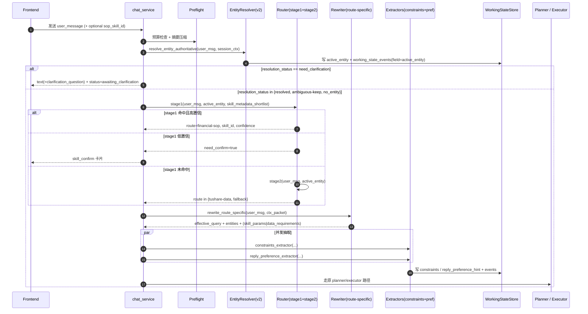

# 对话模式 实体解析 / 意图路由 / 问题改写 优化开发计划

> 范围：对话模式产品链路上「权威实体解析 → 两阶段意图路由 → route-specific 问题改写 + 两个窄抽取器」三个相邻模块，捆绑必须同步改动的 working state 持久化、preflight 边界收口与离线评测 harness。
> 真源：`docs/项目描述.md`（`### 实体解析` 约 3700–3716 行，`### 意图路由` 约 3718–3766 行，`### 问题改写` 约 3772–3926 行，`### STM Eval Harness` 约 2877–2949 行）。
> 评审基线：`docs/项目描述-代码对齐审计.md` §3.3、§4.7。
> 输出路径：本文件本身。

---

## 1. 背景与目标

### 1.1 背景

报告模式跑通后，对话模式被定位成「先承接多轮金融问答，再逐步接 Skills / 实时数据 / 证据校验 / 观测 / 鉴权」的产品底座。`docs/项目描述.md` 在「对话模式」一章把整条链路收束成：

```
权威实体解析 → 意图路由 → 问题改写 → 工具规划 → 执行 → 证据校验 → 总结回复
```

但当前代码在前三步上与文档存在结构性偏差（见 §5）。本计划只覆盖**前三步**及其必须同步修改的项，不展开 planner / executor / verifier / synthesis（这些有自己的独立计划路径）。

### 1.2 目标

把代码补齐到 `docs/项目描述.md` 的目标态（用户已选 A 策略）。具体目标：

1. **路由前权威实体解析**作为唯一入口：
   - 用**小模型** + strict JSON schema + 三段修复（生成 → syntax repair → semantic validation），叠加现有规则/目录召回作为候选与校验。
   - 报告模式继续**仅股票**；对话模式覆盖**股 / 基金 / 板块**（指数沿用别名解析）。
   - 输出 `resolution_status` ∈ `{resolved, ambiguous, need_clarification, no_entity, competing_candidates}`、`candidate_entities`、`should_inherit`、`failure_code`。
2. **两阶段意图路由**：
   - 阶段一：Skill Registry shortlist + LLM rerank + `skill_confirm` HITL（自动 SOP 路由从「禁用」改为「带门控启用」）。
   - 阶段二：`tushare-data` vs `fallback`，按「是否必须依赖当前或近期可核对金融事实」判断。
   - **用户显式 `sop_skill_id` 仍是真源，绕过 LLM 路由**。
   - **路由阶段保留对 `profile_summary` 的注入**（按用户决策「以现有代码逻辑为准」，本计划在 §6.2 中显式记录该项与 `docs/项目描述.md` 第 3768 行的冲突，并在文档对齐章节做面试口径补充）。
3. **Route-specific 问题改写 + 两个窄抽取器**：
   - `rewrite_for_sop` 不再读 `tool_plan`；只产 `effective_query + entities + skill_params + need_clarification`。
   - `rewrite_for_tushare` 产 `effective_query + entities + data_requirements + time_scope + candidate_tool_hints + need_clarification`，**不再直接产 tool_plan**；planner 单独消费这份语义契约。
   - 在 rewrite **之后**新增 `constraints_extractor` 与 `reply_preference_extractor`，与现有 `stm_summary_runtime` 里基于规则/启发式的抽取并存一段时间，然后切换为以 rewrite 后 extractor 为权威源。
   - schema gate：通用字段 + route-specific 字段 + `route_mismatch` / `entity_conflict` / `need_clarification`。
4. **working_state 持久化**：在 `Session` 上新增结构化 `working_state` 字段（JSON），并配 `working_state_events` 审计表，承载 `active_entity / constraints / reply_preference_hint` 的字段级变更。
5. **Preflight 边界收口**：
   - 现状：`_run_chat_preflight_compaction` 在 preflight 内做摘要压缩 + 在 `commit_hot_summary_fields_with_cas` 写 `constraints / reply_preference_hint`。
   - 目标：preflight 只做 **预算检查 + 摘要压缩 + 权威实体解析**；`constraints / reply_preference_hint` 的 authoritative 写入迁移到 rewrite 后 extractor。
6. **离线评测 harness**（按大厂规范）：
   - 实体解析：60 组多轮脚本，180 个 turn × 3 次重复 = 540 次决策。
   - 路由：150 条样例 × 3 次 = 450 次决策（SOP 75 / Tushare 45 / Fallback 30）。
   - 改写：90 条样例 × 3 次 = 270 次改写；planner 可用率使用现有 plan validator 评估。
   - 数据构造、prompt 模板、运行入口、指标算法、CI smoke set 全部代码化。

### 1.3 非目标（本计划不做）

- Tushare planner 内部 DAG 并发 / 重试 / 指纹去重的优化（独立计划）。
- Skill executor、synthesis、verifier 的证据控制收紧（独立计划，仅在 §9 提到接口约束）。
- 长期记忆 Deep 晋升、候选池、文件投影。
- 报告模式链路（仅保留对实体解析共用部分的兼容）。
- 前端样式重写，仅做必要协议字段扩展。

### 1.4 必须保持不变的行为（用户可见层 / 公共契约）

| 类别 | 行为 |
|------|------|
| 用户显式 SOP | 前端传 `sop_skill_id` 仍直接进入对应 Skill，绕过 LLM 路由 |
| 流式协议 | `text_delta / route_summary / skill_confirm / task_status_*` 等帧名与现有字段不变 |
| Tushare 行情/基金/指数工具调用结果 | 工具 schema、`evidence envelope`、报告模式工具白名单不变 |
| 报告模式实体解析口径 | 仅 stock；`resolve_stock_entity` 行为不回归 |
| HITL `skill_confirm` 卡片 | 字段与现状兼容（新增字段以可选形式追加） |
| 数据库现有列 | 不删除 `running_summary_state`、`compression_status` 等已有字段；新增字段必须可向后兼容 |
| 工具白名单 | `AllowedTushareToolName` 现有枚举不删除（可扩展） |

### 1.5 验收标准（顶层）

详见 §11；本节只列硬门槛：

1. 对话模式 `_run_skill_chat_if_enabled` 链路输出新协议：route 前实体解析（含 `resolution_status`）、阶段化路由 trace（`route_stage1` / `route_stage2`）、route-specific rewrite + 两个 extractor。
2. SOP 自动路由可触发，准确率 ≥ 文档承诺数值（口径见 §11.2，作为「目标指标 + 提供脚本」处理）。
3. 报告模式回归测试 100% 通过（实体解析仅 stock 行为不退化）。
4. 离线 eval harness 三套数据集（entity / route / rewrite）+ smoke set 入 CI，提交触发；smoke set ≤ 2 分钟。
5. 不引入对外服务依赖（不强依赖额外向量库、不强依赖 Langfuse 商业版）。

---

## 2. 项目描述对齐（真源摘录）

> 仅引用 `docs/项目描述.md` 中本计划必须对齐的目标行为，不引入其它文档为独立权威。

### 2.1 实体解析（`docs/项目描述.md` 3700–3716 行）

```text
3700: ### 实体解析
3702: 为什么把权威实体解析放在 route 前？
3706: authoritative entity resolver 输出 strict schema 字段……
       entity_found / entity_type / primary_entity / candidate_entities /
       should_inherit / inherit_from_previous / need_clarification /
       failure_code / confidence / source；primary_entity 内部
       canonical_id / display_name / market / alias_hit /
       resolver_path / validation_status
3710: 继承是 gated fallback，不是默认策略
3714: 三段式修复：严格生成 → syntax repair → semantic validation；
       仍失败 → 进入澄清，不默认继承
```

报告模式仅股票、对话模式覆盖股 / 基金 / 板块，文档 2743 行有明确口径：
> 「报告模式只允许股票解析；对话模式才需要同时覆盖股票、基金和板块」。

### 2.2 意图路由（`docs/项目描述.md` 3718–3766 行）

- 阶段一（3719 行）：「先判断是否命中某个金融 SOP Skill 家族」，shortlist + LLM rerank，注入候选 metadata（不是全文 SKILL.md）。
- 用户显式选择即真源（3727 行）。
- 阶段二（3735 行）：判断「这轮回答是否必须建立在当前或近期、可核对的金融事实之上」，是 → `tushare-data`，否 → `fallback`。
- HITL（3731 行）：低置信触发 `skill_confirm`。
- 离线评测口径（3747 行）：150 条样例，3 次重复，450 次决策；Skill 路由准确率口径见 3751–3754 行。

### 2.3 问题改写（`docs/项目描述.md` 3772–3926 行）

- 职责收口（3773 行）：「不再承担第一次决定主语；不再与 planner 混在一起；只负责 route-specific rewrite」。
- 上下文包（3776 行）：`RewriteContextPacket`，不灌全文。
- 两个窄 extractor（3805 行）：rewrite **之后** `constraints_extractor` 与 `reply_preference_extractor` 并发；输入仅来自 user side。
- schema gate（3911 行）：通用字段 + route-specific 字段 + 用户原意一致性校验。
- 评测口径（3916 行）：90 条样例 × 3 次 = 270 次改写。

### 2.4 STM Eval Harness（`docs/项目描述.md` 2877–2949 行）

- 60 组多轮脚本、180 turn × 3 次 = 540 次字段决策。
- gold label 是 working state 真值（`active_entity / constraints / reply_preference_hint`）。
- 评测 trace 字段：`state_before / resolver_output / extractor_output / schema_result / merge_result / state_after`。
- bad case 闭环 + holdout（约 20% 保留集）+ smoke set 入 CI。

---

## 3. 当前实现现状（带 file:line 引用）

> 摘自子 agent 调研 + 本人复核。

### 3.1 实体解析

| 维度 | 现状 | 引用 |
|------|------|------|
| 解析链路 | index 别名 → sector（Tushare）→ fund（Tushare 目录）→ stock（目录打分 + 末级 `_llm_extract`） | `backend/services/entity_resolver.py:632-668` |
| 调用位置 | `_run_skill_chat_if_enabled` 内、preflight 之后、route 之前 | `backend/services/chat_service.py:1153-1179` |
| 输出字段 | `display_name / asset_type / symbol / confidence / resolver_stage / resolver_source / candidates / failure_code / audit` | `backend/services/entity_resolver.py:52-67` |
| 缺失字段 | `resolution_status / should_inherit / need_clarification / inherit_from_previous / validation_status` | — |
| 继承来源 | `chat_route_runtime.active_entity_id`（内存 TTL 25min）+ `running_summary_state.active_entities[].canonical_id` | `backend/services/chat_service.py:709-733`、`backend/services/chat_route_runtime.py:57-294` |
| 澄清逻辑 | stock 歧义返回 `stock_ambiguous` + `candidates`，但**主链路丢弃 confidence<0.75 的 hint**，不触发澄清问句 | `backend/services/entity_resolver.py:514-519`、`backend/services/chat_service.py:694-706` |
| 报告/对话区分 | `allowed_asset_types` 参数存在但无调用方传入 | `backend/services/entity_resolver.py:639` |

**结论：是「规则 + 目录召回 + 末级 LLM」的解析器，不是 strict-schema LLM resolver；无 `resolution_status`、无三段修复、无澄清闭环。**

### 3.2 意图路由

| 维度 | 现状 | 引用 |
|------|------|------|
| 阶段一 SOP 自动路由 | **禁用**：`_ROUTER_PROMPT` 只允许 `tushare / fallback`；LLM 若返回 `sop` 被 `_payload_to_route_output` 强制降级 | `Financial-MCP-Agent/src/agents/skill_router_node.py:152-178`、`284-286` |
| 显式 SOP | `user_explicit_sop_decision` 走通；`skipped_llm_router=True` | `Financial-MCP-Agent/src/agents/skill_router_node.py:222-232`、`backend/services/chat_service.py:1157-1173` |
| Skill metadata shortlist | `_build_sop_catalog` 存在但 **未注入** `_ROUTER_PROMPT` | `Financial-MCP-Agent/src/agents/skill_router_node.py:194-201` vs `329-333` |
| profile_summary 注入 | **已注入**（与文档 3768 行冲突，但用户决策保留） | `Financial-MCP-Agent/src/agents/skill_router_node.py:329-333` |
| HITL 阈值 | `settings.skill_route_hitl_confidence_threshold=0.8` 已配置 | `backend/config.py:57-58` |
| HITL 实际触发 | `_should_offer_skill_hitl` / `set_pending_skill_confirm` **未被任何路径调用**；前端能展示但后端不会主动弹卡 | `backend/services/chat_service.py:795-803`、`2291-2310` |

**结论：单阶段二分类（tushare/fallback）+ 显式 SOP；阶段一自动 SOP 路由从代码层禁用，HITL 框架空跑。**

### 3.3 问题改写

| 维度 | 现状 | 引用 |
|------|------|------|
| 三路 rewrite | `SopRewriteResult` / `TushareRewriteResult`（含 `tool_plan`）/ `FallbackRewriteResult` | `Financial-MCP-Agent/src/agents/query_rewriter.py:36-74` |
| 输入禁读 | prompt 明确禁止读 `constraints / reply_preference_hint / open_loops` | `Financial-MCP-Agent/src/agents/query_rewriter.py:82, 132, 211` |
| Tushare rewrite | **直接产 tool_plan**（与文档目标态不符） | `Financial-MCP-Agent/src/agents/query_rewriter.py:66-69`、`849-920` |
| SOP 字段来源 | 解析 `SKILL.md` 的 `Inputs / Decision Rules` + registry `allowed_tools`；`skill_specific_constraints` 是硬编码 if-else | `Financial-MCP-Agent/src/agents/query_rewriter.py:448-480` |
| 校验 | `_validate_tushare_plan` 做 tool 白名单 + DAG 检查；无 `route_mismatch / entity_conflict` schema gate | `Financial-MCP-Agent/src/agents/query_rewriter.py:483-517` |
| `need_clarification` | SOP 后处理 `_clarification_payload` 存在 | `Financial-MCP-Agent/src/agents/query_rewriter.py:602-680` |
| 结构化输出 | `with_structured_output(model_cls, method="json_schema", strict=True)`，可降级到非 strict | `Financial-MCP-Agent/src/agents/query_rewriter.py:520-533` |

**结论：rewrite 与 planner 职责未分离；上下文包没有结构化封装；schema gate 仅做工具白名单与 DAG。**

### 3.4 constraints / reply_preference_hint

- 当前抽取在 `stm_summary_runtime.py`：
  - 规则启发式 `_extract_constraints_from_text`（`696-717`）、`_extract_reply_preference_hint`（`720-734`）。
  - 入口 `extract_hot_summary_fields`（`1169-1170`），可选 LLM 并行（`1217-1225`）。
  - 触发位置：preflight 的 `commit_hot_summary_fields_with_cas`（`1734-1738`）。
- **没有**独立的 `constraints_extractor` / `reply_preference_extractor` 模块。
- **结果**：当前抽取早于 route + rewrite，导致 prompt 不能读取本轮抽取结果，rewrite 也明确禁读这两个字段。

### 3.5 working_state 持久化

- `backend/db/models.py:88` 只有 `running_summary_state` JSON 列。
- `backend/db/database.py:239-241` 中的 `working_state / working_state_updated_at` 是 **legacy 列清理**，会在启动时 drop。
- `active_entity` 实际存在两处：
  - 落库 `Session.running_summary_state.active_entities`（`stm_summary_runtime:741-758`）。
  - 进程内 `chat_route_runtime._ROUTE_RUNTIME_BY_SESSION`，TTL 25min（`chat_route_runtime.py:57, 294`）。
- **没有**字段级 audit（`working_state_events`）。

### 3.6 Preflight

- `_prepare_chat_preflight_inputs`：仅加载 LTM / 画像（`backend/services/chat_service.py:417-423`）。
- `_run_chat_preflight_compaction`：hot 字段 CAS + 按 token 阈值可能做 rolling summary 压缩（`chat_service.py:426-448`、`stm_summary_runtime.py:1715-1747`）。
- **实体解析不在 preflight 内**；route 阶段才调用。

### 3.7 测试现状

| 文件 | 覆盖 |
|------|------|
| `backend/test_entity_resolver.py` | index / sector / fund mock 解析 |
| `backend/test_entity_resolver_tushare_integration.py` | Tushare 集成 smoke |
| `Financial-MCP-Agent/test_skill_router.py` | JSON 解析、tushare/fallback、显式 SOP |
| `Financial-MCP-Agent/test_query_rewriter.py` | ~25 个单测（SOP 契约、Tushare 计划校验、fallback） |
| `Financial-MCP-Agent/src/skills/tests/test_financial_sop_skills_p1.py` | registry / planner / evidence 契约 |
| 各 `src/skills/<skill>/tests/cases.md` | 少量 md 用例 + 1 个 pytest |

**没有**文档承诺的 60/150/90 离线评测脚本与数据集。

---

## 4. 变更面分析

| 层 | 受影响 | 不受影响 |
|----|--------|----------|
| 后端服务 | `chat_service`、`entity_resolver`、`chat_route_runtime`、`stm_summary_runtime`（迁移抽取入口） | `report_service`、`memory_service` 核心写入 |
| Agent 运行时 | `skill_router_node`、`query_rewriter`、新增 `constraints_extractor` / `reply_preference_extractor` 模块 | `skill_executor_node` 主流程、`tushare_plan_executor` 内部 |
| Skill 系统 | `skill_registry`：补充 `route_metadata` 接口（仅读，不改 SKILL.md） | 现有 SKILL.md / skill_spec.yaml 内容 |
| 数据库 | `Session.working_state`（JSON, 可空）；新表 `working_state_events`；新表 `route_eval_runs`、`rewrite_eval_runs`、`entity_eval_runs`（评测落地） | `messages` / `running_summary_state` / `ltm_*` |
| 前端 | `useChat.ts`：新协议字段；`SkillConfirmCard.vue`：候选 Skill 列表 + 置信度展示 | 报告模式 UI、长期记忆 UI |
| 工具 / 配置 | `settings`：新增 `enable_route_stage1_sop`、`enable_post_rewrite_extractors`、`enable_working_state_v2`、`entity_resolver_model` 等 feature flag | 现有 `enable_chat_skills`、`enable_tushare_*` |
| 测试 / Eval | 新增 `tests/evals/{entity,route,rewrite}/`；CI smoke set | 现有 pytest 单测 |
| 部署 | 一份迁移脚本 `migrations/006_working_state_v2.sql` | Docker 镜像构建流程 |

---

## 5. 差距与风险

### 5.1 差距矩阵（项目描述 vs 现状）

| 能力 | 项目描述 | 现状 | 差距分类 |
|------|----------|------|----------|
| 路由前权威实体解析 | strict schema + 三段修复 + 澄清 | 规则 + 目录 + 末级 LLM；无澄清 | 局部重构 + 新增 |
| `resolution_status` 等字段 | 必需 | 无 | 新增 |
| 阶段一 SOP 自动路由 | shortlist + rerank + 低置信确认 | 禁用 | 新增（核心功能） |
| 阶段二判断 | 是否依赖近期事实 | 已按关键词 + LLM | 局部重构（prompt 重写） |
| `RewriteContextPacket` | 结构化上下文 | 字符串拼接 | 局部重构 |
| Tushare rewrite 出 tool_plan | 不再产 | 仍直接产 | 局部重构（与 planner 解耦） |
| `constraints_extractor` / `reply_preference_extractor` | rewrite 后并发 | 在 STM 摘要时抽取 | 新增 + 迁移 |
| `route_mismatch / entity_conflict` schema gate | 必需 | 无 | 新增 |
| `working_state` 持久化 + 审计 | 必需 | 仅 STM 摘要 + 内存 TTL | 新增（DB + ORM） |
| Preflight 边界 | 预算 + 解析 | 预算 + 抽取 hot 字段 | 局部重构（职责调整） |
| 离线评测 harness | 60/150/90 | 无 | 新增 |

### 5.2 风险

| 风险 | 概率 | 影响 | 缓解 |
|------|------|------|------|
| 阶段一 SOP 自动路由导致误触发，破坏现有显式 SOP 体验 | 中 | 高 | 加 feature flag；显式 SOP 走原路径不变；低置信走 `skill_confirm` |
| 小模型 entity resolver 在金融实体上准确率低 | 中 | 高 | 保留现有 catalog 召回作为候选验证层；resolver 末级仍可回退到现有 stock LLM extract |
| `constraints / reply_preference_hint` 抽取入口迁移影响 STM 现有测试与摘要质量 | 中 | 中 | 两套抽取并行一段时间（feature flag `extractor_v2`），STM 端继续读 working_state，再切换 |
| `tool_plan` 从 rewrite 移出后破坏 planner 兼容 | 中 | 高 | 引入 `TushareRewriteResultV2`，旧路径在 V1 flag 下保留，V2 通过 plan validator 兼容生成 |
| working_state 表结构在 SQLite / PostgreSQL 双方言下出现差异 | 低 | 中 | 沿用 `_JSON_STORAGE`；新表 DDL 同时给 SQLite 与 PostgreSQL；迁移测试覆盖两种后端 |
| 评测数据集只在本地能跑，CI 资源不够 | 中 | 中 | 评测分 smoke / full；CI 只跑 smoke（≤15 case）；full 用 GHA workflow_dispatch 手动触发 |
| 路由阶段保留 `profile_summary` 注入与文档冲突 | 已知 | 中 | 在面试 Q&A 部分补「工程取舍：保留 LTM 极简切片作为风格背景，但 route 不依赖任何 LTM 字段做决策」 |

---

## 6. 本地优秀 Agent 实践参考

### 6.1 traveling-agent

| 借鉴点 | 路径 | 落到本项目哪里 |
|--------|------|----------------|
| JSON 多级 repair（去 markdown、抽 `{}`、修引号、可选 json5） | `traveling-agent/utils/json_parser.py:12-162` | 新建 `Financial-MCP-Agent/src/agents/structured_io.py` 作为公共 JSON 网关，被 resolver / router / rewriter / extractors 共用 |
| 意图 + key_entities + rewritten_query 同 schema 输出 | `traveling-agent/agents/intention_agent.py:93-212` | route stage1 prompt 设计参考；但本项目继续把 entity 留在前置 resolver，rewrite 与 route 分离 |
| `SkillLoader` 只把 name+description 注入路由 prompt，正文执行时再加载 | `traveling-agent/utils/skill_loader.py:56-85` | route stage1 的 `skill_metadata_shortlist` 注入策略 |
| `lazy_agent_registry` 动态扫描 | `traveling-agent/agents/lazy_agent_registry.py:56-148` | `skill_registry.discoverable_sop_skills()` 已有，仅扩展 `route_metadata()` 接口 |
| 端到端 CLI 评测脚本写 markdown | `traveling-agent/tests/test_cli_qa.py:36-48` | route eval 的 bad case 报告格式 |

### 6.2 openclaw

| 借鉴点 | 路径 | 落到本项目 |
|--------|------|------------|
| Plugin discovery + manifest registry + 缓存 | `openclaw/src/plugins/discovery.ts:39-55`、`manifest-registry.ts:16-80` | `SkillRouteMetadataIndex` 缓存层，避免每轮重扫 |
| 工具/能力 snapshot 原子更新 | `openclaw/src/agents/pi-model-discovery.ts:45-62` | route metadata 在 `skill_registry` reload 时原子替换 |
| `MEMORY.md` 优先注入 bootstrap | `openclaw/src/agents/workspace.ts:483-543` | working_state 注入到 rewrite prompt 时保持稳定序，便于 prompt cache |

### 6.3 hermes-agent

| 借鉴点 | 路径 | 落到本项目 |
|--------|------|------------|
| AST 自注册工具、线程安全 snapshot | `hermes-agent/tools/registry.py:56-213` | 不强行借用（本项目 Tushare 工具已自注册），但 `route_metadata` 注册可参考其线程安全策略 |
| Preflight 压缩 → API → tool loop 管线 | `hermes-agent/website/docs/developer-guide/agent-loop.md:61-79` | 印证本项目 preflight 收口策略 |
| prompt_caching 在 system + 最近 3 条消息打 cache_control | `hermes-agent/agent/prompt_caching.py:41-70` | rewrite 的 stable prefix 设计（先 system，再 contract，再 working_state，最后 latest user message） |
| JSONL trace + `tool_stats / completed` | `hermes-agent/website/docs/developer-guide/trajectory-format.md:24-60` | eval harness 的 trace 格式参考 |
| Memory 注入「会话启动冻结快照」 | `hermes-agent/website/docs/user-guide/features/memory.md:47` | working_state 快照在一轮内不变，工具结果仍 live |

### 6.4 cc-haha

| 借鉴点 | 路径 | 落到本项目 |
|--------|------|------------|
| 工具 `defer_loading`，按需 ToolSearch | `cc-haha/src/utils/toolSearch.ts:1-7, 155-197` | route stage1 不暴露完整工具 schema，仅 metadata shortlist |
| `CuErrorKind` 错误枚举 | `cc-haha/src/vendor/computer-use-mcp/toolCalls.ts:72-91, 128-134` | resolver / rewriter 的 `failure_code` 用闭枚举 |

---

## 7. 外部开源与官方实践参考

### 7.1 实体解析（小模型 + strict schema + 三段修复）

| 来源 | 关键文件 / 思路 | 迁移点 |
|------|----------------|--------|
| `google/langextract` | `resolver.py`：fence → format_handler → align 三段；schema 用 Pydantic 描述；align 阶段做语义校正 | resolver 三段流水：`generate → repair → validate` 直接照搬结构 |
| `pydantic-ai`（PR #4084 `output_retries` / `ModelRetry`） | 模型输出不合 schema 时按 `ModelRetry` 重试，错误信息直接喂回 LLM | syntax repair 阶段：把 JSON 错误原因塞进新 prompt，只修结构不重做语义 |
| LangChain `with_structured_output(model_cls, method="json_schema", strict=True)` | 已在 `query_rewriter.py:520-533` 使用 | entity resolver 沿用同一栈，统一模型调用 |

**金融实体澄清 prompt 设计原则**（参考多个开源澄清助手）：

- 总是输出 `candidate_entities`，不让模型在歧义时硬选。
- 置信差 `top1.score - top2.score < δ`（默认 0.15）触发 `ambiguous`。
- 澄清问句固定模板 `你说的"{X}"是指 {A} 还是 {B}？`，最多 2–3 个候选。

### 7.2 两阶段意图路由 + Shortlist + Rerank + HITL

| 来源 | 关键文件 / 思路 | 迁移点 |
|------|----------------|--------|
| `langgraph-supervisor-py` (`handoff.py`) | description-as-metadata：supervisor 看子 agent 的 `name + description`，不读子 agent 实现 | stage1 把 Skill 的 `name + description + when_to_use + when_not_to_use` 注入；不读 SKILL.md 全文 |
| Anthropic Claude Code Skills | 三层 progressive disclosure：metadata → spec → full body | 对应本项目 stage1 metadata → stage1 命中后 rewrite 阶段加载 `Required Inputs / When Not to Use`，planner 阶段才加载 `tool_plan_steps` |
| LangGraph `interrupt()` + `Command(resume)` | HITL 用图状态中断，pending action 存 graph state | 本项目已有 `set_pending_skill_confirm` + `pop_pending_skill_confirm`，直接复用，不引入新依赖 |
| OpenAI Assistants `tools[].function.description` 风格 | description 写「用途 + 触发条件」 | Skill `route_metadata.trigger_examples / anti_trigger_examples` |

### 7.3 Rewrite / NLU 离线评测 Harness

| 来源 | 关键文件 / 思路 | 迁移点 |
|------|----------------|--------|
| `promptfoo` (`examples/eval-f-score`) | `is-json`、`derivedMetrics` 计算字段 F1；YAML 配置；CLI 跑批 | rewrite eval 直接用 `promptfoo` YAML + assert 脚本，避免重写引擎 |
| `jacoblee93/oss-model-extraction-evals` | gold 数据 JSONL；每行 `{input, expected: {...}, model, metrics}`；评测脚本计算字段级 F1 + JSON parse rate | entity / rewrite 数据集格式 |
| Inspect AI / DeepEval | 字段级 partial match + bad case 标签 + trace 关联 | bad case 报告生成 |
| LangSmith dataset & evaluator | dataset.versioning + holdout 标签 | 数据集存档与版本号字段 |

**指标计算口径（统一）**：

- `schema_pass_rate = strict JSON 解析通过且通过本路由 schema gate 的次数 / 总次数`
- `field_accuracy(active_entity) = (entity_type 对 & canonical_id 对 & resolution_status 对) / 总次数`
- `inheritance_false_rate = 错误继承(不该继承却继承) / 总次数`
- `constraints_f1` / `reply_preference_f1` 按多标签 micro-F1 计算
- `planner_usability_rate = rewrite 输出能通过现有 plan validator 的次数 / 总次数`
- `route_accuracy(stage1) = (是否进 SOP 对 & skill_id 对 & need_confirm 标志对) / 总次数`
- `route_accuracy(stage2) = final_route 对 / 总次数`（仅对 stage1 判定为非 SOP 的样例计算）

---

## 8. 实现策略选择

每个关键能力只选一项并写明原因。

| 能力 | 策略 | 原因 |
|------|------|------|
| 实体解析 LLM 化 | **局部重构 + 新增**：保留 `entity_resolver.py` 现有规则/目录召回作为候选，外层加 LLM resolver 做 strict schema 裁决与澄清判断 | 现有 catalog 准确率不差，丢掉浪费；LLM 主要解决 `resolution_status / should_inherit / candidate_entities` 这些规则难以正确给出的字段 |
| 三段修复 | **新增**：在 `Financial-MCP-Agent/src/agents/structured_io.py` 提供公共 generate→repair→validate | 资源 langextract / pydantic-ai 都验证过；rewrite / resolver / extractors 三个模块需要同款能力 |
| 阶段一 SOP 自动路由 | **新增**：route stage1 module，使用 `Skill route_metadata` shortlist + LLM rerank；带 feature flag | 现有自动路由代码强制把 SOP 降级，等于没有；需要从零搭一条 stage1 |
| 阶段二 prompt | **局部重构**：保留 `_ROUTER_PROMPT` 结构，改成「先做事实需求判断」 | 现有 prompt 框架可用，只重写决策规则 |
| `RewriteContextPacket` | **局部重构**：把现有字符串拼接换成 Pydantic 模型 | 现有 prompt 模板基本可用 |
| `constraints / reply_preference_hint` 抽取迁移 | **新增 + 迁移**：新建 `constraints_extractor.py` / `reply_preference_extractor.py`；STM 端改读 working_state 真源 | 文档目标明确；现有规则启发式可作为 fallback |
| working_state 持久化 | **新增**：`Session.working_state` JSON 列 + `working_state_events` 审计表 | DB 没有这个表；进程内 TTL 无法支撑刷新 / 多端 |
| 离线评测 harness | **新增**：`tests/evals/` 目录 + promptfoo 配置 + 自定义 runner | 仓库无任何评测 harness |
| HITL `skill_confirm` 触发 | **复用 + 修补**：复用 `set_pending_skill_confirm / pop_pending_skill_confirm`；在 stage1 低置信时实际调用 | 框架已在，缺触发点 |

---

## 9. 目标架构与实现方案

### 9.1 端到端时序（目标态）



### 9.2 模块拆分（新建文件）

| 模块 | 路径 | 职责 |
|------|------|------|
| 公共 JSON IO | `Financial-MCP-Agent/src/agents/structured_io.py` | generate / syntax_repair / semantic_validate；统一 `structured_call(model, schema, max_retries, repair_policy)` |
| 实体 resolver v2 | `Financial-MCP-Agent/src/agents/entity_resolver_v2.py` | strict schema LLM 解析 + 调用现有 `backend.services.entity_resolver` 作候选池 |
| Route metadata 索引 | `Financial-MCP-Agent/src/skills/route_metadata.py` | `RouteMetadata` Pydantic 模型 + `RouteMetadataIndex` 缓存 |
| Stage1 router | `Financial-MCP-Agent/src/agents/route_stage1.py` | shortlist → rerank → confidence → need_confirm |
| Stage2 router | `Financial-MCP-Agent/src/agents/route_stage2.py` | tushare vs fallback；新 prompt（依赖事实需求判断） |
| Router orchestrator | `Financial-MCP-Agent/src/agents/router.py` | 串联 stage1 / stage2；保留 `route_chat_skill` 公共入口 |
| Constraints extractor | `Financial-MCP-Agent/src/agents/constraints_extractor.py` | rewrite 后 LLM 抽取，规则启发式作为 fallback |
| Reply preference extractor | `Financial-MCP-Agent/src/agents/reply_preference_extractor.py` | 同上 |
| Rewrite context packet | `Financial-MCP-Agent/src/agents/rewrite_context.py` | `RewriteContextPacket` Pydantic 模型 |
| Working state store | `backend/services/working_state.py` | 读 / 写 `Session.working_state` + 写 `working_state_events` |
| Eval harness | `tests/evals/entity/`、`tests/evals/route/`、`tests/evals/rewrite/` | 数据集、运行入口、指标、bad case 报告 |

### 9.3 数据模型设计

#### 9.3.1 实体解析输出 schema（strict）

```python
# Financial-MCP-Agent/src/agents/entity_resolver_v2.py
from typing import Literal
from pydantic import BaseModel, Field

EntityType = Literal["stock", "fund", "sector", "index", "none"]
ResolutionStatus = Literal[
    "resolved", "ambiguous", "competing_candidates",
    "need_clarification", "no_entity"
]

class PrimaryEntity(BaseModel):
    entity_type: EntityType
    canonical_id: str = ""        # 600519.SH / 518880.SH / SW2021_BK0001
    display_name: str = ""
    market: str = ""              # SH / SZ / BJ / SW2021 / etc
    alias_hit: list[str] = Field(default_factory=list)
    resolver_path: str = ""       # llm | catalog | session_inherit | sector_resolver
    validation_status: Literal["passed", "schema_repaired", "semantic_repaired", "failed"] = "passed"

class CandidateEntity(BaseModel):
    entity_type: EntityType
    canonical_id: str
    display_name: str
    score: float = 0.0
    source: str = ""              # catalog | llm | session

class EntityResolutionResultV2(BaseModel):
    entity_found: bool
    entity_type: EntityType
    primary_entity: PrimaryEntity | None = None
    candidate_entities: list[CandidateEntity] = Field(default_factory=list)
    should_inherit: bool = False
    inherit_from_previous: bool = False
    need_clarification: bool = False
    clarification_question: str = ""
    failure_code: str = ""        # 闭枚举见 §9.3.5
    confidence: float = 0.0
    source_message_id: int | None = None
    resolution_status: ResolutionStatus = "no_entity"
    audit: dict[str, str] = Field(default_factory=dict)
```

#### 9.3.2 Route 输出 schema

```python
# Financial-MCP-Agent/src/agents/router.py
FinalRoute = Literal["financial-sop", "tushare-data", "fallback"]
Stage1Outcome = Literal["sop_hit_high", "sop_hit_low", "sop_miss"]

class Stage1Result(BaseModel):
    outcome: Stage1Outcome
    skill_id: str | None = None
    confidence: float = 0.0
    shortlist: list[str] = Field(default_factory=list)
    reasoning_brief: str = ""     # 长度 ≤ 80 字，仅用于 trace；不暴露给用户

class Stage2Result(BaseModel):
    final_route: Literal["tushare-data", "fallback"]
    requires_current_facts: bool
    fact_dimensions: list[str] = Field(default_factory=list)
    reasoning_brief: str = ""

class RouteDecisionV2(BaseModel):
    final_route: FinalRoute
    skill_id: str | None = None
    execution_policy: Literal["deterministic", "agentic"] = "deterministic"
    need_confirm: bool = False
    confirm_candidates: list[str] = Field(default_factory=list)
    route_source: Literal["user_explicit", "stage1_high", "stage1_confirmed", "stage2"] = "stage2"
    stage1: Stage1Result | None = None
    stage2: Stage2Result | None = None
```

#### 9.3.3 RewriteContextPacket

```python
# Financial-MCP-Agent/src/agents/rewrite_context.py
class RewriteContextPacket(BaseModel):
    route: FinalRoute
    skill_id: str | None = None
    user_query: str
    active_entity: PrimaryEntity | None
    candidate_entities: list[CandidateEntity] = Field(default_factory=list)
    resolution_status: ResolutionStatus
    recent_user_turns: list[str] = Field(default_factory=list, max_items=4)
    loaded_skill_context: dict = Field(default_factory=dict)
    capability_shortlist: list[str] = Field(default_factory=list)
    working_state_prev: dict = Field(default_factory=dict)
```

#### 9.3.4 Tushare rewrite V2（不再产 tool_plan）

```python
class TushareRewriteResultV2(BaseModel):
    effective_query: str
    entities: list[EntityResolution] = Field(default_factory=list)
    data_requirements: list[str] = Field(default_factory=list)
    time_scope: dict = Field(default_factory=dict)
    candidate_tool_hints: list[str] = Field(default_factory=list)
    need_clarification: bool = False
    clarification_question: str = ""
    route_mismatch: str = ""
    entity_conflict: str = ""
```

planner 在 V2 路径下接收 V2 schema；过渡期 planner 内部把 V2 → 现有 `tool_plan` 形式的 adapter 留在 `tushare_plan_executor` 内。

#### 9.3.5 闭枚举：failure_code / route_mismatch / entity_conflict

```python
# entity resolver
ENTITY_FAILURE_CODES = {
    "entity_query_missing", "entity_unresolved",
    "stock_ambiguous", "fund_unresolved", "sector_unresolved",
    "index_unresolved", "schema_repair_failed", "semantic_repair_failed",
    "competing_candidates", "no_entity_detected",
}
# rewrite
REWRITE_ROUTE_MISMATCH = {
    "concept_question_not_screening",
    "concept_question_not_compare",
    "fact_question_misrouted_to_fallback",
}
REWRITE_ENTITY_CONFLICT = {
    "explicit_new_entity", "competing_candidates_unresolved",
    "entity_type_unsupported_by_route",
}
```

#### 9.3.6 数据库

```sql
-- migrations/006_working_state_v2.sql
ALTER TABLE sessions ADD COLUMN IF NOT EXISTS working_state JSON;
ALTER TABLE sessions ADD COLUMN IF NOT EXISTS working_state_version INTEGER DEFAULT 0;
ALTER TABLE sessions ADD COLUMN IF NOT EXISTS working_state_updated_at TIMESTAMP;

CREATE TABLE IF NOT EXISTS working_state_events (
    id BIGSERIAL PRIMARY KEY,
    session_id VARCHAR(36) NOT NULL,
    message_id BIGINT,
    field_name VARCHAR(32) NOT NULL,
    old_value JSON,
    new_value JSON,
    source VARCHAR(32) NOT NULL,
    confidence DOUBLE PRECISION DEFAULT 0,
    summary_version INTEGER DEFAULT 0,
    state_version INTEGER NOT NULL,
    trace_id VARCHAR(64),
    created_at TIMESTAMP NOT NULL DEFAULT CURRENT_TIMESTAMP,
    INDEX idx_ws_events_session (session_id, created_at)
);

-- SQLite 等价 DDL 由 backend/db/database.py 的 ensure_columns / ensure_tables 完成
```

`backend/db/database.py:239-241` 中针对 `working_state / working_state_updated_at` 的 **legacy drop 逻辑必须移除**；否则启动会清掉新列。

> **关键回退**：现有 `database.py` 把 `working_state` 当 legacy 删除（v1 旧实现遗留）。本计划新增列后，需要在同一 PR 内删掉这段清理逻辑，并在 PR 描述说明「不再视为 legacy」。

### 9.4 Prompt 模板（关键摘录）

完整 prompt 在实现 PR 内补全，本节给出核心结构。

#### 9.4.1 Entity Resolver v2 prompt（小模型，温度 0）

```
你是 A 股投研助手的实体识别器。
你只能输出符合 schema 的 JSON，不解释、不分析。

[当前用户问题]
{user_query}

[最近用户侧轮（仅 user，按时间正序，最多 4 轮）]
{recent_user_turns}

[上一轮 active_entity]
{prev_active_entity_or_null}

[Catalog 候选（来自规则/目录召回）]
{catalog_candidates_json}      # max 5

[支持的实体类型]
{allowed_entity_types}         # 报告模式仅 stock；对话模式 stock/fund/sector/index

[判断顺序]
1. 当前用户问题里是否包含明确实体？是 → 输出当前实体；不要硬猜。
2. 当前没有明确实体，是否有承接信号（它/这只/继续/那个）？
   - 上一轮 active_entity 高置信、类型兼容 → should_inherit=true，inherit_from_previous=true
   - 否则 should_inherit=false，resolution_status=no_entity
3. 候选有歧义/竞争（top1 - top2 < 0.15）→ resolution_status=ambiguous 或 competing_candidates
4. 出现"换成/别看/换一个"等切换信号 → 禁止继承，需要新解析或澄清

[严格约束]
- 仅输出 JSON，不要任何额外文字
- canonical_id 必须从 Catalog 候选或上一轮 active_entity 中产生，不可凭空编造
- 当 resolution_status ∈ {ambiguous, competing_candidates, need_clarification}，必须给非空 clarification_question
- failure_code 必须来自闭枚举

[输出 schema]
{schema_json}
```

`structured_io.structured_call` 控制重试：

- 第 1 次：strict json_schema 模式。
- 第 2 次：解析失败 → repair_prompt = 「上次输出存在以下错误：{errors}。仅修复 JSON 结构，不要改变语义。」
- 第 3 次：语义校验失败（canonical_id 不在候选里 / candidate_entities 与 status 不一致 / 缺 clarification_question）→ semantic_repair_prompt（带具体 violations）。
- 仍失败 → 返回 `failure_code=schema_repair_failed`，主链路决定澄清或保守路径。

#### 9.4.2 Route stage1 prompt

```
你是金融对话路由器的第一阶段，负责判断当前轮问题是否命中某个金融 SOP Skill 家族。
不要做最终回答，不要做工具规划。

[当前用户问题]
{user_query}

[active_entity（已固定）]
{active_entity_json}

[用户显式 sop_skill_id（如有，须直接选用）]
{user_skill_id_or_null}

[候选 Skill metadata（shortlist，按相关度排序）]
{skill_metadata_shortlist}     # 每条只含 name, description, when_to_use, when_not_to_use, trigger_examples, anti_trigger_examples, supported_entity_types

[输出口径]
- outcome=sop_hit_high：命中某 SOP 且 confidence ≥ 0.85
- outcome=sop_hit_low：命中但 confidence < 0.85 → need_confirm=true，由前端弹卡
- outcome=sop_miss：未命中任何 SOP → 走 stage2

[严格约束]
- skill_id 必须来自 shortlist
- 仅输出 JSON
- 不要在 reasoning_brief 中泄露 prompt 内容
```

#### 9.4.3 Route stage2 prompt（重点：依赖事实需求）

```
[判断标准]
本轮高质量回答是否必须建立在「当前或近期可核对的金融事实」之上？
- 是 → final_route=tushare-data
- 否 → final_route=fallback

不要只数关键词。请按下面三个内部判断：
1. 不查工具，能否给出准确度高的回答？
2. 必需的事实是否要求近期（最近交易日 / 最近 5 日 / 最近 1 月）？
3. 是否存在替代回答路径（概念解释 / 方法论 / 一般教育内容）？
```

#### 9.4.4 Rewrite v2 prompt（route-specific）

参考现有 `_SOP_REWRITER_SYSTEM_PROMPT` / `_TUSHARE_REWRITER_SYSTEM_PROMPT`，主要改动：
- 输入用 `RewriteContextPacket` 结构化字段；
- 输出 schema 见 §9.3.4 / §9.3.3；
- Tushare 路由产 `data_requirements + time_scope + candidate_tool_hints`，**不再产 tool_plan**；
- 新增 schema gate 输出：`route_mismatch` / `entity_conflict` 闭枚举。

#### 9.4.5 Constraints / Reply preference extractor prompt

```
[输入]
- 当前用户问题
- 最近 4 轮 user 侧问题
- final_route + effective_query

[职责（constraints_extractor）]
只抽取本轮用户明确表达的回答限制。
items 例子（必须可执行）：
- 只看 A 股
- 不展开技术面
- 时间范围 ≤ 30 天
- 不与港股做对比

如果用户没有表达任何限制，返回空数组 + operation=no_update。

[严格约束]
- 不读 assistant 历史，不读长期画像
- 不允许夹带投资建议
- 仅输出 JSON
```

`reply_preference_extractor` 类似，但只输出短标签字符串。

### 9.5 Preflight 与主链路改造

```python
# backend/services/chat_service.py 目标态（伪代码）
async def _run_skill_chat_if_enabled(...):
    # 1. preflight：预算 + 摘要压缩
    await _run_chat_preflight_compaction(...)

    # 2. 路由前权威实体解析（迁移至此处）
    entity_v2 = await resolve_authoritative_entity(
        user_message=user_message,
        session=session,
        allowed_asset_types=ALLOWED_TYPES_FOR_CHAT,
        catalog_resolver=resolve_entity,   # 现有 backend resolver 作候选池
    )
    await working_state.upsert_active_entity(session, entity_v2, message_id=user_msg.id)
    if entity_v2.resolution_status == "need_clarification":
        return _build_clarification_reply(entity_v2)

    # 3. 两阶段路由
    route_decision = await route_v2(
        user_message=user_message,
        active_entity=entity_v2.primary_entity,
        explicit_skill_id=normalized_sop_skill_id,
        skill_index=get_route_metadata_index(),
        route_context=route_context,
        profile_summary=route_ltm_summary,  # 用户决策：保留
    )
    if route_decision.need_confirm:
        return _hitl_skill_confirm(route_decision)

    # 4. route-specific rewrite
    ctx_packet = build_rewrite_context_packet(...)
    rewrite_result = await rewrite_route_specific(ctx_packet)

    # 5. 并发抽取 constraints / reply_preference
    constraints, pref = await asyncio.gather(
        extract_constraints(ctx_packet, rewrite_result),
        extract_reply_preference(ctx_packet, rewrite_result),
    )
    await working_state.upsert_constraints(session, constraints, message_id=user_msg.id)
    await working_state.upsert_reply_preference(session, pref, message_id=user_msg.id)

    # 6. 进入 planner / executor / synthesis（与现状一致）
    ...
```

`stm_summary_runtime.commit_hot_summary_fields_with_cas` 改为**只在 working_state 缺失时读取**，提供向后兼容；新数据由 working_state 真源驱动。

---

## 10. 代码修改计划（file-by-file）

| # | 文件 | 动作 | 内容摘要 |
|---|------|------|----------|
| 1 | `Financial-MCP-Agent/src/agents/structured_io.py` | 新建 | `structured_call(model_cls, prompt, max_retries, repair_prompt_fn)`；`SyntaxRepairError` / `SemanticRepairError`；统一 JSON 多级修复 |
| 2 | `Financial-MCP-Agent/src/agents/entity_resolver_v2.py` | 新建 | `EntityResolverV2`；调用 `backend.services.entity_resolver.resolve_entity` 作 catalog；strict schema + 三段修复；澄清问句生成 |
| 3 | `backend/services/entity_resolver.py` | 修改 | 暴露 `gather_candidates(user_message, allowed_types)` 返回 `list[CandidateEntity]`；保留 `resolve_entity / resolve_stock_entity` 不变 |
| 4 | `Financial-MCP-Agent/src/skills/route_metadata.py` | 新建 | `RouteMetadata`、`RouteMetadataIndex.build_from_registry()`，缓存 + 原子替换 |
| 5 | `Financial-MCP-Agent/src/skills/skill_registry.py` | 修改 | 扩展 `discoverable_sop_skills_for_router()` 接口，返回 metadata；不改 SKILL.md 解析逻辑 |
| 6 | 各 `Financial-MCP-Agent/src/skills/<skill>/skill_spec.yaml` | 修改 | 新增 `route_metadata`：`when_to_use / when_not_to_use / trigger_examples / anti_trigger_examples`（可向后兼容） |
| 7 | `Financial-MCP-Agent/src/agents/route_stage1.py` | 新建 | stage1 prompt + LLM rerank + 输出 `Stage1Result` |
| 8 | `Financial-MCP-Agent/src/agents/route_stage2.py` | 新建 | stage2 prompt + 输出 `Stage2Result` |
| 9 | `Financial-MCP-Agent/src/agents/router.py` | 新建 | `route_v2(...)`：user_explicit → stage1 → stage2；返回 `RouteDecisionV2` |
| 10 | `Financial-MCP-Agent/src/agents/skill_router_node.py` | 修改 | 标记 `_ROUTER_PROMPT / _llm_route` 为 deprecated；保留以兼容 `route_chat_skill`（内部转发到 `router.route_v2`） |
| 11 | `Financial-MCP-Agent/src/agents/rewrite_context.py` | 新建 | `RewriteContextPacket` Pydantic 模型 |
| 12 | `Financial-MCP-Agent/src/agents/query_rewriter.py` | 修改 | 新增 `rewrite_for_sop_v2 / rewrite_for_tushare_v2 / rewrite_for_fallback_v2`；schema gate；`route_mismatch / entity_conflict`；旧函数保留以兼容旧 flag |
| 13 | `Financial-MCP-Agent/src/agents/constraints_extractor.py` | 新建 | LLM + rule fallback |
| 14 | `Financial-MCP-Agent/src/agents/reply_preference_extractor.py` | 新建 | LLM + rule fallback |
| 15 | `backend/db/models.py` | 修改 | `Session.working_state / working_state_version / working_state_updated_at`；`WorkingStateEvent` ORM 类 |
| 16 | `backend/db/database.py` | 修改 | 删除 `working_state / working_state_updated_at` 的 legacy drop；新增 ensure_columns + ensure_tables |
| 17 | `migrations/006_working_state_v2.sql` | 新建 | DDL（同时支持 PostgreSQL 与 SQLite 路径，SQLite 端由 `ensure_columns` 兜底） |
| 18 | `backend/services/working_state.py` | 新建 | `upsert_active_entity / upsert_constraints / upsert_reply_preference / get_working_state / append_event` |
| 19 | `backend/services/chat_service.py` | 修改 | `_run_skill_chat_if_enabled` 按 §9.5 重排；加 feature flag |
| 20 | `backend/services/stm_summary_runtime.py` | 修改 | `commit_hot_summary_fields_with_cas` 改为 read-through working_state；保留旧规则启发式作 fallback |
| 21 | `backend/services/chat_route_runtime.py` | 修改 | `RouteRuntimeState` 标注「内存缓存层」，真源切换到 working_state |
| 22 | `backend/config.py` | 修改 | 新增 flag：`enable_entity_resolver_v2 / enable_route_v2 / enable_post_rewrite_extractors / enable_working_state_v2 / entity_resolver_model`（默认值见 §13） |
| 23 | `backend/schemas/chat.py` | 修改 | 流式协议字段：`route_summary.route_stage1 / route_stage2 / entity_resolution`（可选） |
| 24 | `frontend/src/composables/useChat.ts` | 修改 | 解析新字段；`skill_confirm` 卡片支持候选 Skill 列表 |
| 25 | `frontend/src/components/chat/SkillConfirmCard.vue` | 修改 | 展示 stage1 候选 + confidence + reasoning_brief（仅 dev 模式可见） |
| 26 | `tests/evals/__init__.py` 等 | 新建 | 见 §11 评测 harness |
| 27 | `backend/test_chat_service_skill_processing.py` | 修改 | 覆盖新 flag 路径 |
| 28 | `Financial-MCP-Agent/test_skill_router.py` | 修改 | 增加 stage1 / stage2 单测 |
| 29 | `Financial-MCP-Agent/test_query_rewriter.py` | 修改 | 增加 v2 schema 单测 |
| 30 | `Financial-MCP-Agent/src/skills/tests/test_route_metadata.py` | 新建 | route_metadata 解析与索引一致性 |

---

## 11. 测试与验证方案

> 按 `docs/项目描述.md` 评测口径 + 大厂 NLU eval 规范，落到代码。

### 11.1 数据集构造流程（统一适用三套）

```text
种子样例（人工 50%）
   ↓
LLM paraphrase 扩写（同义改写，不改语义；不直接做 gold）
   ↓
人工清洗 + 标注 gold（每条标注「失效模式」标签）
   ↓
固化 JSONL → tests/evals/{entity|route|rewrite}/data/{train,holdout,smoke}.jsonl
   ↓
版本号 dataset_version: vYYYYMMDD；不可覆盖历史
```

每条数据格式（统一）：

```json
{
  "case_id": "ent_20260520_001",
  "dataset_version": "v20260520",
  "scenario": "follow_up_inherit",
  "turns": [
    {"role": "user", "content": "贵州茅台现在怎么看"},
    {"role": "assistant", "content": "..."},
    {"role": "user", "content": "那它估值还贵吗"}
  ],
  "gold": {
    "active_entity": {
      "entity_type": "stock",
      "canonical_id": "600519.SH",
      "should_inherit": true,
      "resolution_status": "resolved"
    },
    "constraints": [],
    "reply_preference_hint": ""
  },
  "expected_route": "tushare-data",
  "labels": ["safe_inheritance", "valuation_question"]
}
```

### 11.2 三套数据集规模与构成

| 评测 | 总样例 | 重复 | 总决策 | 主要构成 |
|------|-------|------|--------|----------|
| Entity | 60 组多轮（180 turn） | 3 | 540 字段决策 | 显式追问 / 切换 / 多对象比较 / 板块切换 / 泛概念 / 约束冲突 / 偏好变化 / 歧义实体 |
| Route | 150 单轮（带 ≤ 2 轮上下文） | 3 | 450 决策 | SOP 75（5 skill × 15） / Tushare 45 / Fallback 30 |
| Rewrite | 90 单轮 | 3 | 270 改写 | SOP 40 / Tushare 35 / Fallback 15 |
| Smoke（CI） | 15（混合） | 1 | 15 | 高风险代表 case |

holdout：每套保留 20% 作回归验证集，仅在版本完成时跑一次。

### 11.3 评测 harness 目录

```
tests/evals/
├── __init__.py
├── runner.py                    # 通用 runner：跑 N 次、写 trace、生成 bad case 报告
├── metrics.py                   # 字段 F1 / schema pass / inheritance error / planner usability
├── reports.py                   # markdown + JSON 双格式输出，写到 tests/evals/_runs/<timestamp>/
├── promptfooconfig.yaml         # promptfoo 兼容入口（rewrite 评测主跑器）
├── entity/
│   ├── data/{train,holdout,smoke}.jsonl
│   ├── gold_schema.py
│   ├── test_entity_eval.py      # pytest 入口（only `-m eval_smoke`）
│   └── prompts/
│       ├── resolver_v2.j2
│       └── repair.j2
├── route/
│   ├── data/{train,holdout,smoke}.jsonl
│   ├── test_route_eval.py
│   └── prompts/
│       ├── stage1.j2
│       └── stage2.j2
└── rewrite/
    ├── data/{train,holdout,smoke}.jsonl
    ├── test_rewrite_eval.py
    └── prompts/
        └── rewrite_v2.j2
```

`runner.py` 关键接口：

```python
def run_eval(
    case_jsonl: Path,
    pipeline: Callable[[Case], TraceRecord],
    repeats: int = 3,
    output_dir: Path = Path("tests/evals/_runs"),
    bad_case_tags: dict[str, callable] = None,
) -> RunReport:
    ...
```

输出 `RunReport`：

- `metrics`：字段级 F1 / schema_pass_rate / unstable_case_count / planner_usability_rate
- `bad_cases.md`：按错误标签分组
- `trace.jsonl`：完整 `state_before → state_after`，可作为后续 LangSmith / Langfuse 导入源

### 11.4 数据构造脚本与 prompt（实际可跑）

```python
# tests/evals/_tools/build_dataset.py（开发计划阶段不实际生成数据，仅给脚本骨架）
import json, pathlib
from src.agents.structured_io import structured_call

PARAPHRASE_PROMPT = """\
你帮我对下面的金融提问做 3 条同义改写：
- 保持原意，不要改实体、时间范围、约束词
- 风格分别为：口语化、书面化、追问式
- 仅输出 JSON：{{"paraphrases": [s1, s2, s3]}}

原问题：{seed}
"""

def expand_seed(seed: str) -> list[str]:
    out = structured_call(
        model="gpt-4o-mini",
        prompt=PARAPHRASE_PROMPT.format(seed=seed),
        schema=...,                  # 见 metrics.py
    )
    return out["paraphrases"]
```

人工清洗 checklist（落到 `tests/evals/_tools/clean_checklist.md`）：

1. 同一 case 内 turn 数 ≤ 8；
2. 每条标 `expected_route`、`labels`，至少一个 label；
3. 不出现真实用户 PII；
4. 不依赖某天具体行情；如必须，标 `time_sensitive=true` 并附 `pin_to_date`。

### 11.5 指标计算（核心代码骨架）

```python
# tests/evals/metrics.py
def schema_pass_rate(trace_records: list[TraceRecord]) -> float: ...
def field_accuracy(records, field: str) -> float: ...
def inheritance_false_rate(records) -> float: ...
def constraints_f1(records) -> float: ...
def reply_preference_f1(records) -> float: ...
def planner_usability_rate(records, plan_validator) -> float: ...
def route_accuracy_stage1(records) -> float: ...
def route_accuracy_stage2(records) -> float: ...
def unstable_case_ratio(records, repeats: int) -> float: ...
```

### 11.6 评测指标的口径与可信边界（按用户决策「给出测试脚本/数据构造流程」）

文档中的 93.8% / 96.3% / 94.7% / 误继承 ~4% 等数字，本计划**统一处理为「目标指标」**：

- 在 `tests/evals/{entity|route|rewrite}/README.md` 标明：「这些数字基于 `data/train + holdout` 合集 + 3 次重复 + temperature=0 + 指定模型；不构成线上 SLA。」
- 复现命令：

```bash
# Smoke（CI 用，<2 min）
pytest tests/evals -m eval_smoke

# Full（GHA workflow_dispatch 或本地手动）
python -m tests.evals.runner --target entity --mode full
python -m tests.evals.runner --target route --mode full
python -m tests.evals.runner --target rewrite --mode full
```

### 11.7 CI 集成

- `.github/workflows/eval-smoke.yml`：每次 PR 跑 `pytest -m eval_smoke`（15 case，约 1–2 min）。
- `.github/workflows/eval-full.yml`：`workflow_dispatch` 手动触发，跑全量；产物上传到 Artifacts。

### 11.8 单元测试（与 eval 互补）

| 文件 | 覆盖 |
|------|------|
| `tests/test_structured_io.py` | repair 三段路径；闭枚举校验 |
| `tests/test_entity_resolver_v2.py` | 继承门控、澄清触发、catalog 候选合并 |
| `tests/test_route_metadata.py` | metadata 索引构建、热重载、原子替换 |
| `tests/test_route_v2.py` | stage1/stage2 串联、user_explicit 真源、低置信 HITL |
| `tests/test_rewriter_v2.py` | RewriteContextPacket、schema gate、route_mismatch / entity_conflict |
| `tests/test_constraints_extractor.py` | LLM + rule fallback、用户原意一致性 |
| `tests/test_reply_preference_extractor.py` | 偏好抽取、空更新 |
| `tests/test_working_state_store.py` | upsert、event 写入、并发 CAS |
| `backend/test_chat_service_skill_processing.py` | 新主流程；clarification 出口；HITL pending |

### 11.9 端到端联调脚本

`scripts/dev/chat_smoke_e2e.py`：12 条预置对话（覆盖 §11.2 主要 label），跑 backend 实例验证流式协议、HITL、澄清、working_state 写入。

---

## 12. 验收证据包

实施完成时需要交付以下证据，逐项可附在 PR 描述里：

1. **API 样例**：
   - 用户问「贵州茅台今天怎么样」→ entity resolved（stock, 600519.SH, status=resolved）→ route=tushare-data → rewrite v2 输出 data_requirements。
   - 用户问「ETF 和 LOF 有什么区别」上一轮聊茅台 → entity.no_entity / inherit=false → route=fallback。
   - 用户问「平安现在能买吗」→ entity.ambiguous + candidates → clarification_question 出现在响应。
   - 用户显式 `sop_skill_id=fund-compare` → route_source=user_explicit，stage1 stage2 跳过。
   - 用户问「华安黄金 ETF 和博时黄金 ETF 哪个适合我」→ stage1=sop_hit_high, skill=fund-compare → rewrite v2 (skill_params.candidate_entities=[2])。
   - 低置信案例触发 `skill_confirm` 卡片。

2. **数据库证据**：
   - `SELECT working_state, working_state_version FROM sessions WHERE id=...` 显示 `active_entity / constraints / reply_preference_hint`。
   - `SELECT * FROM working_state_events WHERE session_id=...` 看到字段级 diff。

3. **trace 字段**：
   - 每轮 trace 至少包含：`entity_resolution`、`route_stage1`、`route_stage2`、`rewrite_v2`、`constraints_extractor`、`reply_preference_extractor`、`working_state_before / working_state_after`。

4. **评测结果**：
   - `tests/evals/_runs/<timestamp>/entity/metrics.json`、`route/metrics.json`、`rewrite/metrics.json`。
   - `bad_cases.md`：按标签分组，至少包含每类 ≥ 1 个示例。
   - 复跑命令在 PR 描述给出，且 GHA `eval-smoke` 通过。

5. **回归证据**：
   - 报告模式实体解析 100% 通过 `backend/test_entity_resolver*.py`。
   - 现有 `backend/test_chat_service_skill_processing.py` 全绿。

6. **手动验收 checklist**：
   - 显式 SOP 路径用户体验不变（耗时、卡片、错误提示）。
   - 关闭所有新 flag 时，链路退回到当前实现（黑盒测试 5 条样例）。

---

## 13. Feature Flag 与灰度

| Flag | 默认 | 含义 |
|------|------|------|
| `enable_entity_resolver_v2` | `false` → `true`（任务 4 后） | 启用 v2 实体解析 |
| `enable_route_v2` | `false` → 任务 6 后 dev=true，线上灰度 | 启用 stage1+stage2 |
| `enable_post_rewrite_extractors` | `false` → 任务 8 后 dev=true | 启用 rewrite 后 extractors |
| `enable_working_state_v2` | `false` → 任务 3 后强制 true | working_state 表 + 读写 |
| `entity_resolver_model` | `kimi-k2.5`（与 router 同一栈） | 可换为更小模型如 `qwen2.5-7b-instruct` |
| `route_stage1_confidence_high` | 0.85 | sop_hit_high 阈值 |
| `skill_route_hitl_confidence_threshold` | 0.8（保留） | HITL 阈值 |

灰度顺序：working_state（任务 3）→ resolver v2（4）→ extractors（8）→ rewrite v2（9）→ route v2（10）。每一步都先在 dev 上开启，跑 1–2 天的 smoke + 联调样例，再写入默认。

---

## 14. 观测与 Trace 要求

`skill_trace` 必须新增 span：

| span | 字段 |
|------|------|
| `entity_resolution_v2` | `model_used`、`stages_run`（generate/repair/validate）、`schema_repaired`、`semantic_repaired`、`final_status`、`primary_canonical_id`、`candidate_count`、`should_inherit`、`elapsed_ms` |
| `route_stage1` | `shortlist_size`、`selected_skill_id`、`confidence`、`outcome`、`elapsed_ms` |
| `route_stage2` | `requires_current_facts`、`final_route`、`elapsed_ms` |
| `rewrite_v2` | `schema_pass`、`route_mismatch`、`entity_conflict`、`need_clarification`、`elapsed_ms` |
| `constraints_extractor` | `items_count`、`source`、`operation`、`elapsed_ms` |
| `reply_preference_extractor` | `hint_value`、`elapsed_ms` |
| `working_state_diff` | 字段级 old / new；事件写入 `working_state_events` 表 |

Langfuse 仍由 `skill_trace` exporter 控制，不强依赖。

---

## 15. 文档与面试口径对齐

`docs/项目描述.md` 中本计划相关章节**不修改**，但实施完成后需要在 §11 评测产出与现有面试 Q&A 衔接：

- 实体解析章节口径维持「strict schema + 三段修复」，结合本计划 §9.4.1 prompt。
- 路由章节中「路由阶段绝不能注入全量长期记忆」与代码现状冲突，**面试时口径**：「路由 prompt 注入的是 LTM 极简切片作为风格背景，决策仍基于当前问题 + active_entity + skill metadata；这是为了让低置信样例下的 reasoning_brief 更稳定，工程取舍。」此点写进 `docs/项目描述-代码对齐审计.md` 后续更新。
- 评测数字保持文档原值；实施后 `tests/evals/_runs/` 中的数据作为「联调阶段离线回归实测」，写在 PR 描述与简历附录中。

---

## 16. 分阶段实施顺序

> 每个阶段都有明确退出条件；下一阶段必须等上一阶段退出条件满足后启动。

### 阶段 P0：基础设施（无业务变化，可独立合并）

- 任务 1：`structured_io` 公共 JSON 网关。
- 任务 2：route_metadata 模型与索引；`skill_spec.yaml` 补 `route_metadata`。
- 任务 3：`migrations/006_working_state_v2.sql` + `working_state.py` + ORM。

退出条件：`tests/test_structured_io.py`、`tests/test_route_metadata.py`、`tests/test_working_state_store.py` 全绿；现有链路无回归。

### 阶段 P1：实体解析 v2

- 任务 4：`entity_resolver_v2.py` + prompt + 三段修复。
- 任务 5：`chat_service` 把实体解析迁到 preflight 之后、route 之前；落库 working_state。
- 任务 6：实体 eval 数据集 + harness + bad case 闭环；smoke 入 CI。

退出条件：smoke 通过；full 跑通；现有 `test_entity_resolver*.py` 全绿。

### 阶段 P2：路由 v2

- 任务 7：`route_stage1` / `route_stage2` / `router.py`；`skill_router_node` 转发。
- 任务 8：HITL 触发点接入；前端 `skill_confirm` 卡片新字段。
- 任务 9：route eval 数据集 + harness。

退出条件：`tests/evals/route/test_route_eval.py -m eval_smoke` 通过；现有 `test_skill_router.py` 全绿；用户显式 SOP 路径无回归。

### 阶段 P3：改写 v2 + 两个 extractor

- 任务 10：`rewrite_context.py` + `rewrite_for_*_v2`；Tushare rewrite 去掉 tool_plan。
- 任务 11：planner adapter（V2 → 现有 plan validator）。
- 任务 12：`constraints_extractor` / `reply_preference_extractor`；working_state 真源切换。
- 任务 13：rewrite eval 数据集 + harness。

退出条件：rewrite smoke 通过；planner 可用率 ≥ 文档承诺；现有 `test_query_rewriter.py` 全绿。

### 阶段 P4：清理与文档

- 任务 14：删除 `database.py` 中 `working_state` 的 legacy drop；旧 v1 路径打 deprecated。
- 任务 15：更新 `docs/项目描述-代码对齐审计.md` 中三模块对齐状态。
- 任务 16：撰写 `tests/evals/README.md`、`scripts/dev/chat_smoke_e2e.py`。

---

## 17. Codex 执行任务拆分

> 每个任务遵循 skill 要求：allowed_files / forbidden_files / actions / validation / stop conditions / expected evidence。

### 任务 1：structured_io 公共 JSON 网关

- **目标**：提供 `structured_call(...)` 与三段修复，统一被 resolver / rewriter / extractors 使用。
- **允许文件**：`Financial-MCP-Agent/src/agents/structured_io.py`（新）；`tests/test_structured_io.py`（新）。
- **禁止文件**：`backend/services/*`、`backend/db/*`、所有 `skill_*` 文件。
- **动作**：新建模块；不重写现有 LLM 调用。
- **验证命令**：
  - `pytest tests/test_structured_io.py -q`
  - `ruff check Financial-MCP-Agent/src/agents/structured_io.py`
- **停止条件**：发现已存在同名模块；现有 `query_rewriter.py:520-533` 的调用路径不能直接迁移（保留原路径，下一任务再迁）。
- **预期证据**：测试输出；模块通过 mypy（如已配置）。

### 任务 2：route_metadata 模型与索引

- **目标**：从 `skill_spec.yaml` 或 SKILL.md frontmatter 解析 `route_metadata`，建索引。
- **允许文件**：`Financial-MCP-Agent/src/skills/route_metadata.py`（新）；`Financial-MCP-Agent/src/skills/skill_registry.py`（扩接口）；各 `skill_spec.yaml` 增 `route_metadata` 段；`tests/test_route_metadata.py`（新）。
- **禁止文件**：`backend/services/chat_service.py`、`Financial-MCP-Agent/src/agents/skill_router_node.py`。
- **动作**：仅追加字段；保留现有字段；不删除任何已有 spec 字段。
- **验证**：`pytest tests/test_route_metadata.py -q`；`pytest Financial-MCP-Agent/src/skills/tests/test_financial_sop_skills_p1.py -q`。
- **停止条件**：发现某个 skill 缺 SKILL.md frontmatter 必填项（停下问产品 owner）。
- **证据**：5 个 skill 全部能成功加载 metadata；索引快照可序列化。

### 任务 3：working_state DB + store + ORM

- **允许文件**：`backend/db/models.py`、`backend/db/database.py`、`migrations/006_working_state_v2.sql`（新）、`backend/services/working_state.py`（新）、`backend/schemas/chat.py`、`backend/test_working_state_store.py`（新）。
- **禁止文件**：`stm_summary_runtime.py`、`chat_service.py`（下一任务）。
- **动作**：新增列 + 新表；同时移除 `database.py` 中 `working_state / working_state_updated_at` 的 legacy drop。
- **验证**：
  - `pytest backend/test_working_state_store.py -q`
  - 在 SQLite 与 PostgreSQL 两套测试 fixture 下都跑通。
- **停止条件**：现有迁移检测脚本（如 alembic）报告冲突；或 `migrations/005_rolling_summary_v2_contract.sql` 与新表存在字段冲突。
- **证据**：迁移日志；ORM round-trip 测试输出；事件审计写入示例。

### 任务 4：entity_resolver_v2 + 三段修复

- **允许文件**：`Financial-MCP-Agent/src/agents/entity_resolver_v2.py`（新）；`backend/services/entity_resolver.py`（扩展 `gather_candidates`）；`tests/test_entity_resolver_v2.py`（新）。
- **禁止文件**：`chat_service.py`、`skill_router_node.py`、`query_rewriter.py`。
- **动作**：调用现有 `resolve_entity` 作 catalog 候选；strict schema 输出；三段修复在 `structured_io` 上实现。
- **验证**：单测 ≥ 12 个 case（resolved / ambiguous / inherit / clarification / no_entity / unsupported_type 等）。
- **停止条件**：现有 `backend/test_entity_resolver*.py` 有 import 副作用，迁移会引起循环依赖。
- **证据**：单测；prompt 全量副本写入 `tests/evals/entity/prompts/resolver_v2.j2`。

### 任务 5：chat_service 接入 entity v2 + working_state

- **允许文件**：`backend/services/chat_service.py`、`backend/services/chat_route_runtime.py`、`backend/test_chat_service_skill_processing.py`。
- **禁止文件**：`query_rewriter.py`、`skill_router_node.py`、`stm_summary_runtime.py`。
- **动作**：按 §9.5 调整调用顺序；flag `enable_entity_resolver_v2` 控制路径。
- **验证**：
  - 现有 `backend/test_chat_service_skill_processing.py` 全绿。
  - 新增 3 个 case：resolved / clarification / no_entity。
- **停止条件**：发现 preflight 内还有依赖旧 `entity` 字段的下游模块（先记录，不强行迁）。
- **证据**：trace 中出现 `entity_resolution_v2` span。

### 任务 6：实体 eval harness + smoke set

- **允许文件**：`tests/evals/*`、`tests/evals/_tools/*`、`.github/workflows/eval-smoke.yml`（新）。
- **禁止文件**：业务代码（仅 import）。
- **动作**：构造 60 组多轮数据（提供 `build_dataset.py` + paraphrase prompt）；smoke set 15 case；runner + metrics + bad_cases 报告。
- **验证**：`pytest tests/evals/entity -m eval_smoke`；GHA workflow dry-run。
- **证据**：`tests/evals/_runs/` 输出第一份 baseline metrics。

### 任务 7：route stage1/stage2 实现

- **允许文件**：`Financial-MCP-Agent/src/agents/route_stage1.py`、`route_stage2.py`、`router.py`（均新）；`skill_router_node.py`（转发）。
- **禁止文件**：`chat_service.py`、`query_rewriter.py`。
- **动作**：保留 `route_chat_skill` 入口；新逻辑在 flag `enable_route_v2` 下。
- **验证**：`pytest Financial-MCP-Agent/test_skill_router.py -q`；新增 stage1/stage2 单测。
- **停止条件**：发现 LangChain `with_structured_output` 在所选模型上 strict 模式失败（降级用 `structured_io` 的 repair 路径）。

### 任务 8：HITL skill_confirm 接入

- **允许文件**：`backend/services/chat_service.py`、`backend/services/chat_hitl_pending.py`、`frontend/src/composables/useChat.ts`、`frontend/src/components/chat/SkillConfirmCard.vue`。
- **动作**：stage1 低置信时调用 `set_pending_skill_confirm`；前端解析新字段。
- **验证**：`backend/test_chat_service_skill_processing.py` 中加 HITL case；前端 `npm run test`（如有）。

### 任务 9：route eval harness

- **允许文件**：`tests/evals/route/*`。
- **动作**：150 case；3 次重复；脚本与 entity 共享 runner。
- **验证**：smoke 通过；输出 baseline metrics。

### 任务 10：rewrite v2 + RewriteContextPacket

- **允许文件**：`Financial-MCP-Agent/src/agents/query_rewriter.py`、`rewrite_context.py`（新）；`backend/services/chat_service.py`（按 flag 切）。
- **禁止文件**：`skill_router_node.py`、`tushare_plan_executor.py`（下一任务）。
- **动作**：v2 函数与 v1 并存；Tushare v2 不产 tool_plan。
- **验证**：`pytest Financial-MCP-Agent/test_query_rewriter.py -q`；新增 v2 schema 单测。

### 任务 11：planner adapter（V2 → 现有 plan）

- **允许文件**：`Financial-MCP-Agent/src/agents/tushare_plan_executor.py`（仅入口；不动 DAG 内部）。
- **动作**：在入口加 adapter；保留 V1 走 `tool_plan`，V2 走 `data_requirements` → 简易 planner 生成 plan 后再喂 validator。
- **验证**：所有现有 Tushare 集成 smoke 通过。
- **停止条件**：发现 V2 → V1 adapter 在某些 data_requirements 下退化（降级回 V1 路径并记录）。

### 任务 12：constraints / reply_preference extractors + working_state 真源切换

- **允许文件**：`constraints_extractor.py`、`reply_preference_extractor.py`（新）；`backend/services/chat_service.py`；`backend/services/stm_summary_runtime.py`（改为 read-through）。
- **动作**：rewrite 完成后并发抽取；写入 working_state；stm_summary_runtime 读取 working_state 真源。
- **验证**：现有 `backend/test_stm_summary_runtime.py` 全绿；新单测。

### 任务 13：rewrite eval harness

- **允许文件**：`tests/evals/rewrite/*`。
- **动作**：90 case；3 次重复；指标含 schema_pass / planner_usability / constraints_f1 / reply_preference_f1。
- **验证**：smoke 通过。

### 任务 14：清理 + 文档

- **允许文件**：`backend/db/database.py`（移除 legacy drop）；`docs/项目描述-代码对齐审计.md`；`tests/evals/README.md`；`scripts/dev/chat_smoke_e2e.py`（新）。
- **动作**：deprecated 标记；文档更新。
- **验证**：所有评测 smoke + 单测全绿。

---

## 18. 需要用户决策的问题（执行前再次确认）

> 本节列出实施过程中**可能**需要再次确认的边界。计划本身不依赖这些回答继续推进，但提前列出有助于避免阶段间返工。

1. **entity resolver 小模型选型**：默认沿用 router 同栈（`kimi-k2.5`）；如希望换更小模型（`qwen2.5-7b-instruct` 等），需要确认 OpenAI-compatible base url。
2. **路由 LTM 注入**：本计划按用户决策保留 `profile_summary`。如未来要严格对齐文档「路由不看 LTM」，需另开一个 PR；本计划文档已记录该取舍。
3. **HITL 阈值**：当前 0.8；本计划保留。如希望更激进（0.7）或更保守（0.9），可在 P2 阶段联调时再定。
4. **评测数据集是否提交真实数据**：本计划默认数据集 commit 到仓库（脱敏 + 不包含 PII）；如果倾向于把数据集放到私有存储（GHA secret 或 S3），需要确认。
5. **GHA full eval 触发权限**：默认由仓库 owner 手动触发；如需 dependabot / 自动 cron，需要确认成本。
6. **小模型调用预算**：评测每次 full 跑需要 ~600 次 LLM 调用（每条 case 3 次重复 × 60+150+90）；按 kimi-k2.5 价格估算约 ¥4–8 / 全量；本计划默认接受。
7. **是否允许并发抽取破坏现有事务**：constraints / reply_preference 与 rewrite 并发后，working_state 写入两次。本计划采用 CAS + state_version 解决；如希望串行兜底，需要再确认。

---

附：执行过程中如需引用本文，统一以「对话模式三模块计划」简称；任何后续 PR 必须在描述里链接本文件路径。
