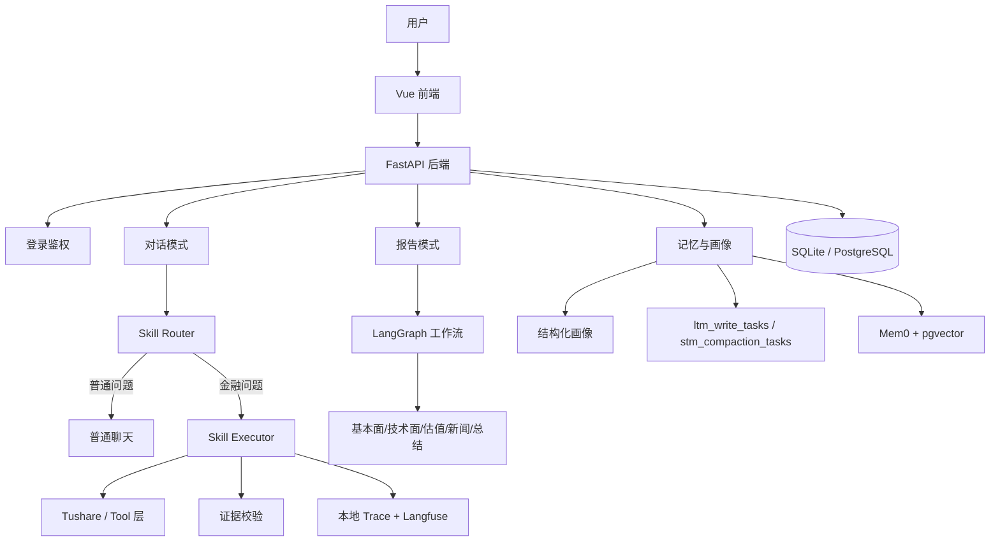

# 股票 Agent 项目技术总览

> 面向对象：第一次接触本项目、希望快速看懂“系统全貌”的同学  
> 文档目标：用尽量直白的方式讲清楚这个项目现在能做什么、核心代码怎么分层、关键链路怎么跑、当前开发做到哪一步

---

## 1. 先用一句话理解这个项目

这个项目不是一个“单纯会聊天的大模型壳子”，而是一套面向 A 股投研场景的智能助手系统。

它现在主要有两条主能力线：

- **对话模式**：像 ChatGPT 一样连续提问，但遇到金融问题时会优先查真实数据、结合用户画像和记忆再回答
- **报告模式**：把一个投研问题拆成多个分析节点并行处理，最后生成一份完整 Markdown 报告

如果再说得再通俗一点：

> 这是一个“会聊天、会查数、会记住用户偏好、还能生成完整研究报告”的股票投研 Agent 项目。

---

## 2. 这个项目现在已经有哪些真实能力

从当前代码来看，项目已经形成闭环的能力主要有下面几块。

### 2.1 前端可见的核心产品能力

前端当前真实页面有：

- [LoginView.vue](../frontend/src/views/LoginView.vue)
- [HomeView.vue](../frontend/src/views/HomeView.vue)
- [ChatView.vue](../frontend/src/views/ChatView.vue)
- [ReportView.vue](../frontend/src/views/ReportView.vue)

用户能感知到的主流程是：

1. 登录或注册
2. 新用户先做冷启动问卷
3. 进入首页
4. 选择“智能对话”或“调研报告”

### 2.2 对话模式

对话模式现在支持：

- 普通聊天问答
- 多轮会话历史管理
- WebSocket 流式回复
- 会话摘要压缩（支持动态 token 预算策略；后台 `stm_compaction_worker` 异步压缩）
- 用户画像与长期记忆注入
- 金融 Skill 路由（`tushare-data` 通用链路 + `financial-sop` workspace 五枚场景 Skill）
- Tushare 实时数据工具调用
- trace / Langfuse 观测（本地 JSONL 为主，Langfuse 可选）
- 开启 STM 时前端可展示上下文占用环（`ContextUsageRing`）

### 2.3 报告模式

报告模式现在支持：

- 提交一条股票研究请求
- 后端异步执行 LangGraph 工作流
- 多个分析节点并行处理
- 汇总成 Markdown 报告
- 历史报告查看
- Markdown 下载

### 2.4 用户与记忆系统

现在已经支持：

- 账号注册 / 登录 / 退出
- JWT 鉴权
- 多用户数据隔离
- 冷启动问卷写入画像
- 画像侧栏编辑
- 长期记忆 outbox + worker 异步写入
- 短期记忆摘要压缩

### 2.5 还没有真正做完的部分

这部分也要明确说出来，避免新同学误会。

当前**仍是预留接口或 stub** 的主要是：

- 持仓管理
- 自选股管理
- 批量行情同步

对应代码在 [portfolio.py](../backend/routers/portfolio.py)，文件里已经明确写了 `Phase 4`。

所以今天项目最成熟的主线不是“持仓运营系统”，而是：

- 对话投研
- 报告生成
- 记忆画像
- 金融 Skill
- trace 观测

---

## 3. 项目整体架构怎么理解

### 3.1 可以先把它看成四层

#### 第一层：前端交互层

负责：

- 登录与注册
- 冷启动问卷
- 聊天页
- 报告页
- 用户画像展示

核心目录：

- [frontend/src/views](../frontend/src/views)
- [frontend/src/stores](../frontend/src/stores)

#### 第二层：FastAPI 后端应用层

负责：

- 提供 HTTP / WebSocket 接口
- 处理用户请求
- 鉴权
- 数据库读写
- 调用聊天服务和报告服务

核心目录：

- [backend/main.py](../backend/main.py)
- [backend/routers](../backend/routers)
- [backend/services](../backend/services)

#### 第三层：Agent / Skill 运行时

负责：

- 报告模式的 LangGraph 工作流
- 对话模式的 Skill 路由、执行、证据校验
- Tushare 工具调用
- trace 记录和导出

核心目录：

- [Financial-MCP-Agent/src/agents](../Financial-MCP-Agent/src/agents)
- [Financial-MCP-Agent/src/skills](../Financial-MCP-Agent/src/skills)
- [Financial-MCP-Agent/src/tools](../Financial-MCP-Agent/src/tools)

#### 第四层：数据与记忆层

负责：

- 用户、会话、消息、报告等结构化数据
- 用户投资画像
- LTM outbox 任务
- STM 压缩任务
- Mem0 语义记忆增强

核心目录：

- [backend/db](../backend/db)
- [Financial-MCP-Agent/src/memory](../Financial-MCP-Agent/src/memory)

### 3.2 总体架构图



---

## 4. 默认运行环境到底是什么

这一点很容易被文档写混，这里直接按代码现状讲。

### 4.1 默认数据库不是 PostgreSQL，而是 SQLite

当前配置里，[config.py](../backend/config.py) 默认将 SQLite 文件放在**项目根目录下**的 `backend/finance.db`（连接串由代码拼接，见 `database_url`）。

所以对新人最准确的说法是：

- **本地默认开发环境**：SQLite（文件路径随项目根目录变化）
- **需要更完整部署或配合记忆增强时**：可以切 PostgreSQL

### 4.2 PostgreSQL / pgvector 是“增强部署形态”

PostgreSQL 在项目里主要用于：

- 更稳定的部署
- 与 pgvector 配合做长期记忆增强
- 更适合 outbox/worker/并发任务的真实部署场景

所以不要把当前项目理解成“本地默认已经强依赖 PostgreSQL 才能跑”。

### 4.3 Mem0 和 Langfuse 都是可开关能力

当前代码里很多能力都是 feature flag 控制：

- `ENABLE_MEMORY`
- `ENABLE_STM`
- `ENABLE_CHAT_SKILLS`
- `ENABLE_TUSHARE_SKILLS`
- `ENABLE_LANGFUSE`

这意味着：

- 这些增强能力没开时，主链路仍然可以降级运行
- 项目不是“一个组件挂了，整个系统全挂”

---

## 5. 前端现在是什么样的产品结构

### 5.1 路由结构

前端当前主路由在 [frontend/src/router/index.ts](../frontend/src/router/index.ts)，只有四个核心页面：

- `/login`
- `/`
- `/report`
- `/chat`

并且做了两层前置判断：

- 是否已登录
- 是否完成冷启动

也就是说，新用户不是一登录就直接进入聊天页，而是会先补完初始化偏好。

### 5.2 首页的真实入口设计

[HomeView.vue](../frontend/src/views/HomeView.vue) 里已经能看到两张核心入口卡：

- 调研报告
- 智能对话

这说明项目产品形态本身就是“双模式”，不是单一聊天机器人。

### 5.3 前端状态管理

当前 Pinia stores 主要有：

- [authStore.ts](../frontend/src/stores/authStore.ts)
- [chatStore.ts](../frontend/src/stores/chatStore.ts)
- [memoryStore.ts](../frontend/src/stores/memoryStore.ts)
- [portfolioStore.ts](../frontend/src/stores/portfolioStore.ts)
- [userStore.ts](../frontend/src/stores/userStore.ts)

如果你是新同学，可以这样记：

- `authStore`：管登录态
- `userStore`：管当前用户和冷启动状态
- `chatStore`：管聊天会话
- `memoryStore`：管画像和记忆展示

---

## 6. 后端主入口和 API 分层

### 6.1 后端入口是谁

后端入口是 [backend/main.py](../backend/main.py)。

它做的事情包括：

- 初始化数据库
- 加载两侧 `.env`
- 初始化 trace runtime
- 校准测试账号
- 按开关启动 `ltm_worker`
- 按开关启动 `stm_compaction_worker`
- 注册所有 router

这说明现在项目已经不是“只有一个简单 app = FastAPI()”，而是有完整启动生命周期管理。

### 6.2 当前后端有哪些路由

目前真实注册的路由有：

- [auth.py](../backend/routers/auth.py)
- [chat.py](../backend/routers/chat.py)
- [memory.py](../backend/routers/memory.py)
- [report.py](../backend/routers/report.py)
- [user.py](../backend/routers/user.py)
- [portfolio.py](../backend/routers/portfolio.py)

对应功能分别是：

- 鉴权
- 对话
- 记忆画像
- 报告
- 用户信息与冷启动
- 持仓/自选股预留接口

### 6.3 现在的服务层怎么分工

当前 `backend/services` 里的核心文件有：

- [agent_service.py](../backend/services/agent_service.py)
- [chat_service.py](../backend/services/chat_service.py)
- [memory_service.py](../backend/services/memory_service.py)
- [auth_service.py](../backend/services/auth_service.py)
- [stock_resolver.py](../backend/services/stock_resolver.py)
- [stm_context_service.py](../backend/services/stm_context_service.py)
- [stm_compaction_worker.py](../backend/services/stm_compaction_worker.py)
- [token_counter.py](../backend/services/token_counter.py)

可以把它们理解成：

- `agent_service`：报告模式总调度
- `chat_service`：对话模式总调度
- `memory_service`：画像和记忆接口封装
- `auth_service`：账号、JWT、测试账号种子
- `stock_resolver`：股票自然语言解析
- `stm_context_service`：STM 上下文预算、压缩入队与摘要协调
- `stm_compaction_worker`：短期记忆异步压缩 worker
- `token_counter`：对话上下文 token 估算（与前端占用展示等配合）

---

## 7. 报告模式现在是怎么实现的

### 7.1 报告模式解决什么问题

报告模式不是为了“回答一句话”，而是为了输出一份完整研究结果。

例如用户问：

```text
帮我做一份完整的贵州茅台投研报告
```

这时用户希望得到的不是几句聊天回复，而是一份更系统的输出。

### 7.2 核心实现思路

报告模式的核心在 [agent_service.py](../backend/services/agent_service.py)。

它会构建一个 LangGraph 工作流，并按当前开关形成不同拓扑：

- 原始模式
- 仅 STM
- 仅 LTM
- STM + LTM

也就是说，报告模式已经不是固定死图，而是会根据记忆开关动态拼接节点。

### 7.3 当前主要分析节点

当前主要 analyst / summary 节点包括：

- `fundamental_agent`
- `technical_agent`
- `value_agent`
- `news_agent`
- `summary_agent`

如果开启记忆，还会插入：

- `memory_read_node`
- `memory_write_node`

如果开启 STM，还会插入：

- `prepare_summary_context`
- `maybe_summarize_state`

### 7.4 用户能看到的报告流程

真实链路是：

1. 前端调用 [report.py](../backend/routers/report.py) 的 `/generate`
2. 后端先落一条 `reports` 记录，状态是 `pending`
3. 后台任务执行 `run_report_task`
4. 前端轮询 `/status/{task_id}`
5. 完成后查看全文或下载 `.md`

也就是说，现在报告模式已经是**异步任务模式**，不是同步卡住用户界面等待。

### 7.5 对小白最值得记住的一点

> 报告模式本质上是“一个 LangGraph 工作流驱动的多节点分析系统”，而不是“把聊天结果复制得更长一点”。

---

## 8. 对话模式现在是怎么实现的

### 8.1 对话入口

对话主路由在 [chat.py](../backend/routers/chat.py)。

它同时提供两种方式：

- `/api/chat/message`：同步回复
- `/api/chat/stream`：WebSocket 流式回复

所以现在前端不是只能等整段答案返回，而是支持流式显示。

### 8.2 对话总调度

对话总调度在 [chat_service.py](../backend/services/chat_service.py)。

它负责：

- 创建或获取会话
- 保存用户消息
- 读取画像、STM、LTM
- 构造路由上下文
- 调用 Skill 路由与执行器
- 保存 assistant 消息
- 触发画像更新、LTM 入队、STM 压缩
- 写 trace

你可以把它理解成“对话总导演”。

### 8.3 普通聊天和金融问答已经分流

今天的对话链路已经不是“一切都直接扔给大模型”。

系统会先判断：

- 是普通聊天？
- 还是金融问题？

如果是普通聊天，走 `fallback`。  
如果是金融问题，走 Skill。

这也是项目和普通聊天 Demo 的核心区别之一。

---

## 9. Skills 集成现在做到哪一步

### 9.1 当前已经有两层金融能力

对话里的金融能力现在分成两层：

#### 第一层：`tushare-data`

这是旧的通用金融数据链路，适合：

- 单股行情问答
- 单股基本面问答
- 板块市场概览
- 一般性金融数据查询

#### 第二层：`financial-sop`

这是新的标准化高频场景链路，适合：

- 基金 / ETF 对比
- ETF 筛选
- 单股首轮研判
- 板块热点简报
- 涨跌原因解释

### 9.2 当前已经落地的 SOP skills

当前 `financial-sop` 已经落地的技能有：

- [fund-compare](../Financial-MCP-Agent/src/skills/fund-compare)
- [stock-first-pass](../Financial-MCP-Agent/src/skills/stock-first-pass)
- [sector-hotspot-brief](../Financial-MCP-Agent/src/skills/sector-hotspot-brief)
- [etf-screen](../Financial-MCP-Agent/src/skills/etf-screen)
- [market-move-explain](../Financial-MCP-Agent/src/skills/market-move-explain)

### 9.3 当前 Skill 主链

关键文件是：

- [skill_registry.py](../Financial-MCP-Agent/src/skills/skill_registry.py)
- [skill_router_node.py](../Financial-MCP-Agent/src/agents/skill_router_node.py)
- [skill_executor_node.py](../Financial-MCP-Agent/src/agents/skill_executor_node.py)
- [skill_spec_planner.py](../Financial-MCP-Agent/src/agents/skill_spec_planner.py)
- [skill_evidence.py](../Financial-MCP-Agent/src/agents/skill_evidence.py)
- [chat_tushare_tools.py](../Financial-MCP-Agent/src/tools/chat_tushare_tools.py)

可以简单理解成：

- `skill_registry`：技能目录
- `skill_router`：判定命中哪个 skill
- `skill_executor`：实际执行
- `skill_spec_planner`：按 SOP spec 生成计划
- `skill_evidence`：做证据校验
- `chat_tushare_tools`：真正查数据

### 9.4 为什么这条链很重要

因为这条链解决了金融问答最大的风险：

> 模型看起来会说，但实际上没有证据。

现在系统会先查数据，再决定能不能给出更确定的金融结论。

如果你想更细地看这一块，建议继续读：

- [skill功能集成技术说明.md](./skill功能集成技术说明.md)

---

## 10. 记忆系统现在是怎么做的

### 10.1 短期记忆 STM

短期记忆的核心是：

- 当前会话滚动摘要
- 最近消息保留
- 异步压缩 worker

相关数据表在：

- `sessions`
- `messages`
- `session_summaries`
- `stm_compaction_tasks`

相关实现主要在：

- [chat_service.py](../backend/services/chat_service.py)
- [stm_compaction_worker.py](../backend/services/stm_compaction_worker.py)

现在 STM 已经不是“压缩一下日志”这么简单，而是会维护：

- `running_summary`
- context token 指标（`stm_context_service` + `token_counter`，并与 `config` 中 `STM_*` 预算参数联动）
- 压缩版本与压缩任务（`stm_compaction_tasks` 表 + worker）
- 压缩状态

前端在开启 STM 时可通过接口展示上下文占用（见 [ContextUsageRing.vue](../frontend/src/components/chat/ContextUsageRing.vue)），便于感知长对话下的预算压力。

### 10.2 长期记忆 LTM

长期记忆采用的是“双轨制”：

- 结构化画像：权威主数据
- Mem0 语义层：增强补充

相关核心表和模块包括：

- `user_invest_profiles`
- `ltm_write_tasks`
- [memory_service.py](../Financial-MCP-Agent/src/memory/memory_service.py)
- [ltm_worker.py](../Financial-MCP-Agent/src/memory/ltm_worker.py)
- [mem0_client.py](../Financial-MCP-Agent/src/memory/mem0_client.py)

### 10.3 为什么用了 outbox + worker

因为长期记忆写入不适合阻塞主请求。

所以现在的做法是：

1. 主链路先更新画像或写 outbox 任务
2. `ltm_worker` 异步消费
3. 真正去写 Mem0

这会比“用户一发消息就同步做完整记忆写入”稳定得多。

### 10.4 对新同学最重要的理解

> 结构化画像是“确定性主干”，Mem0 是“语义增强层”；即使 Mem0 不可用，项目也不会整条链路崩掉。

---

## 11. 登录鉴权和多用户隔离现在做到哪一步

### 11.1 当前账号体系

现在账号体系已经不是早期的“裸 user_id 模式”，而是：

- `users`：业务用户
- `auth_accounts`：登录账号

也就是说：

- 登录身份和业务数据分层
- 账号系统不会把原来的业务表全部推翻重来

### 11.2 当前鉴权方式

当前使用 JWT。

主要实现文件是：

- [auth_service.py](../backend/services/auth_service.py)
- [auth.py](../backend/routers/auth.py)
- [auth.py](../backend/middleware/auth.py)

后端不仅保护 HTTP 接口，也保护 WebSocket。

### 11.3 当前测试账号

当前代码里明确存在两个种子账号：

- `test1 / test1`
- `test2 / test2`

并且 `ensure_seed_accounts()` 会尽量把它们重新绑定回有历史数据的旧用户，避免“登录成功但历史聊天全没了”的问题。

### 11.4 当前多用户隔离方式

后端会校验：

- token 对应的 `user_id`
- 请求里的 `user_id`

如果请求的是别人的数据，就会被拒绝。

这意味着项目现在已经具备了基本的真实多用户隔离能力，而不只是演示用单用户系统。

---

## 12. Trace 和 Langfuse 现在是什么角色

### 12.1 本地 trace 已经是正式主链

当前本地 trace 主入口在：

- [skill_trace.py](../Financial-MCP-Agent/src/tools/skill_trace.py)

它已经能统一记录：

- trace
- span
- event
- skill 命中情况
- 工具调用
- 证据校验
- claim lineage
- memory enqueue
- degrade history

### 12.2 Langfuse 不是替代，而是观测面

当前 Langfuse 适配层在：

- [langfuse_exporter.py](../Financial-MCP-Agent/src/tools/trace_exporters/langfuse_exporter.py)

你可以这样理解：

- 本地 JSONL trace：第一事实来源，适合精确审计
- Langfuse：可视化观测平台，适合看链路、聚合和排障

### 12.3 这部分为什么重要

因为项目现在已经不再只是“能跑就行”，而是在往“可调试、可定位、可复盘”的工程化方向走。

### 12.4 配置与联调文档

环境变量见 [backend/.env.example](../backend/.env.example)（`ENABLE_TRACE`、`ENABLE_LANGFUSE`、`LANGFUSE_*` 等）。  
本机开发与 Langfuse Cloud 联调步骤见 [部署指南-Langfuse-本机开发联调.md](./部署指南-Langfuse-本机开发联调.md)。

---

## 13. 数据库里大概有哪些核心表

如果你是第一次看这个项目，先认识这几张表就够了：

- `users`
- `auth_accounts`
- `sessions`
- `messages`
- `reports`
- `user_invest_profiles`
- `ltm_write_tasks`
- `session_summaries`
- `stm_compaction_tasks`

这些表基本对应了项目四条主线：

- 登录与用户
- 聊天与会话
- 报告
- 记忆与压缩

相关定义都在：

- [models.py](../backend/db/models.py)

---

## 14. 当前项目更像什么，不像什么

### 14.1 它更像什么

它更像一个“有完整后端和多条业务链路的投研助手系统”，而不是单纯的大模型调用脚手架。

因为它已经包含：

- 前后端
- 鉴权
- 会话系统
- 记忆系统
- 报告工作流
- Skill 路由与执行
- trace 与 Langfuse

### 14.2 它不像什么

它不像下面这些东西：

- 一个只会调一个 LLM 接口的聊天 Demo
- 一个只有 Prompt、没有真实金融数据工具的壳子
- 一个只有实验脚本、没有用户系统和部署路径的研究仓库

---

## 15. 当前代码现状下，最适合新同学先看什么

如果你第一次进仓库，推荐按这个顺序读：

1. [backend/main.py](../backend/main.py)  
先看系统怎么启动、有哪些开关、会起哪些 worker

2. [backend/services/chat_service.py](../backend/services/chat_service.py)  
看对话主链路

3. [backend/services/agent_service.py](../backend/services/agent_service.py)  
看报告模式主链路

4. [skill功能集成技术说明.md](./skill功能集成技术说明.md)  
看 Skills 这条新链路

5. [backend/db/models.py](../backend/db/models.py)  
看数据库模型

6. [Financial-MCP-Agent/src/memory/memory_service.py](../Financial-MCP-Agent/src/memory/memory_service.py)  
看 LTM 双轨设计

7. [Financial-MCP-Agent/src/tools/skill_trace.py](../Financial-MCP-Agent/src/tools/skill_trace.py)  
看 trace 主链

---

## 16. 当前阶段最准确的项目总结

如果要面向完全不了解项目的人，用一句话总结当前版本，我会这样说：

> 这是一个以 FastAPI + Vue 为外壳、以 LangGraph 和金融 Skills 为核心能力、同时带有用户画像、长短期记忆、真实数据查证和 trace 观测能力的股票投研 Agent 系统；其中对话模式和报告模式已经形成闭环，持仓和自选股等投资运营能力还处在后续阶段。

---

## 17. 相关文档

| 文档 | 用途 |
|------|------|
| [项目代码架构说明.md](./项目代码架构说明.md) | 按目录说明 `backend/`、`frontend/`、`Financial-MCP-Agent/` 等与可选子项目 |
| [skill功能集成技术说明.md](./skill功能集成技术说明.md) | Skill 路由、`tushare-data` / `financial-sop`、Trace/Langfuse 配置与排障 |
| [部署指南-Langfuse-本机开发联调.md](./部署指南-Langfuse-本机开发联调.md) | Langfuse Cloud 与本机 Trace 联调步骤 |
| [README.md](../README.md) | 一键运行、环境变量与 Docker |
